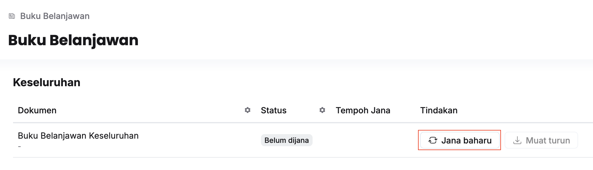
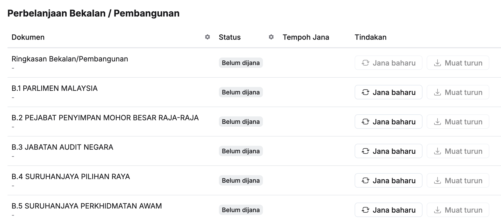

## Jana Buku Belanjawan Keseluruhan
Langkah:
1. Klik **Buku Belanjawan** pada *Sidebar*

2. Klik **Jana baharu** pada sudut kanan **Buku Belanjawan Keseluruhan**
3. Klik butang **Teruskan**
4. Klik butang **Muat turun** selepas status menunjukkan **Selesai**

<Callout title="Outcome">
Buku Belanjawan Keseluruhan berjaya dijana
</Callout>

## Jana Buku Belanjawan Kementerian
Langkah:
1. Klik **Buku Belanjawan** pada *Sidebar*

2. Klik **Jana baharu** pada sudut kanan maksud perbelanjaan yang berkaitan
3. Pilih **Nilai Peringkat**
4. Klik butang **Teruskan**
5. Klik butang **Muat turun** selepas status menunjukkan **Selesai**

<Callout title="Outcome">
Buku Belanjawan Kementerian berjaya dijana
</Callout>

## Jana Muka Surat Prakata / Ringkasan / Lampiran
Langkah:
1. Klik **Buku Belanjawan** pada *Sidebar*
2. Klik **Jana baharu** pada sudut kanan dokumen yang berkaitan
3. Klik butang **Teruskan**
4. Klik butang **Muat turun** selepas status menunjukkan **Selesai**

<Callout title="Outcome">
Muka Surat Buku yang berkaitan berjaya dijana
</Callout>