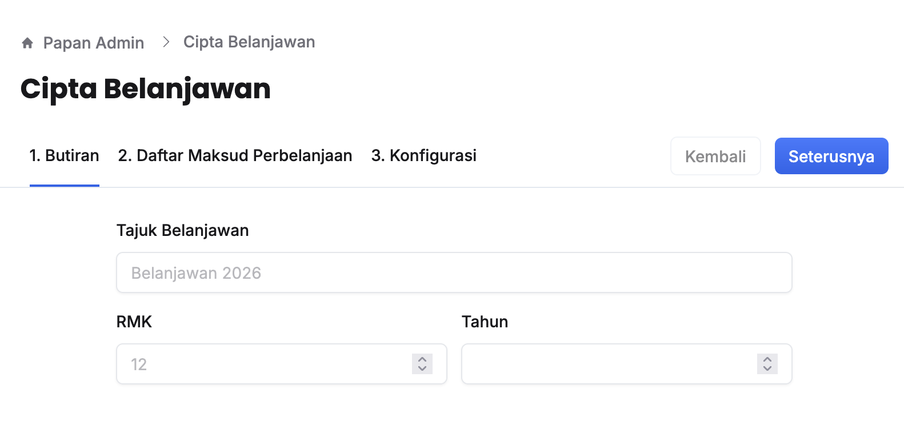
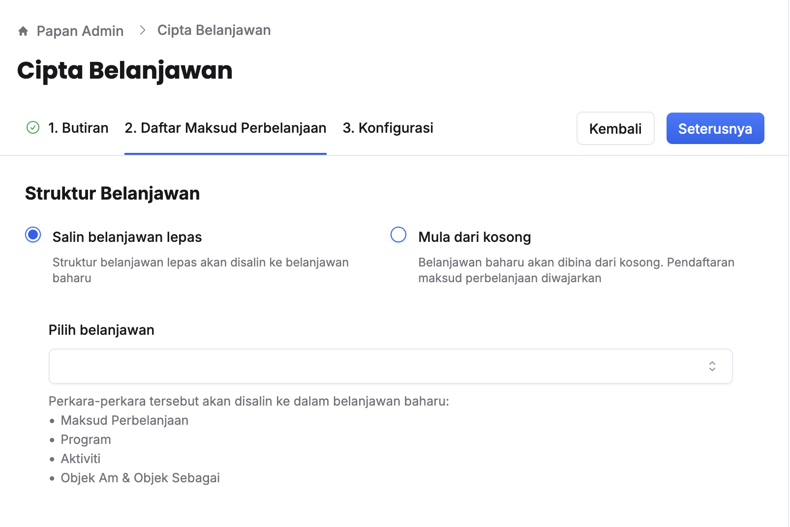
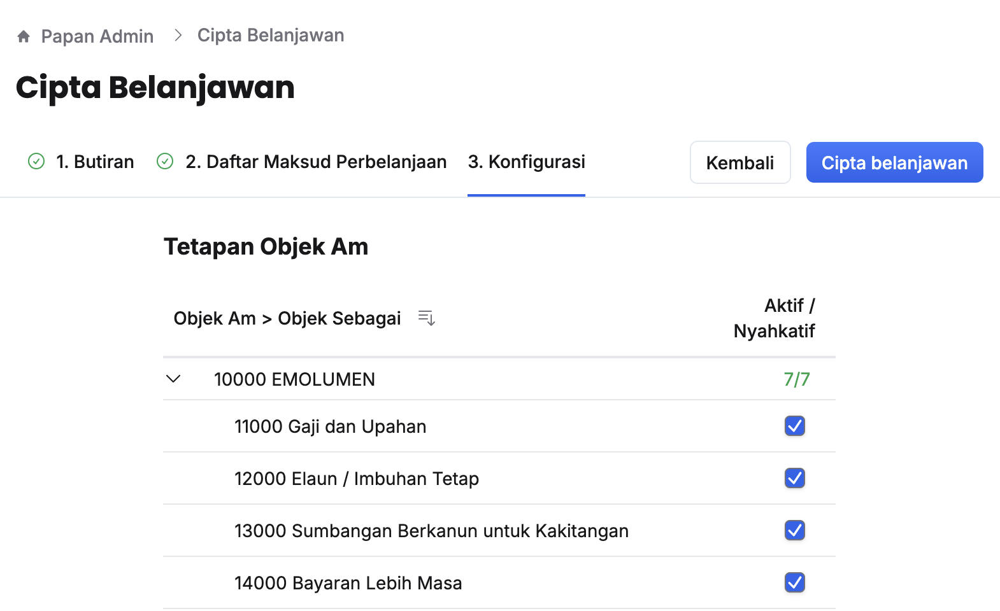
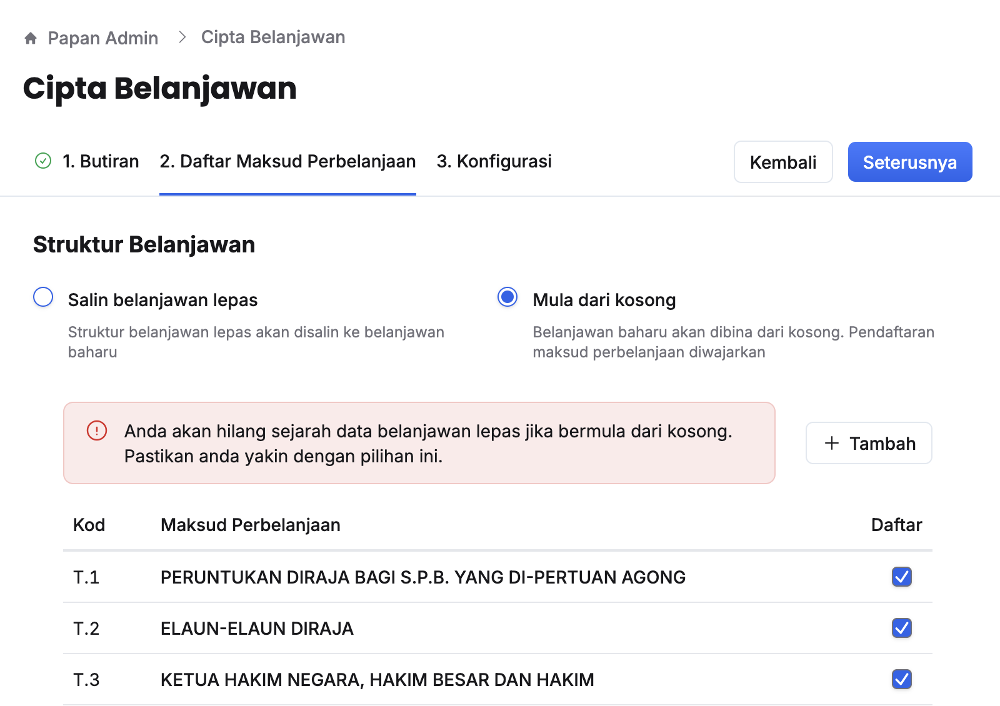

## Cipta Belanjawan

### Struktur Belanjawan Lepas
Peranan: Super Admin

Langkah:
1. Klik **Papan Admin** pada *Sidebar*
2. Klik **Cipta belanjawan** di bawah aturan umum

3. Isikan maklumat dalam medan:
    * Tajuk Belanjawan
    * RMK
    * Tahun
4. Klik butang **Seterusnya** ke halaman **Daftar Maksud Perbelanjaan**

5. Klik pilihan **Salin belanjawan lepas**
6. Klik ruangan dan buat pilihan pada medan **Pilih belanjawan**
7. Klik butang **Seterusnya** ke halaman **Konfigurasi**

8. Aktif/nyahaktif objek am yang berkaitan
9. Klik butang **Cipta belanjawan**

<Callout title="Outcome"> 
Belanjawan berjaya dicipta dan dapat dipilih pada bar navigasi belanjawan di bahagian atas laman web untuk memulakan proses perancangan bajet
</Callout>

### Struktur Baharu
Peranan: Super Admin

Langkah:
1. Klik **Papan Admin** pada *Sidebar*
2. Klik **Cipta belanjawan** di bawah aturan umum

3. Isikan maklumat dalam medan:
    * Tajuk Belanjawan
    * RMK
    * Tahun
4. Klik butang **Seterusnya** ke halaman **Daftar Maksud Perbelanjaan**

5. Pilih **Mula dari kosong**
6. Pilih/nyahpilih maksud perbelanjaan yang ingin didaftar
7. Klik butang **+ Tambah** sekiranya ingin menambah maksud perbelanjaan yang baharu
8. Cari dan aktifkan maksud perbelanjaan yang ditambah
9. Klik butang **Seterusnya** ke halaman **Konfigurasi**

10. Aktif/nyahaktif objek am yang berkaitan
11. Klik butang **Cipta belanjawan**
12. Cari dan pilih belanjawan berkaitan di bar navigasi belanjawan pada bahagian atas laman web untuk memulakan proses perancangan

<Callout title="Outcome">
Belanjawan berjaya dicipta dan dapat dipilih pada bar navigasi belanjawan di bahagian atas laman web untuk memulakan proses perancangan bajet
</Callout>