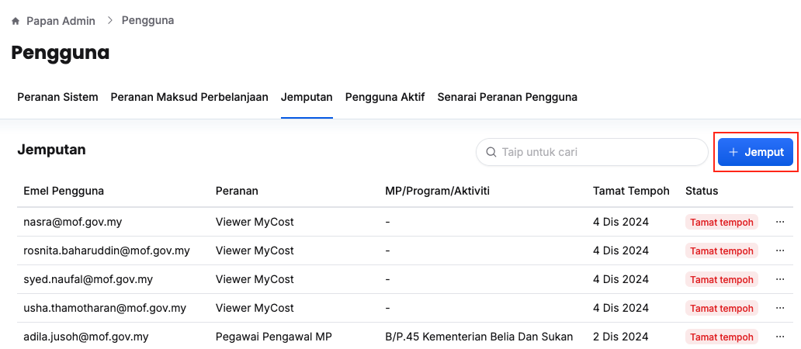
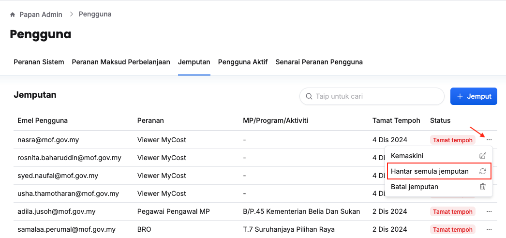
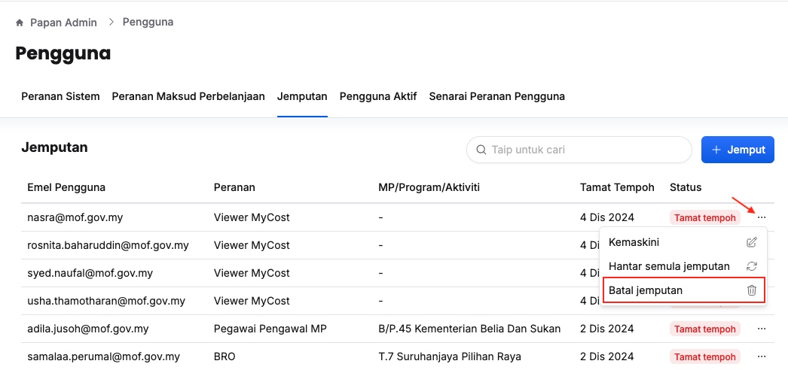
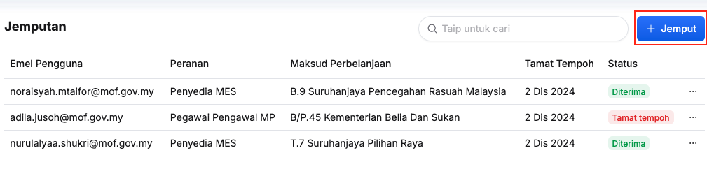
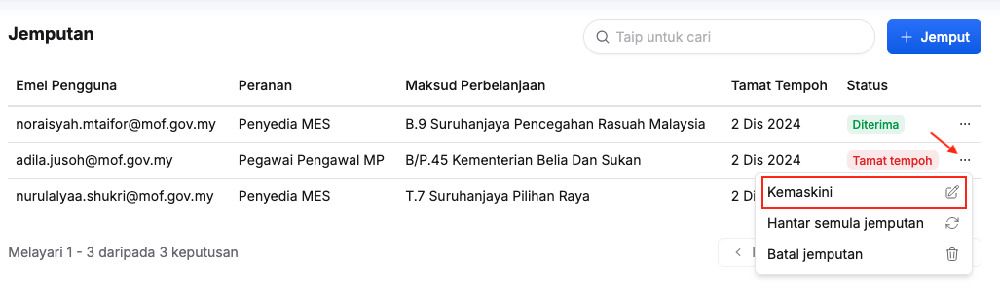
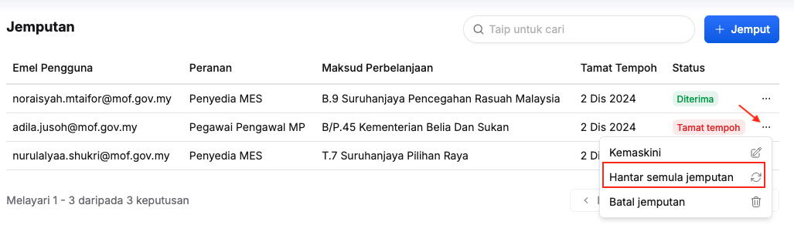
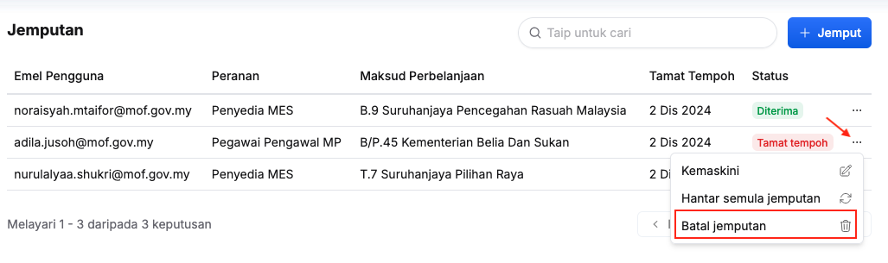

## Jemputan Pengguna - Keseluruhan Sistem
Peranan: Super Admin

<Callout>
Super Admin mempunyai akses untuk jemput pengguna sistem dan juga kementerian
</Callout>

Langkah:
1. Klik **Papan Admin** pada *Sidebar*
2. Klik **Peranan & pengguna** di bawah aturan umum
3. Klik tab **Jemputan**

4. Klik butang **+ Jemput**
5. Isikan maklumat dalam medan:
    * Emel
    * Peranan
    * MP/Program/Aktiviti
6. Klik butang **+ Tambah** dan ulang langkah 5 sekiranya perlu jemput lebih daripada satu pengguna yang baharu
7. Klik butang **Jemput**
8. Pastikan jemputan pengguna telah tersenarai

<Callout title = "Outcome">
Pengguna yang berkaitan akan menerima jemputan melalui emel
</Callout>

### Kemaskini Butiran Jemputan
Peranan: Super Admin

Langkah:
1. Klik  pada *Sidebar*
2. Klik **Peranan & pengguna** di bawah aturan umum
3. Klik tab **Jemputan**

4. Klik butang **3 dots** pada sudut kanan pengguna yang berkaitan
5. Klik butang **Kemaskini**
6. Kemaskini:
    * Peranan
    * MP/Program/Aktiviti
7. Klik butang **Kemaskini**

<Callout title = "Outcome">
Butiran jemputan pengguna yang berkaitan berjaya dikemaskini
</Callout>

### Jemputan Semula Pengguna
Peranan: Super Admin 

<Callout type="warn">
Aksi ini dilakukan hanya dilakukan untuk jemputan telah tamat tempoh
</Callout>

Langkah:
1. Klik **Papan Admin** pada *Sidebar*
2. Klik **Peranan & pengguna** di bawah aturan umum
3. Klik tab **Jemputan**

4. Klik butang **3 dots** pada sudut kanan pengguna yang berkaitan
5. Klik butang **Hantar semula jemputan**
6. Klik butang **Teruskan** pada paparan **Hantar semula jemputan**
7. Pastikan status jemputan pengguna yang berkaitan bertukar dari **Tamat tempoh** kepada **Belum diterima**

<Callout title = "Outcome">
Pengguna yang berkaitan akan menerima jemputan melalu emel
</Callout>

### Batal Jemputan Pengguna
Peranan: Super Admin 

Langkah:
1. Klik **Papan Admin** pada *Sidebar*
2. Klik **Peranan & pengguna** di bawah aturan umum
3. Klik tab **Jemputan**

4. Klik butang **3 dots** pada sudut kanan pengguna yang berkaitan
5. Klik butang **Batal jemputan**
6. Klik butang **Teruskan** pada paparan **Batal jemputan**
7. Pastikan jemputan pengguna yang berkaitan telah dipadam

<Callout title = "Outcome">
Jemputan pengguna berjaya dibatalkan
</Callout>

---

## Jemputan Pengguna Kementerian
Peranan: Penyelaras MP

<Callout>
Penyelaras MP hanya mempunyai akses untuk menjemput pengguna kementerian. 

Ini termasuk:
* Penyedia MES/Pegawai Pengawal
* Penyedia/Pengurus Program
* Penyedia/Ketua Aktiviti
</Callout>

Langkah:
1. Klik peringkat yang berkaitan pada *Sidebar*
    * Maksud Perbelanjaan *atau*
    * Program *atau*
    * Aktiviti
2. Klik butang **Tetapan**
3. Klik tab **Jemputan Pengguna**

4. Klik butang **+ Jemput**
5. Isikan maklumat dalam medan:
    * Emel
    * Domain Emel
    * Peranan
    * Maksud Perbelanjaan/Program/Aktiviti
6. Klik butang **+ Tambah** dan ulang langkah 5 sekiranya perlu jemput lebih daripada satu pengguna yang baharu
7. Klik butang **Jemput**
8. Pastikan jemputan pengguna telah tersenarai

<Callout title = "Outcome">
Pengguna yang berkaitan akan menerima jemputan melalui emel
</Callout>

### Kemaskini Butiran Jemputan
Peranan: Penyelaras MP

Langkah:
1. Klik peringkat yang berkaitan pada *Sidebar*
    * Maksud Perbelanjaan *atau*
    * Program *atau*
    * Aktiviti
2. Klik butang **Tetapan**
3. Klik tab **Jemputan Pengguna**

4. Klik butang **3 dots** pada sudut kanan pengguna yang berkaitan
5. Klik butang **Kemaskini**
6. Kemaskini:
    * Peranan
    * Maksud Perbelanjaan/Program/Aktiviti
7. Klik butang **Kemaskini**

<Callout title = "Outcome">
Butiran jemputan pengguna yang berkaitan berjaya dikemaskini
</Callout>

### Jemputan Semula Pengguna
Peranan: Penyelaras MP

<Callout type="warn">
Aksi ini dilakukan hanya dilakukan untuk jemputan telah tamat tempoh
</Callout>

Langkah:
1. Klik peringkat yang berkaitan pada *Sidebar*
    * Maksud Perbelanjaan *atau*
    * Program *atau*
    * Aktiviti
2. Klik butang **Tetapan**
3. Klik tab **Jemputan Pengguna**

4. Klik butang **3 dots** pada sudut kanan pengguna yang berkaitan
5. Klik butang **Hantar semula jemputan**
6. Klik butang **Teruskan** pada paparan **Hantar semula jemputan**
7. Pastikan status jemputan pengguna yang berkaitan bertukar dari **Tamat tempoh** kepada **Belum diterima**

<Callout title = "Outcome">
Pengguna yang berkaitan akan menerima jemputan melalu emel
</Callout>

### Batal Jemputan Pengguna
Peranan: Penyelaras MP

Langkah:
1. Klik peringkat yang berkaitan pada *Sidebar*
    * Maksud Perbelanjaan *atau*
    * Program *atau*
    * Aktiviti
2. Klik butang **Tetapan**
3. Klik tab **Jemputan Pengguna**

4. Klik butang **3 dots** pada sudut kanan pengguna yang berkaitan
5. Klik butang **Batal jemputan**
6. Klik butang **Teruskan** pada paparan **Batal jemputan**
7. Pastikan jemputan pengguna yang berkaitan telah dipadam

<Callout title = "Outcome">
Jemputan pengguna berjaya dibatalkan
</Callout>