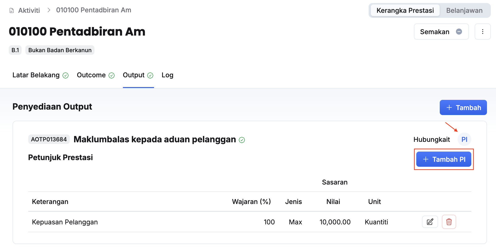

## Tambah Output Aktiviti
### Salin Terdahulu
Peranan: Penyedia Aktiviti / Ketua Aktiviti

Langkah:
1. Klik **Aktiviti** pada *Sidebar*
2. Pilih aktiviti yang berkaitan
3. Klik tab **Output**

4. Klik butang **+ Tambah**
5. Klik butang **Salin data terdahulu**
6. Pilih:
    * Belanjawan 
    * Outcome
7. Klik **Tambah**
8. Pastikan output yang berkaitan telah tersenarai

<Callout title="Outcome">
Output berjaya ditambahkan
</Callout>

### Tambah Baharu
Peranan: Penyedia Aktiviti / Ketua Aktiviti

Langkah:
1. Klik **Aktiviti** pada *Sidebar*
2. Pilih aktiviti yang berkaitan
3. Klik tab **Output**

4. Klik butang **+ Tambah**
5. Klik butang **Tambah baharu**

6. Isikan maklumat dalam medan **Keterangan Output**
7. Klik butang **+ Tambah**
8. Pilih **Outcome Berkaitan** dan isikan **Wajaran (%)**
9. Klik butang **Simpan**

<Callout title="Outcome">
Output baharu berjaya ditambahkan
</Callout>

### Kemaskini Output Aktiviti
Peranan: Penyedia Aktiviti / Ketua Aktiviti

Langkah:
1. Klik **Aktiviti** pada *Sidebar*
2. Pilih aktiviti yang berkaitan
3. Klik tab **Output**

4. Klik butang **Kemaskini** pada sudut kanan output yang berkaitan

5. Kemaskini:
    * Keterangan Output
    * Outcome Berkaitan
6. Klik butang **Simpan**
7. Pastikan output yang berkaitan telah dikemaskini

<Callout title="Outcome">
Output berjaya dikemaskini
</Callout>

## Padam Output Aktiviti
Peranan: Penyedia Aktiviti / Ketua Aktiviti

Langkah:
1. Klik **Aktiviti** pada *Sidebar*
2. Pilih aktiviti yang berkaitan
3. Klik tab **Output**

4. Klik butang **Kemaskini** pada output yang berkaitan
5. Klik butang **Padam**
6. Klik butang **Teruskan** pada paparan **Padam Output**
7. Pastikan outcome yang berkaitan berjaya dipadamkan

<Callout title="Outcome">
Output berjaya dipadamkan
</Callout>