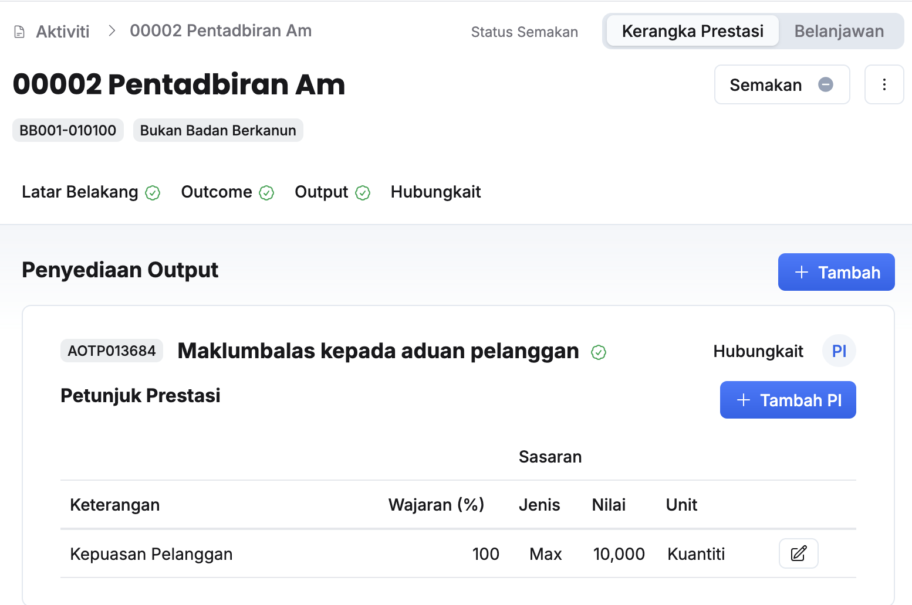
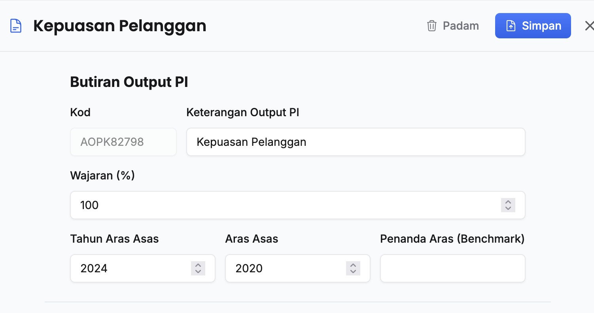
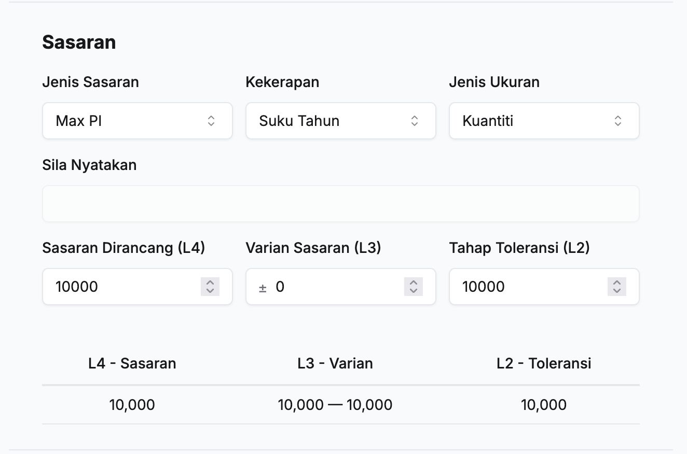
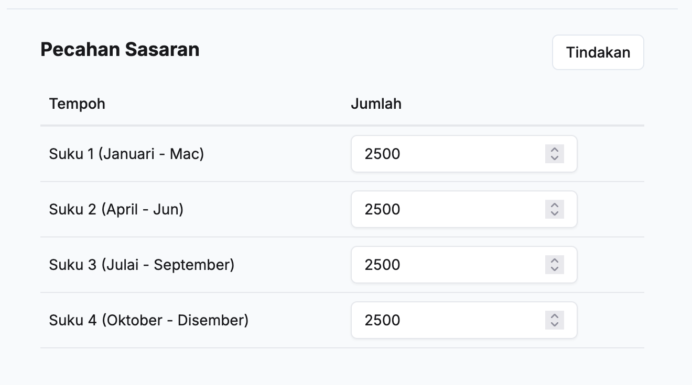

## Tambah PI Output Aktiviti
Peranan: Penyedia Aktiviti / Ketua Aktiviti

Langkah:
1. Klik **Aktiviti** pada *Sidebar*
2. Pilih aktiviti yang berkaitan
3. Klik pada tab **Output**

4. Klik **PI** pada sudut kanan outcome yang berkaitan
5. Klik butang **+ Tambah PI**

6. Isikan maklumat **Butiran Outcome PI** dalam medan:
    * Keterangan PI
    * Wajaran (%)
    * Tahun Aras Asas 
    * Aras Asas
    * Penanda Aras (Benchmark)

7. Isikan maklumat **Sasaran** dalam medan:
    * Jenis Sasaran
    * Kekerapan
    * Jenis Ukuran
    * Sila Nyatakan (Perlu diisi sekiranya **Jenis Ukuran: Lain-lain** dipikih)
    * Sasaran Dirancang (L4)
    * Varian Sasaran (L3)
    * Tahap Toleransi (L2)

8. Isikan maklumat **Pecahan Sasaran** menggunakan kaedah-kaedah berikut:
    * Secara manual satu demi satu dalam medan setiap tempoh
    * Klik butang **Tindakan** dan pilih **Pecah sama rata / Salin sasaran**
9. Klik butang **Simpan** pada sudut kanan atas paparan **Tambah Outcome KPI**
10. Pastikan PI yang baharu telah tersenarai

<Callout title="Outcome">
PI output berjaya ditambahkan
</Callout>

## Kemaskini PI Output Aktiviti
Peranan: Penyedia Aktiviti / Ketua Aktiviti

Langkah:
1. Klik **Aktiviti** pada *Sidebar*
2. Pilih aktiviti yang berkaitan
3. Klik pada tab **Output**

4. Klik **PI** pada sudut kanan outcome yang berkaitan
5. Klik butang **Kemaskini** pada sudut kanan **PI**

6. Kemaskini maklumat **Butiran Output PI**:
    * Keterangan PI
    * Wajaran (%)
    * Tahun Aras Asas 
    * Aras Asas
    * Penanda Aras (Benchmark)
    
7. Kemaskini maklumat **Sasaran**:
    * Jenis Sasaran
    * Kekerapan
    * Jenis Ukuran
    * Sila Nyatakan (Perlu diisi sekiranya **Jenis Ukuran: Lain-lain** dipikih)
    * Sasaran Dirancang (L4)
    * Varian Sasaran (L3)
    * Tahap Toleransi (L2)

8. Kemaskini maklumat **Pecahan Sasaran** menggunakan kaedah-kaedah berikut:
    * Secara manual satu demi satu dalam medan setiap tempoh
    * Klik butang **Tindakan** dan pilih **Pecah sama rata / Salin sasaran**
9. Klik butang **Simpan** pada sudut kanan atas
10. Pastikan PI berkaitan telah dikemaskini

<Callout title="Outcome">
PI output berjaya dikemaskini
</Callout>

## Padam PI Output Aktiviti
Peranan: Penyedia Aktiviti / Ketua Aktiviti

Langkah:
1. Klik **Aktiviti** pada *Sidebar*
2. Pilih aktiviti yang berkaitan
3. Klik pada tab **Output**

4. Klik **PI** pada sudut kanan outcome yang berkaitan
5. Klik butang **Kemaskini** pada sudut kanan **PI**

6. Klik butang **Padam**
7. Klik butang **Teruskan** pada paparan **Padam Output PI**
8. Pastikan PI output yang berkaitan telah dipadamkan

<Callout title="Outcome">
PI output berjaya dipadamkan
</Callout>