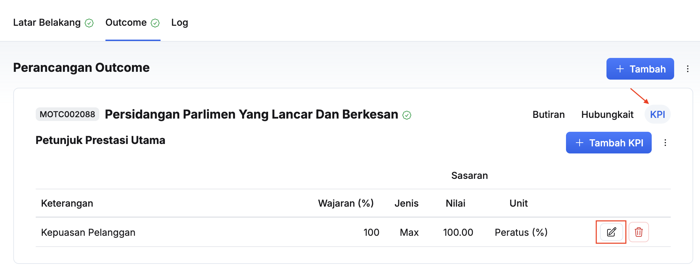

## Tambah KPI Outcome MP
Peranan: Penyedia MES / Pegawai Pengawal

Langkah:
1. Klik **Maksud Pebelanjaan** pada *Sidebar*
2. Pilih maksud perbelanjaan yang berkaitan
3. Klik pada tab **Outcome**

4. Klik **KPI** pada sudut kanan outcome yang berkaitan
5. Klik butang **+ Tambah KPI**

6. Isikan maklumat **Butiran Outcome KPI** dalam medan:
    * Keterangan KPI
    * Wajaran (%)
    * Tahun Aras Asas 
    * Aras Asas
    * Penanda Aras (Benchmark)
    
7. Isikan maklumat **Sasaran** dalam medan:
    * Jenis Sasaran
    * Kekerapan
    * Jenis Ukuran
    * Sila Nyatakan (Perlu diisi sekiranya **Jenis Ukuran: Lain-lain** dipilih)
    * Sasaran Dirancang (L4)
    * Varian Sasaran (L3)
    * Tahap Toleransi (L2)
    
8. Isikan maklumat **Pecahan Sasaran** menggunakan kaedah-kaedah berikut:
    * Secara manual satu demi satu dalam medan setiap tempoh
    * Klik butang **Tindakan** dan pilih **Pecah sama rata / Salin sasaran**
9. Klik butang **Simpan** pada sudut kanan atas paparan **Tambah Outcome KPI**
10. Pastikan KPI yang baharu telah tersenarai

<Callout title="Outcome">
KPI outcome berjaya ditambahkan
</Callout>

## Kemaskini KPI Outcome MP
Peranan: Penyedia MES / Pegawai Pengawal

Langkah:
1. Klik **Maksud Pebelanjaan** pada *Sidebar*
2. Pilih maksud perbelanjaan yang berkaitan
3. Klik pada tab **Outcome**

4. Klik **KPI** pada sudut kanan outcome yang berkaitan
5. Klik butang **Kemaskini** pada sudut kanan **KPI**

6. Kemaskini maklumat **Butiran Outcome KPI**:
    * Keterangan KPI
    * Wajaran (%)
    * Tahun Aras Asas 
    * Aras Asas
    * Penanda Aras (Benchmark)
    
7. Kemaskini maklumat **Sasaran**:
    * Jenis Sasaran
    * Kekerapan
    * Jenis Ukuran
    * Sila Nyatakan (Perlu diisi sekiranya **Jenis Ukuran: Lain-lain** dipilih)
    * Sasaran Dirancang (L4)
    * Varian Sasaran (L3)
    * Tahap Toleransi (L2)
    
8. Kemaskini maklumat **Pecahan Sasaran** menggunakan kaedah-kaedah berikut:
    * Secara manual satu demi satu dalam medan setiap tempoh
    * Klik butang **Tindakan** dan pilih **Pecah sama rata / Salin sasaran**
9. Klik butang **Simpan** pada sudut kanan atas
10. Pastikan KPI berkaitan telah dikemaskini

<Callout title="Outcome">
KPI outcome berjaya dikemaskini
</Callout>

## Padam KPI Outcome MP
Peranan: Penyedia MES / Pegawai Pengawal

Langkah:
1. Klik **Maksud Pebelanjaan** pada *Sidebar*
2. Pilih maksud perbelanjaan yang berkaitan
3. Klik pada tab **Outcome**

4. Klik **KPI** pada sudut kanan outcome yang berkaitan
5. Klik butang **Kemaskini** pada sudut kanan **KPI**

6. Klik butang **Padam**
7. Klik butang **Teruskan** pada paparan **Padam Outcome KPI**
8. Pastikan KPI outcome yang berkaitan telah dipadamkan

<Callout title="Outcome">
KPI outcome berjaya dipadamkan
</Callout>