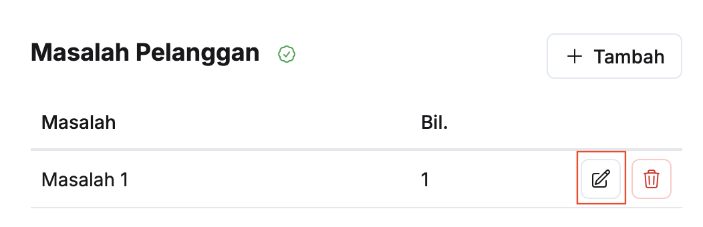
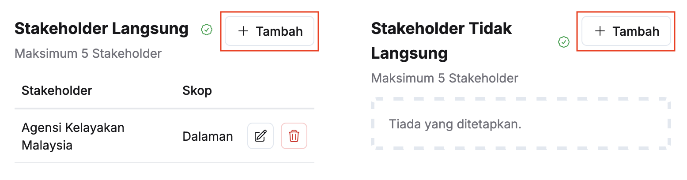
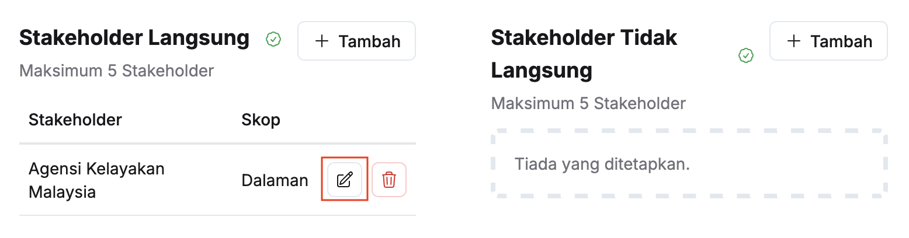

## Matlamat
### Tambah/Kemaskini Matlamat
Peranan: Penyedia MES / Pegawai Pengawal

Langkah:
1. Klik **Maksud Perbelanjaan** pada *Sidebar*
2. Pilih maksud perbelanjaan yang berkaitan

3. Klik butang **Kemaskini** pada sudut kanan tajuk **Matlamat**

4. Isikan maklumat dalam medan:
    * Visi
    * Misi
5. Klik butang **+ Tambah**
6. Isikan maklumat dalam medan **Strategi**
7. Ulang langkah 4-5 sekiranya terdapat lebih daripada satu Strategi
8. Klik butang **Simpan**
9. Pastikan maklumat matlamat telah dikemaskini

<Callout title="Outcome">
Matlamat kementerian berjaya dikemaskini
</Callout>

## Bidang Kuasa
### Tambah Bidang Kuasa 
Peranan: Penyedia MES / Pegawai Pengawal

Langkah:
1. Klik **Maksud Perbelanjaan** pada *Sidebar*
2. Pilih maksud perbelanjaan yang berkaitan

3. Klik butang **+ Tambah** pada sudut kanan tajuk **Bidang Kuasa**

4. Pilih **Jenis Dasar** dan **Bidang Kuasa**

5. Isikan maklumat dalam medan **Keterangan**
6. Klik butang **Simpan**
7. Pastikan bidang kuasa telah tersenarai

<Callout title="Outcome">
Maklumat bidang kuasa berjaya ditambahkan
</Callout>

### Kemaskini Bidang Kuasa
Peranan: Penyedia MES / Pegawai Pengawal

Langkah:
1. Klik **Maksud Perbelanjaan** pada *Sidebar*
2. Pilih maksud perbelanjaan yang berkaitan

3. Klik butang **Kemaskini** pada sudut kanan bidang kuasa yang berkaitan

4. Kemaskini:
    * Jenis Dasar
    * Bidang Kuasa
    * Keterangan

5. Klik butang **Simpan**
6. Pastikan maklumat bidang kuasa yang berkaitan telah dikemaskini

<Callout title="Outcome"> 
Maklumat bidang kuasa berjaya dikemaskini
</Callout>

### Padam Bidang Kuasa
Peranan: Penyedia MES / Pegawai Pengawal

Langkah:
1. Klik **Maksud Perbelanjaan** pada *Sidebar*
2. Pilih maksud perbelanjaan yang berkaitan

3. Klik butang **Padam** pada sudut kanan bidang kuasa yang berkaitan

4. Klik butang **Teruskan** pada paparan **Padam bidang kuasaa**
5. Pastikan bidang kuasa yang berkaitan telah dipadamkan

<Callout title="Outcome">
Bidang kuasa berjaya dipadamkan
</Callout>

## Punca Kuasa
### Tambah Punca Kuasa 
Peranan: Penyedia MES / Pegawai Pengawal

Langkah:
1. Klik **Maksud Perbelanjaan** pada *Sidebar*
2. Pilih maksud perbelanjaan yang berkaitan

3. Klik butang **+ Tambah** pada sudut kanan tajuk **Punca Kuasa**

4. Isikan maklumat dalam medan:
* Punca Kuasa
* Keterangan

5. Klik butang **Simpan**
6. Pastikan punca kuasa telah tersenarai

<Callout title="Outcome">
Maklumat punca kuasa berjaya ditambahkan
</Callout>

### Kemaskini Punca Kuasa
Peranan: Penyedia MES / Pegawai Pengawal

Langkah:
1. Klik **Maksud Perbelanjaan** pada *Sidebar*
2. Pilih maksud perbelanjaan yang berkaitan

3. Klik butang **Kemaskini** pada sudut kanan punca kuasa yang berkaitan

4. Kemaskini:
    * Punca Kuasa
    * Keterangan

5. Klik butang **Simpan**
6. Pastikan maklumat punca kuasa yang berkaitan telah dikemaskini

<Callout title="Outcome"> 
Maklumat punca kuasa berjaya dikemaskini
</Callout>

### Padam Punca Kuasa
Peranan: Penyedia MES / Pegawai Pengawal

Langkah:
1. Klik **Maksud Perbelanjaan** pada *Sidebar*
2. Pilih maksud perbelanjaan yang berkaitan

3. Klik butang **Padam** pada sudut kanan punca kuasa yang berkaitan

4. Klik butang **Teruskan** pada paparan **Padam punca kuasa**
5. Pastikan punca kuasa yang berkaitan telah dipadamkan

<Callout title="Outcome">
Punca kuasa berjaya dipadamkan
</Callout>

## Pelanggan Langsung / Tidak Langsung
### Tambah Pelanggan
Peranan: Penyedia MES / Pegawai Pengawal

Langkah:
1. Klik **Maksud Perbelanjaan** pada *Sidebar*
2. Pilih maksud perbelanjaan yang berkaitan

3. Klik butang **+ Tambah** pada sudut kanan tajuk **Pelanggan Langsung / Pelanggan Tidak Langsung**

4. Isikan maklumat dalam medan:
    * Kategori Pelanggan
    * Skop Pelanggan
    * Nama Pelanggan

5. Klik butang **Simpan**
6. Pastikan pelanggan telah tersenarai

<Callout title="Outcome">
Pelanggan berjaya ditambahkan
</Callout>

### Kemaskini Maklumat Pelanggan 
Peranan: Penyedia MES / Pegawai Pengawal

Langkah:
1. Klik **Maksud Perbelanjaan** pada *Sidebar*
2. Pilih maksud perbelanjaan yang berkaitan

3. Klik butang **Kemaskini** pada sudut kanan pelanggan yang berkaitan

4. Kemaskini:
    * Kategori Pelanggan
    * Skop Pelanggan
    * Nama Pelanggan
    
5. Klik butang **Simpan**
6. Pastikan maklumat pelanggan yang berkaitan telah dikemaskini

<Callout title="Outcome">
Maklumat pelanggan berjaya dikemaskini
</Callout>

### Padam Pelanggan 
Peranan: Penyedia MES / Pegawai Pengawal

Langkah:
1. Klik **Maksud Perbelanjaan** pada *Sidebar*
2. Pilih maksud perbelanjaan yang berkaitan

3. Klik butang **Kemaskini** pada sudut kanan pelanggan yang berkaitan

4. Klik butang **Padam**

5. Klik butang **Teruskan** pada paparan **Padam Pelanggan**
6. Pastikan pelanggan yang berkaitan telah dipadamkan

<Callout title="Outcome">
Pelanggan berjaya dipadamkan
</Callout>

## Masalah Pelanggan 
### Tambah Masalah
Peranan: Penyedia MES / Pegawai Pengawal

Langkah:
1. Klik **Maksud Perbelanjaan** pada *Sidebar*
2. Pilih maksud perbelanjaan yang berkaitan

3. Klik butang **+ Tambah** pada sudut kanan tajuk **Masalah**

4. Isikan maklumat dalam medan:
    * Keterangan
    * Punca Masalah

5. Klik butang **+ Tambah**
6. Pilih **Pelanggan berkaitan**
7. Ulang langkah 5-6 sekiranya terdapat lebih daripada satu pelanggan berkaitan
8. Klik butang **Simpan**
9. Pastikan masalah yang berkaitan telah tersenarai

<Callout title="Outcome">
Masalah pelanggan berjaya ditambahkan
</Callout>

### Kemaskini Butiran Masalah
Peranan: Penyedia MES / Pegawai Pengawal

Langkah:
1. Klik **Maksud Perbelanjaan** pada *Sidebar*
2. Pilih maksud perbelanjaan yang berkaitan

3. Klik butang **Kemaskini** pada sudut kanan masalah yang berkaitan

4. Kemaskini:
    * Keterangan
    * Punca Masalah
    * Pelanggan Berkaitan
    
5. Klik butang **Simpan**
6. Pastikan butiran masalah yang berkaitan telah dikemaskini

<Callout title="Outcome">
Butiran masalah pelanggan berjaya dikemaskini
</Callout>

### Padam Masalah
Peranan: Penyedia MES / Pegawai Pengawal

Langkah:
1. Klik **Maksud Perbelanjaan** pada *Sidebar*
2. Pilih maksud perbelanjaan yang berkaitan

3. Klik butang **Kemaskini** pada sudut kanan masalah yang berkaitan

4. Klik butang **Padam**

5. Klik butang **Teruskan** pada paparan **Padam Masalah**
6. Pastikan masalah yang berkaitan telah dipadamkan

<Callout title="Outcome">
Masalah pelanggan berjaya dipadamkan
</Callout>

## Stakeholder Langsung / Tidak Langsung
### Tambah Stakeholder
Peranan: Penyedia MES / Pegawai Pengawal

Langkah:
1. Klik **Maksud Perbelanjaan** pada *Sidebar*
2. Pilih maksud perbelanjaan yang berkaitan

3. Klik butang **+ Tambah** pada sudut kanan tajuk **Stakeholder Langsung / Stakeholder Tidak Langsung**

4. Isikan maklumat dalam medan:
    * Kategori Stakeholder
    * Skop Stakeholder
    * Nama Stakeholder
    
5. Klik butang **Simpan**
6. Pastikan stakeholder telah tersenarai

<Callout title="Outcome">
Stakeholder berjaya ditambahkan
</Callout>

### Kemaskini Maklumat Stakeholder 
Peranan: Penyedia MES / Pegawai Pengawal

Langkah:
1. Klik **Maksud Perbelanjaan** pada *Sidebar*
2. Pilih maksud perbelanjaan yang berkaitan

3. Klik butang **Kemaskini** pada sudut kanan stakeholder yang berkaitan

4. Kemaskini:
    * Kategori Stakeholder
    * Skop Stakeholder
    * Nama Stakeholder
    
5. Klik butang **Simpan**
6. Pastikan maklumat stakeholder yang berkaitan telah dikemaskini

<Callout title="Outcome">
Maklumat stakeholder berjaya dikemaskini
</Callout>

### Padam Stakeholder 
Peranan: Penyedia MES / Pegawai Pengawal

Langkah:
1. Klik **Maksud Perbelanjaan** pada *Sidebar*
2. Pilih maksud perbelanjaan yang berkaitan

3. Klik butang **Kemaskini** pada sudut kanan stakeholder yang berkaitan

4. Klik butang **Padam**

5. Klik butang **Teruskan** pada paparan **Padam Stakeholder**
6. Pastikan stakeholder yang berkaitan telah dipadamkan

<Callout title="Outcome">
Stakeholder berjaya dipadamkan
</Callout>

## Keperluan Stakeholder 
### Tambah Keperluan
Peranan: Penyedia MES / Pegawai Pengawal

Langkah:
1. Klik **Maksud Perbelanjaan** pada *Sidebar*
2. Pilih maksud perbelanjaan yang berkaitan

3. Klik butang **+ Tambah** pada sudut kanan tajuk **Keperluan**

4. Isikan maklumat dalam medan:
    * Keterangan
    * Punca Keperluan
    
5. Klik butang **+ Tambah**
6. Pilih **Stakeholder berkaitan**
7. Ulang langkah 5-6 sekiranya terdapat lebih daripada satu stakeholder berkaitan
8. Klik butang **Simpan**
9. Pastikan keperluan yang berkaitan telah tersenarai

<Callout title="Outcome">
Keperluan stakeholder berjaya ditambahkan
</Callout>

### Kemaskini Butiran Keperluan 
Peranan: Penyedia MES / Pegawai Pengawal

Langkah:
1. Klik **Maksud Perbelanjaan** pada *Sidebar*
2. Pilih maksud perbelanjaan yang berkaitan

3. Klik butang **Kemaskini** pada sudut kanan keperluan yang berkaitan

4. Kemaskini:
    * Keterangan
    * Punca Keperluan
    * Stakeholder Berkaitan
    
5. Klik butang **Simpan**
6. Pastikan butiran keperluan yang berkaitan telah dikemaskini

<Callout title="Outcome">
Butiran keperluan stakeholder berjaya dikemaskini
</Callout>

### Padam Keperluan 
Peranan: Penyedia MES / Pegawai Pengawal

Langkah:
1. Klik **Maksud Perbelanjaan** pada *Sidebar*
2. Pilih maksud perbelanjaan yang berkaitan

3. Klik butang **Kemaskini** pada sudut kanan keperluan yang berkaitan

4. Klik butang **Padam**

5. Klik butang **Teruskan** pada paparan **Padam Keperluan**
6. Pastikan keperluan yang berkaitan telah dipadamkan

<Callout title="Outcome">
Keperluan stakeholder berjaya dipadamkan
</Callout>