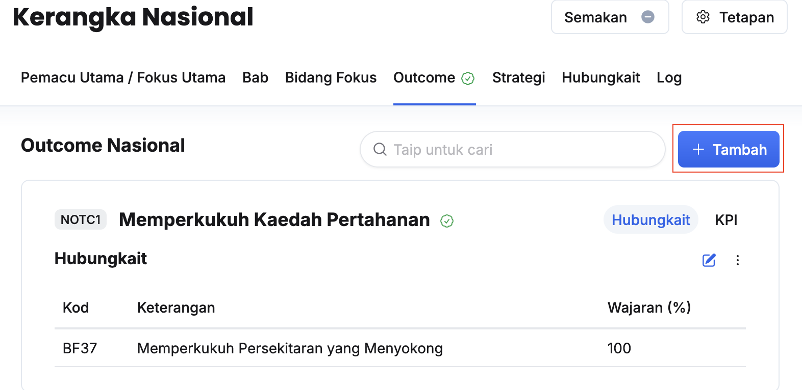
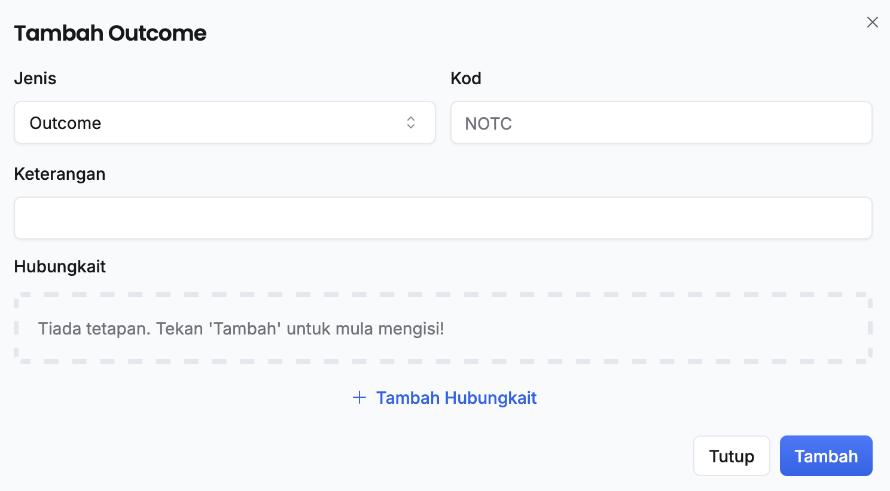
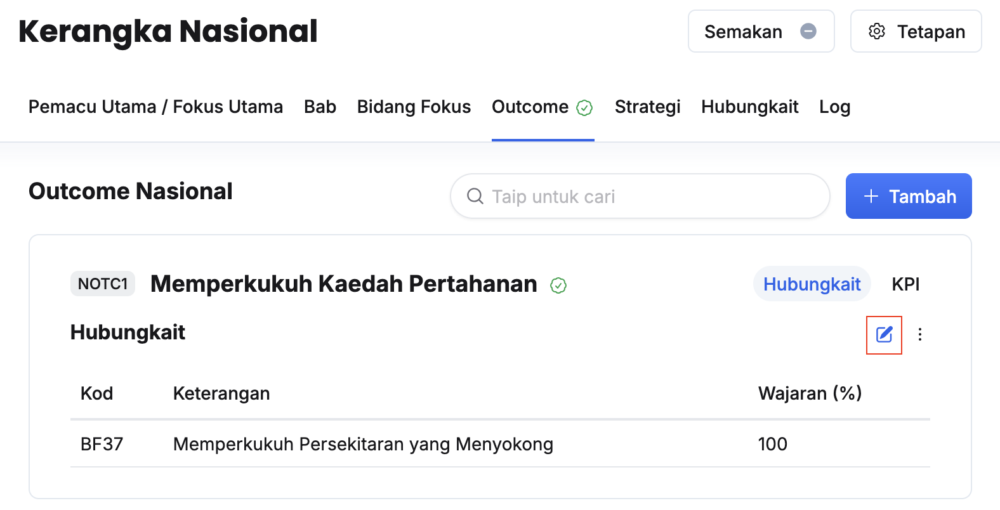
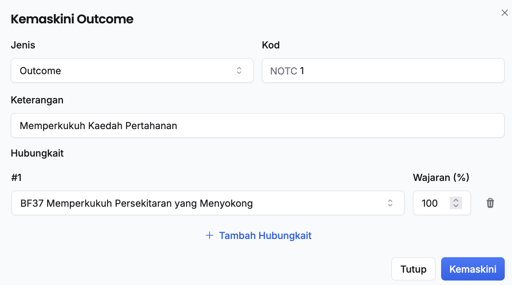
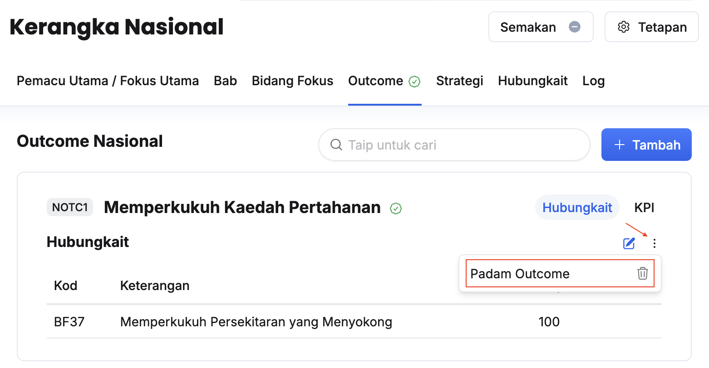

## Tambah Outcome Nasional Baharu
Peranan: Penyedia / Pelulus Nasional

Langkah:
1. Klik **Nasional** pada *Sidebar*
2. Klik pada tab **Outcome**

3. Klik butang **+ Tambah** 

4. Isikan maklumat dalam medan:
    * Jenis
    * Kod
    * Keterangan
5. Klik butang **+ Tambah Hubungkait**
6. Isikan maklumat dalam medan:
    * Hubungkait
    * Wajaran (%)
7. Ulang langkah 5-6 sekiranya terdapat lebih daripada satu Hubungkait
8. Klik butang **Tambah** di sudut kanan bawah paparan
9. Pastikan outcome baharu telah tersenarai

<Callout title="Outcome">
Outcome nasional baharu berjaya ditambahkan dan sedia untuk penyediaan KPI outcome
</Callout>

## Kemaskini Maklumat Outcome Nasional
Peranan: Penyedia / Pelulus Nasional

Langkah:
1. Klik **Nasional** pada *Sidebar*
2. Klik pada tab **Outcome**

3. Klik butang **Kemaskini** pada sudut kanan outcome yang berkaitan

4. Kemaskini:
    * Jenis
    * Kod
    * Keterangan
    * Hubungkait
5. Klik butang **Kemaskini**
6. Pastikan maklumat outcome yang berkaitan telah dikemaskini

<Callout title="Outcome">
Maklumat outcome yang berkaitan berjaya dikemaskini
</Callout>

## Padam Outcome Nasional
Peranan: Penyedia / Pelulus Nasional

Langkah:
1. Klik **Nasional** pada *Sidebar*
2. Klik pada tab **Outcome**

3. Klik butang **3 dots** pada sudut kanan outcome yang berkaitan
4. Klik butang **Padam Outcome**
5. Klik butang **Teruskan** pada paparan seterusnya
6. Pastikan outcome yang berkaitan telah dipadamkan

<Callout title="Outcome">
Outcome yang berkaitan berjaya dipadamkan
</Callout>