## Tambah Outcome Program
### Salin Terdahulu
Peranan: Penyedia Program / Pengurus Program

Langkah:
1. Klik **Program** pada *Sidebar*
2. Pilih program yang berkaitan
3. Klik tab **Outcome**
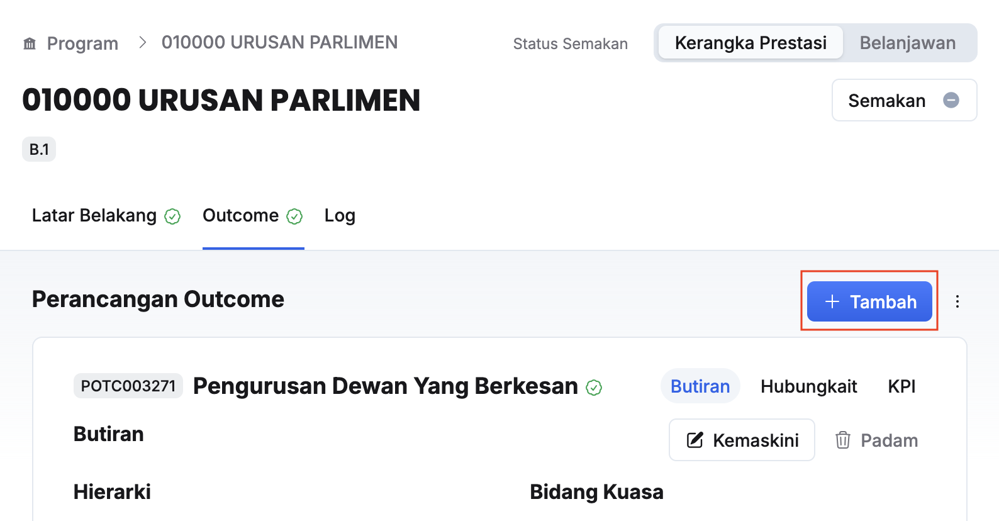
4. Klik butang **+ Tambah**
5. Klik butang **Salin data terdahulu**
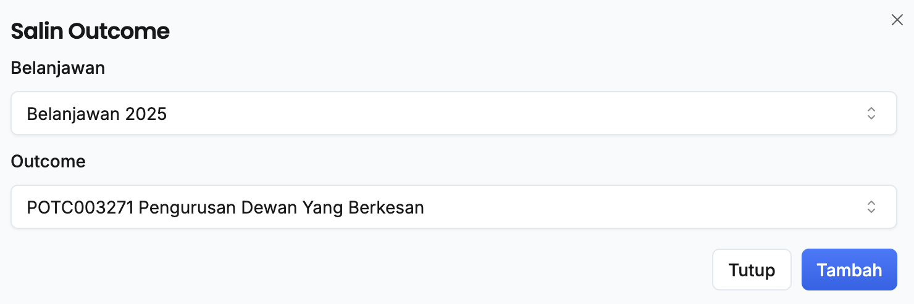
6. Pilih:
    * Belanjawan 
    * Outcome
7. Klik **Tambah**
8. Pastikan outcome yang berkaitan telah tersenarai

<Callout title="Outcome">
Outcome berjaya ditambahkan
</Callout>

### Tambah Baharu
Peranan: Penyedia Program / Pengurus Program

Langkah:
1. Klik **Program** pada *Sidebar*
2. Pilih program yang berkaitan
3. Klik tab **Outcome**

4. Klik butang **+ Tambah**
5. Klik butang **Tambah baharu**
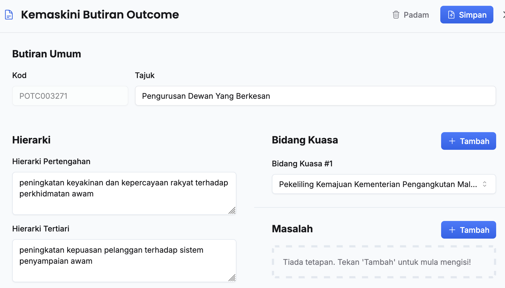
6. Isikan maklumat **Butiran Umum** dalam medan:
    * Tajuk
    * Hierarki Pertengahan
    * Hierarki Tertiari
    * Hierarki Impak
7. Klik butang **+ Tambah** dan buat pilihan untuk:
    * Bidang Kuasa
    * Masalah
    * Keperluan
8. Ulang langkah 7 sekiranya terdapat lebih daripada satu *Bidang Kuasa / Masalah / Keperluan* yang berkaitan
9. Klik butang **+ Tambah** pada sudut kanan tajuk **Analisis Kesan Negatif**
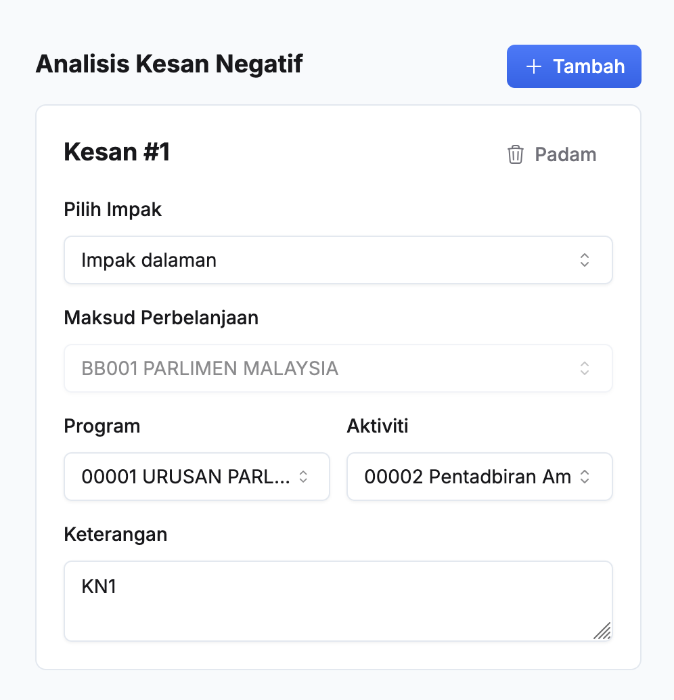
10. Isikan maklumat **Kesan Negatif** dalam medan:
    * Pilih Impak
    * Maksud Perbelanjaan
    * Program
    * Aktiviti
    * Keterangan
11. Ulang langkah 9-10 sekiranya terdapat lebih daripadu satu kesan negatif
12. Klik butang **+ Tambah** pada sudut kanan tajuk **Risiko & Andaian**
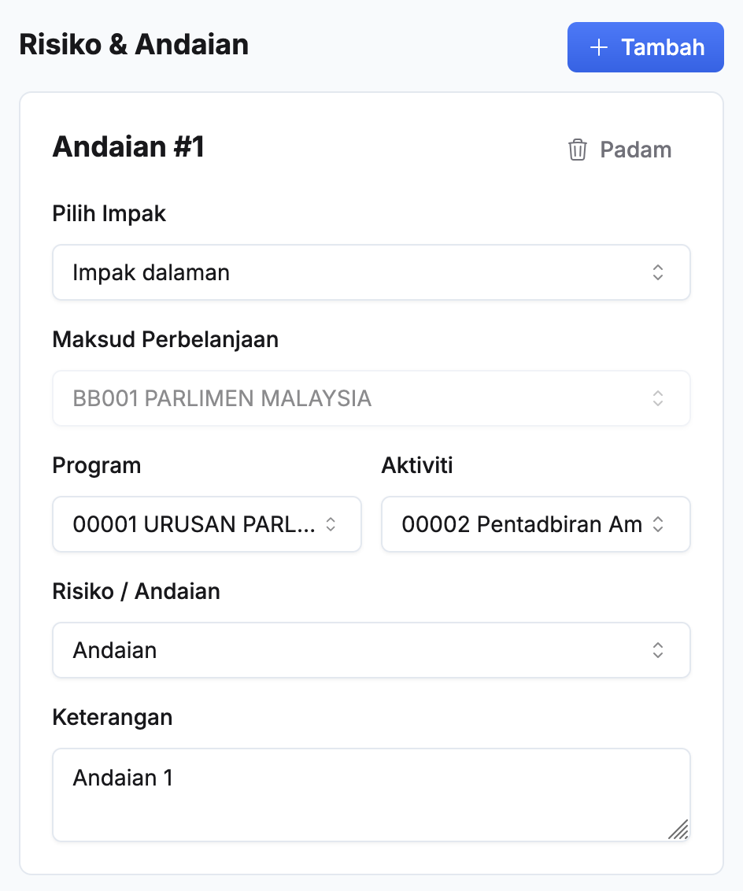
13. Isikan maklumat **Risiko & Andaian** dalam medan:
    * Pilih Impak
    * Maksud Perbelanjaan
    * Program
    * Aktiviti
    * Risiko / Andaian
    * Keterangan
14. Ulang langkah 12-13 sekiranya terdapat lebih daripada satu risiko/andaian 
15. Klik butang **Simpan**
16. Pastikan outcome baharu telah tersenarai

<Callout title="Outcome">
Outcome baharu berjaya ditambahkan
</Callout>

### Kemaskini Butiran Outcome Nasional
Peranan: Penyedia Program / Pengurus Program

Langkah:
1. Klik **Program** pada *Sidebar*
2. Pilih program yang berkaitan
3. Klik tab **Outcome**
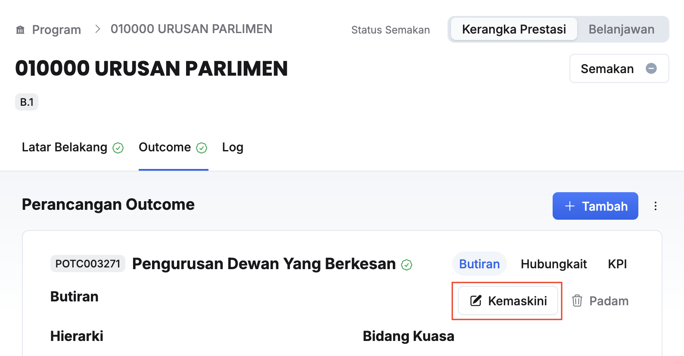
4. Klik butang **Kemaskini**

5. Kemaskini **Butiran Umum**:
    * Tajuk
    * Hierarki Pertengahan
    * Hierarki Tertiari
    * Hierarki Impak
    * Bidang Kuasa 
    * Masalah 
    * keperluan
    
6. Kemaskini **Kesan Negatif**:
    * Pilih Impak
    * Maksud Perbelanjaan
    * Program
    * Aktiviti
    * Keterangan 
    
7. Kemaskini Risiko & Andaian:
    * Pilih Impak
    * Maksud Perbelanjaan
    * Program
    * Aktiviti
    * Risiko / Andaian
    * Keterangan 

<Callout title="Outcome">
Butiran outcome berjaya dikemaskini
</Callout>

## Pemetaan Outcome Program kepada Outcome MP
Peranan: Penyedia Program / Pengurus Program

<Callout title="Pra-syarat" type="warn">
Penyediaan outcome kementerian telah selesai
</Callout>

Langkah:
1. Klik **Program** pada *Sidebar*
2. Pilih program yang berkaitan
3. Klik tab **Outcome**
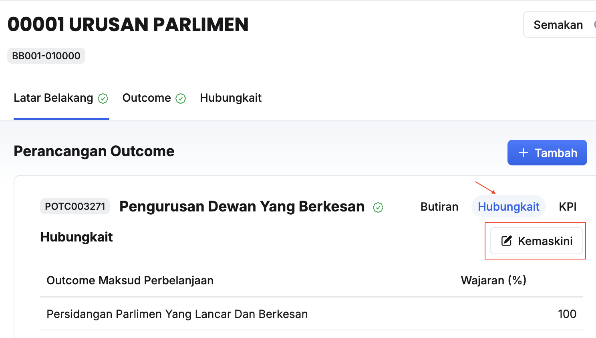
4. Klik **Hubungkait** pada outcome yang berkaitan
5. Klik butang **Kemaskini** 
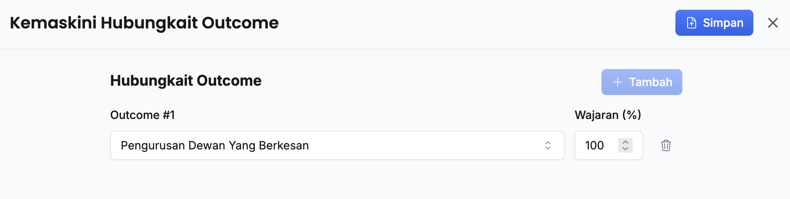
6. Kemaskini:
    * Outcome
    * Wajaran (%)
7. Pastikan jumlah wajaran adalah 100%
8. Klik butang **Simpan**
9. Pastikan hubungkait outcome telah dikemaskini

<Callout title="Outcome">
Pemetaan outcome program kepada outcome kementerian telah selesai, proses penyediaan outcome aktiviti boleh bermula
</Callout>

# Ubah Susunan Outcome Program
Peranan: Penyedia / Pengurus Program

Langkah:
1. Klik **Program** pada *Sidebar*
2. Pilih program yang berkaitan
3. Klik tab **Outcome**
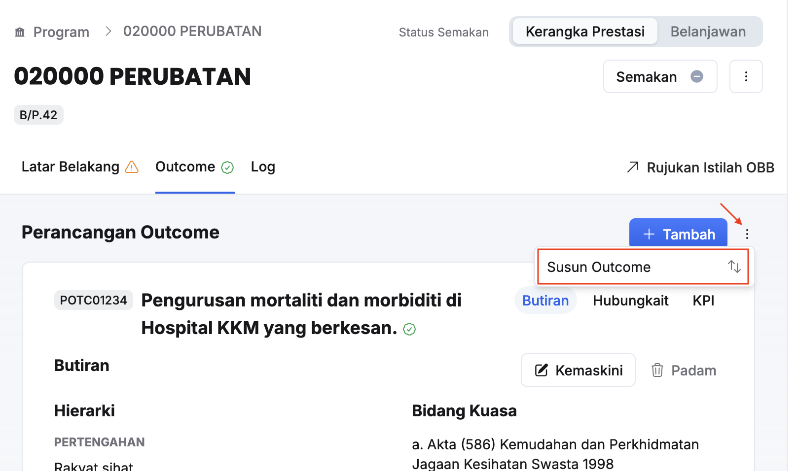
4. Klik butang **3 dots**
5. Klik **Susun Outcome**
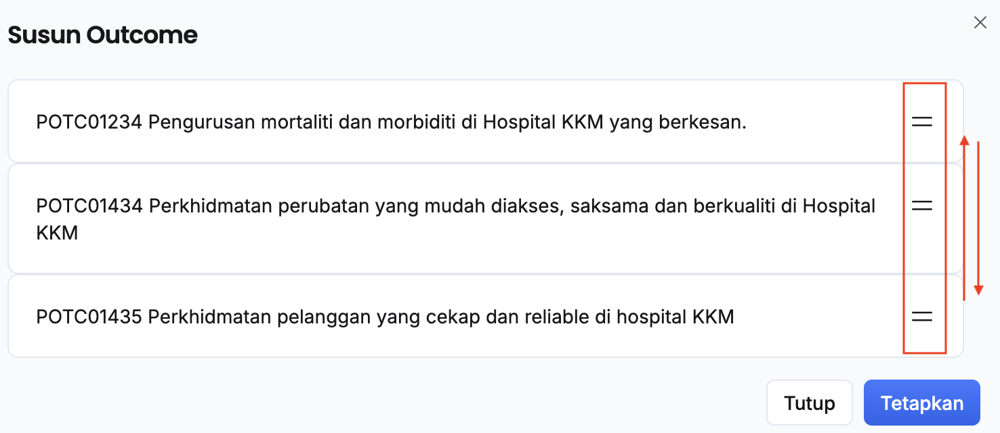
6. Ubah susunan outcome melalui kaedah _Drag and Drop_
7. Klik butang **Tetapkan**

<Callout title="Outcome">
Susunan outcome berjaya dikemaskini
</Callout>

## Padam Outcome Program
Peranan: Penyedia Program / Pengurus Program

Langkah:
1. Klik **Program** pada *Sidebar*
2. Pilih program yang berkaitan
3. Klik tab **Outcome**
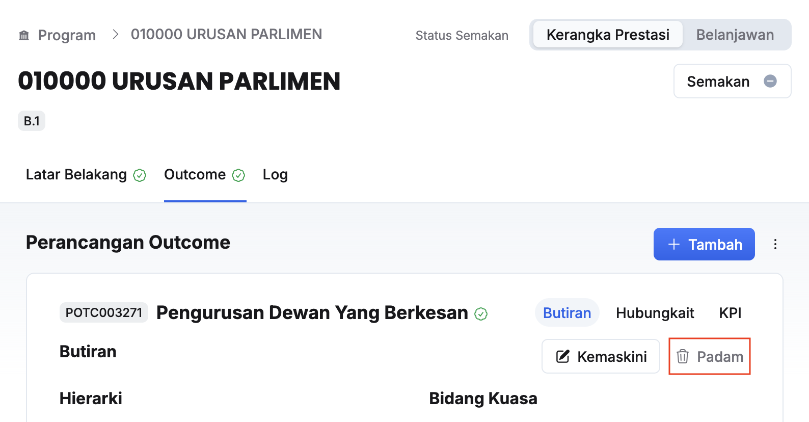
4. Klik butang **Kemaskini** pada outcome yang berkaitan
5. Klik butang **Teruskan** pada paparan **Padam Outcome**
6. Pastikan outcome yang berkaitan berjaya dipadamkan

<Callout title="Outcome">
Outcome berjaya dipadamkan
</Callout>