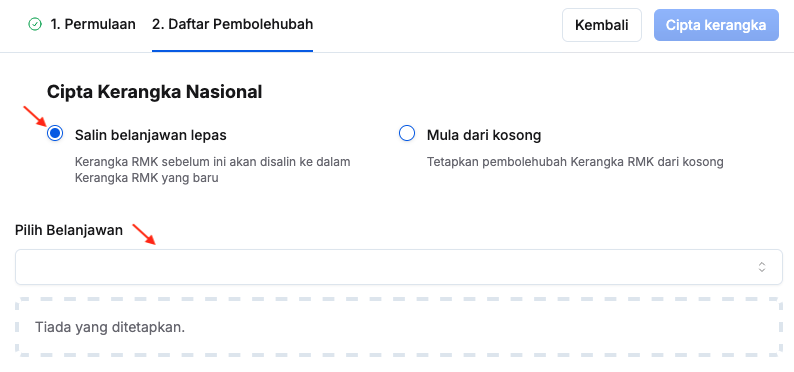

## Tetapan Awal Kerangka Nasional - Salin RMK Belanjawan Lepas
Peranan: Penyedia / Pelulus Nasional

Langkah:
1. Klik **Nasional** pada *Sidebar*

2. Klik butang **Teruskan**
3. Pilih **Salin belanjawan lepas**

4. **Pilih Belanjawan** yang berkaitan dan pastikan maklumat RMK tersenarai
5. Klik butang **Cipta kerangka**
6. Klik butang **Teruskan** pada paparan **Teruskan mencipta Kerangka Nasional**

<Callout title="Outcome">
Maklumat RMK berjaya disalin dan sedia untuk penyediaan outcome nasional
</Callout>

## Tetapan Awal Kerangka Nasional - RMK Baharu
### Tetapan Rangkaian RMK
Peranan: Penyedia / Pelulus Nasional

Langkah:
1. Klik **Nasional** pada *Sidebar*

2. Klik butang **Teruskan**
3. Pilih **Mula dari kosong**

4. Klik butang **+ Tambah** pada sudut kanan tajuk **Pembolehubah Baharu**
5. Isikan maklumat dalam medan:
    * Perkara
    * Kod Prefix
    * Peringkat
6. Klik butang **+ Tambah** dan ulang langkah 5 sehingga selesai mengunci masuk rangkaian RMK yang berkaitan

7. Isikan maklumat dalam medan **Peringkat** pada **Outcome Nasional**
8. Klik butang **Cipta kerangka**
9. Klik butang **Teruskan** pada paparan **Teruskan mencipta Kerangka Nasional**

<Callout title="Outcome">
Rangkaian RMK berjaya ditetapkan
</Callout>

### Penyediaan dan Pemetaan Rangkaian RMK
Peranan: Penyedia / Pelulus Nasional

<Callout title="Pra-syarat" type="warn"> 
Rangkaian RMK telah ditetapkan
</Callout>

**[Peringkat Pertama]**

Langkah:
1. Klik **Nasional** pada *Sidebar*
2. Klik pada tab peringkat yang pertama

3. Klik butang **+ Tambah** pada sudut kanan atas

4. Isikan maklumat dalam medan:
    * Jenis
    * Kod
    * Keterangan
5. Klik butang **Tambah**
6. Pastikan pemacu perubah yang berkaitan telah tersenarai

**[Peringkat Seterusnya]**

Langkah:
1. Klik **Nasional** pada *Sidebar*
2. Klik pada tab peringkat yang berkaitan

3. Klik butang **+ Tambah** pada sudut kanan atas

4. Isikan maklumat dalam medan:
    * Jenis
    * Kod
    * Keterangan
5. Klik butang **+ Tambah Hubungkait**
6. Pilih **Hubungkait** untuk pemetaan kepada pemacu perubah peringkat satu tahap di atas
7. Ulang langkah 5-6 sekiranya terdapat lebih daripadu satu hubungkait
8. Klik butang **Tambah**
9. Pastikan pemacu perubah yang berkaitan telah tersenarai

<Callout title="Outcome">
Maklumat RMK berjaya ditetapkan dan sedia untuk penyediaan outcome nasional
</Callout>

## Kemaskini Maklumat RMK
Peranan: Penyedia / Pelulus Nasional

Langkah:
1. Klik **Nasional** pada *Sidebar*
2. Klik pada tab peringkat yang berkaitan

3. Klik butang **Kemaskini** pada sudut kanan perkara yang berkaitan

4. Kemaskini:
    * Jenis
    * Kod
    * Keterangan
    * Hubungkait
5. Klik butang **Kemaskini**
6. Pastikan maklumat RMK yang berkaitan telah dikemaskini

<Callout title="Outcome">
Maklumat RMK berjaya dikemaskini
</Callout>

## Padam Maklumat RMK
Peranan: Penyedia / Pelulus Nasional

Langkah:
1. Klik **Nasional** pada *Sidebar*

2. Klik pada tab peringkat yang berkaitan
3. Klik butang **Padam** pada sudut kanan perkara yang berkaitan
4. Klik butang **Padam** 
5. Pastikan maklumat RMK yang berkaitan telah dipadamkan

<Callout title="Outcome">
Maklumat RMK berjaya dipadamkan
</Callout>

