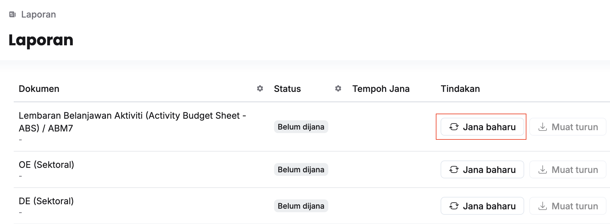
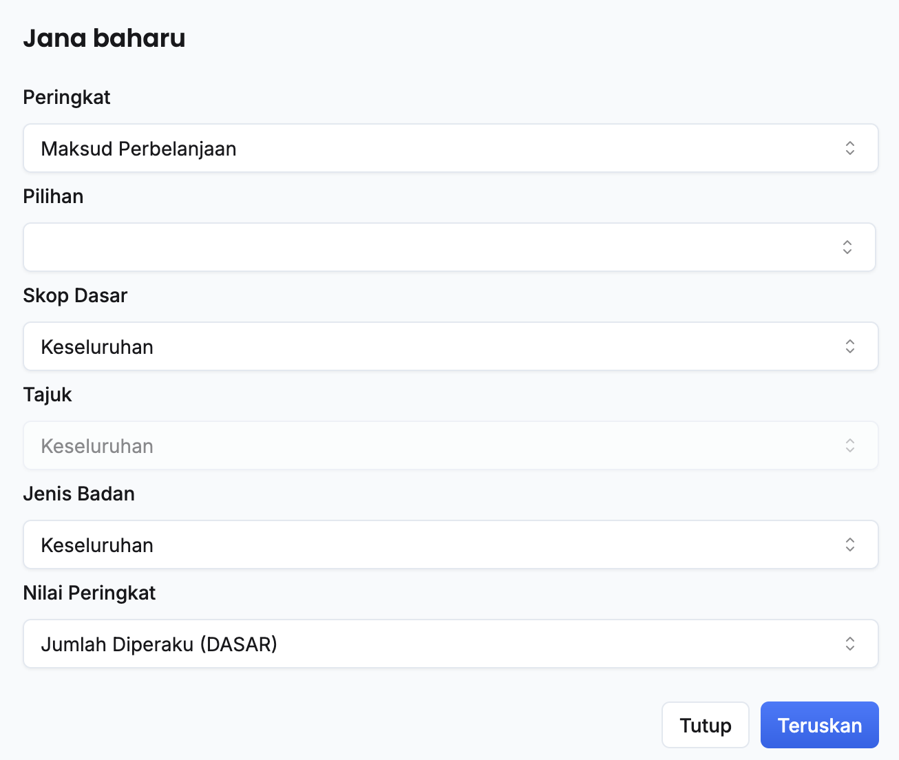
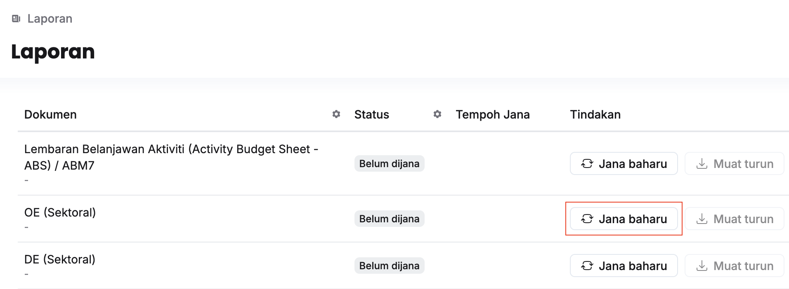

## Jana Laporan Lembaran Belanjawan Aktiviti *(Activity Budget Sheet - ABS)* / ABM7

Langkah:
1. Klik **Laporan** pada *Sidebar*

2. Klik **Jana baharu** pada sudut kanan **Lembaran Belanjawan Aktiviti *(Activity Budget Sheet - ABS)* / ABM7**

3. Isikan maklumat dalam medan:
    * Peringkat
    * Pilihan
    * Skop Dasar
    * Tajuk
    * Jenis Badan
    * Nilai Peringkat
4. Klik butang **Teruskan**
5. Klik butang **Muat turun** selepas status menunjukkan **Selesai**

<Callout title="Outcome">
Laporan berjaya dijana 
</Callout>

## Jana Laporan Lain-lain
Langkah:
1. Klik **Laporan** pada *Sidebar*

2. Klik **Jana baharu** pada sudut kanan dokumen yang berkaitan
3. Klik butang **Teruskan**
4. Klik butang **Muat turun** selepas status menunjukkan **Selesai**

<Callout title="Outcome">
Laporan berjaya dijana
</Callout>