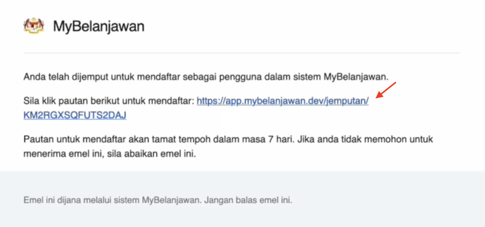
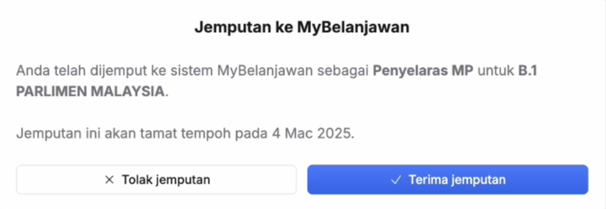
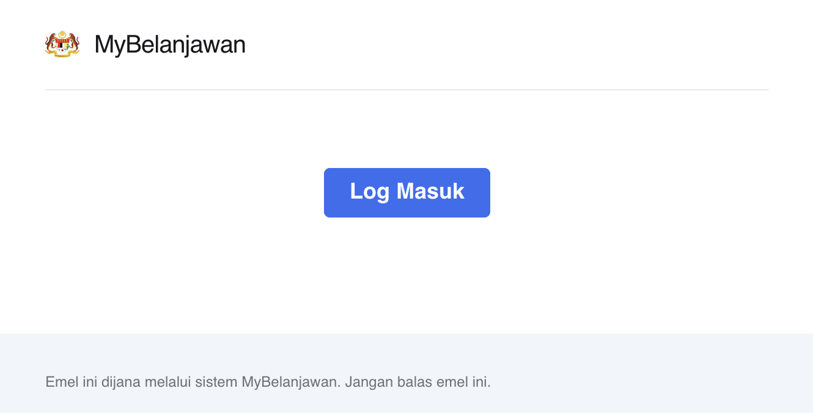
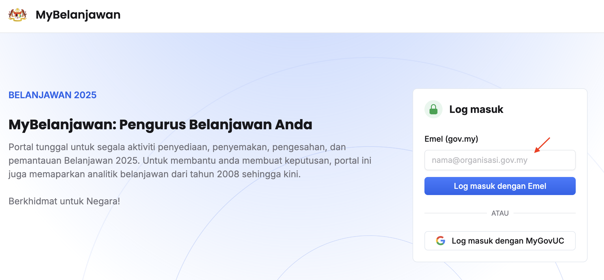
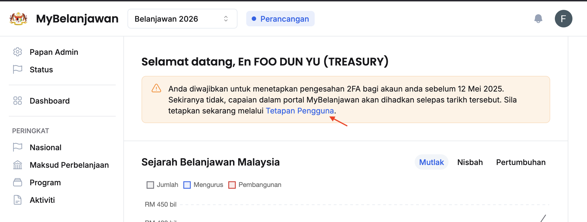
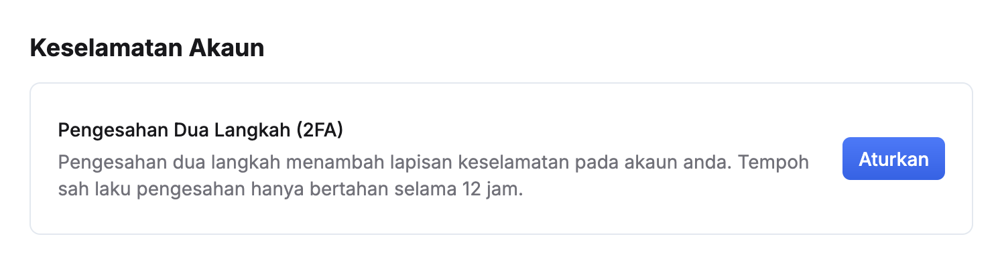
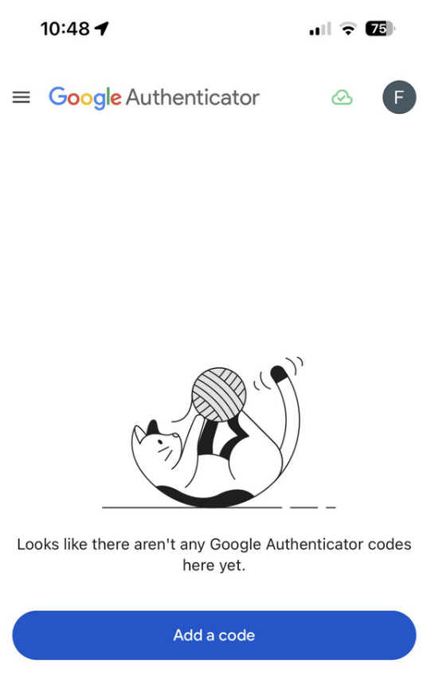
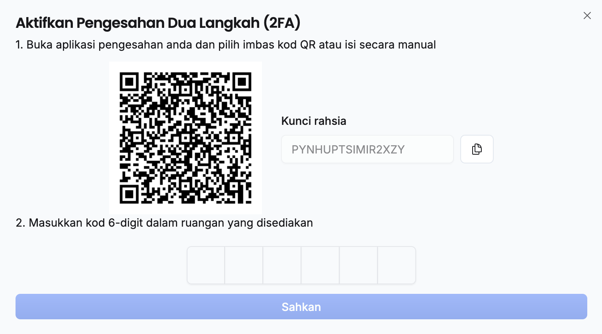
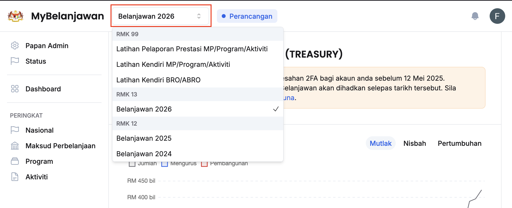

## Terima Jemputan dan Log Masuk Kali Pertama
Langkah:
1. Buka emel **Jemputan Pendaftaran di MyBelanjawan** dan klik pautan dalam emel tersebut

2. Klik **Terima Jemputan**

3. Isikan **Gelaran** dan **Nama**
4. Klik butang **Daftar**
5. Balik kepada peti emel dan buka emel **Log Masuk ke MyBelanjawan**
6. Klik butang **Log Masuk**

<Callout title="Outcome">
Anda berjaya terima jemputan dan log masuk ke dalam sistem MyBelanjawan
</Callout>

## Log Masuk Biasa
Langkah:
1. Isikan emel anda pada medan **Emel (gov.my)**

2. Klik butang **Log masuk dengan Emel**
3. Buka emel **Log Masuk ke MyBelanjawan** pada peti emel
4. Klik butang **Log Masuk**

<Callout title="Outcome">
Anda berjaya log masuk ke dalam sistem MyBelanjawan
</Callout>

## Penetapan 2FA
<Callout title="Pra-Syarat" type="warn">
Sila muat turun aplikasi _Google Authenticator_ pada _Google Play Store_ ataupun _Apple App Store_ pada telefon bimbit anda
* https://play.google.com/store/apps/details?id=com.google.android.apps.authenticator2&hl=en
* https://apps.apple.com/us/app/google-authenticator/id388497605
</Callout>

Langkah:
1. Klik **Tetapan Pengguna**

2. Klik butang **Aturkan** pada sudut kanan **Pengesahan Dua Langkah (2FA)**

3. Buka aplikasi _**Google Authenticator**_ pada telefon
4. Klik butang _**Add a code**_ dan klik _**Scan a QR code**_

5. Imbas kod QR  

6. Masukkan kod 6-digit dalam ruang yang disediakan
7. Klik butang **Sahkan**
8. Simpan kod pemulihan yang dipaparkan
9. Klik butang **Tutup**

<Callout title="Outcome">
Anda telah berjaya menetapkan 2FA pada akaun anda 
</Callout>

## Pilihan Tahun Belanjawan
Langkah:
1. Klik butang **Pilihan Belanjawan**

2. Pilih belanjawan yang berkaitan

<Callout title="Outcome">
Belanjawan yang berkaitan berjaya diakses
</Callout>