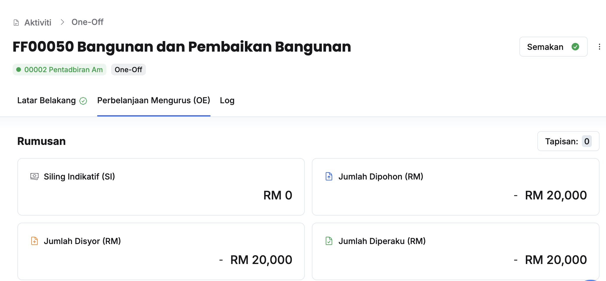
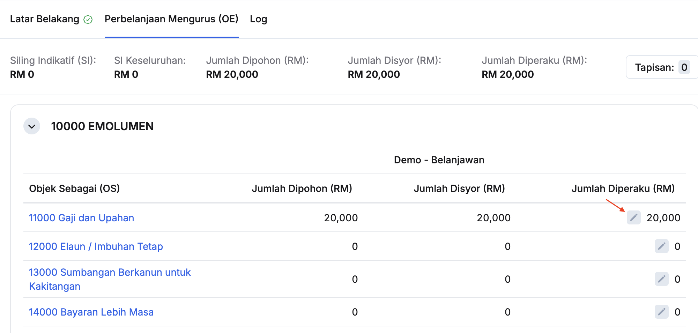
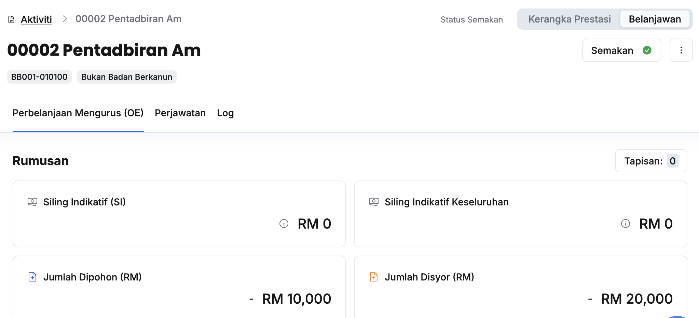
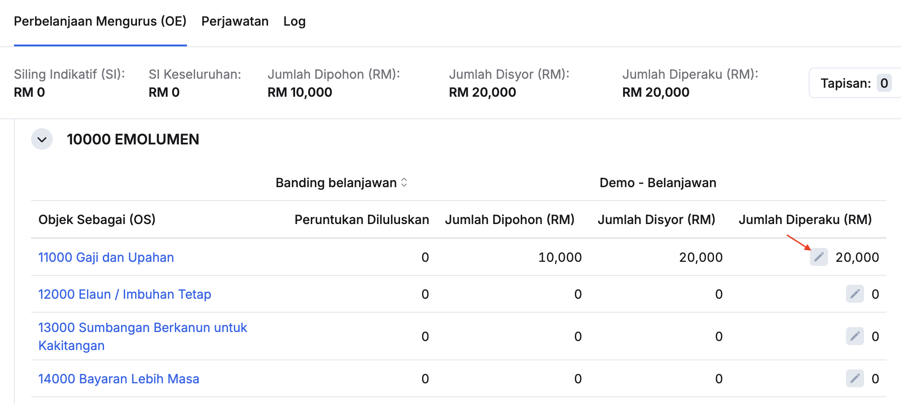

## Penyediaan Jumlah Diperaku Tajuk (PK/DB/OO/KK)
Peranan: Dasar

<Callout title="Pra-syarat" type="warn">
TPBN Sektor telah membuat semakan dan memberikan kelulusan
</Callout>

Langkah:
1. Klik **Aktiviti** pada *Sidebar*
2. Klik pada tajuk yang berkaitan

3. Klik pada tab **Perbelanjaan Mengurus (OE)**

4. Klik butang **Kemaskini** dan kunci masuk **Jumlah Diperaku** pada Objek Sebagai yang berkaitan

<Callout title="Outcome">
* Jumlah diperaku pada tajuk aktiviti berjaya dimasukkan
</Callout>

## Penyediaan Jumlah Diperaku Aktiviti
Peranan: Dasar

<Callout title="Pra-syarat" type="warn">
TPBN Sektor telah membuat semakan dan memberikan kelulusan
</Callout>

Langkah:
1. Klik **Aktiviti** pada *Sidebar*
2. Klik pada aktiviti yang berkaitan

3. Klik **Belanjawan** pada sudut kanan atas halaman aktiviti

4. Klik butang **Kemaskini** dan kunci masuk **Jumlah Diperaku** pada Objek Sebagai yang berkaitan

<Callout title="Outcome">
* Jumlah diperaku pada aktiviti berjaya dimasukkan
</Callout>

## Perakuan Bilangan Perjawatan Aktiviti
Peranan: Dasar

<Callout title="Pra-syarat" type="warn">
TPBN Sektor telah membuat semakan dan memberikan kelulusan
</Callout>

Langkah:
1. Klik **Aktiviti** pada *Sidebar*
2. Klik pada aktiviti yang berkaitan
3. Klik **Belanjawan** pada sudut kanan atas halaman aktiviti
4. Klik pada tab **Perjawatan**

5. Klik butang **Kemaskini** dan kunci masuk **Bilangan Perjawatan** pada Kumpulan Perkhidmatan yang berkaitan

<Callout title="Outcome">
* Bilangan perjawatan aktiviti berjaya dikemaskini 
</Callout>