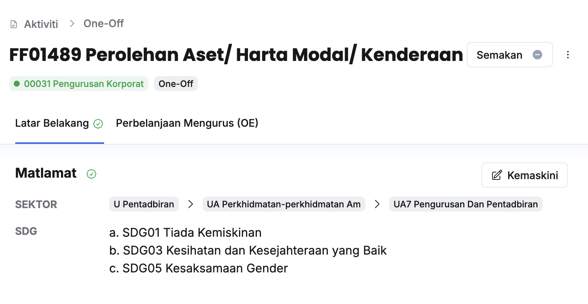
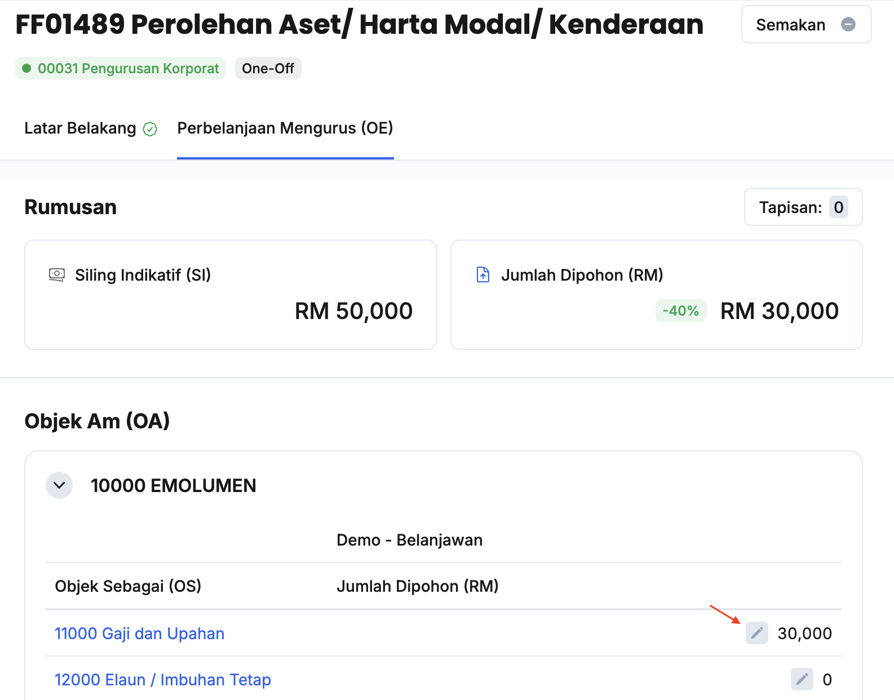
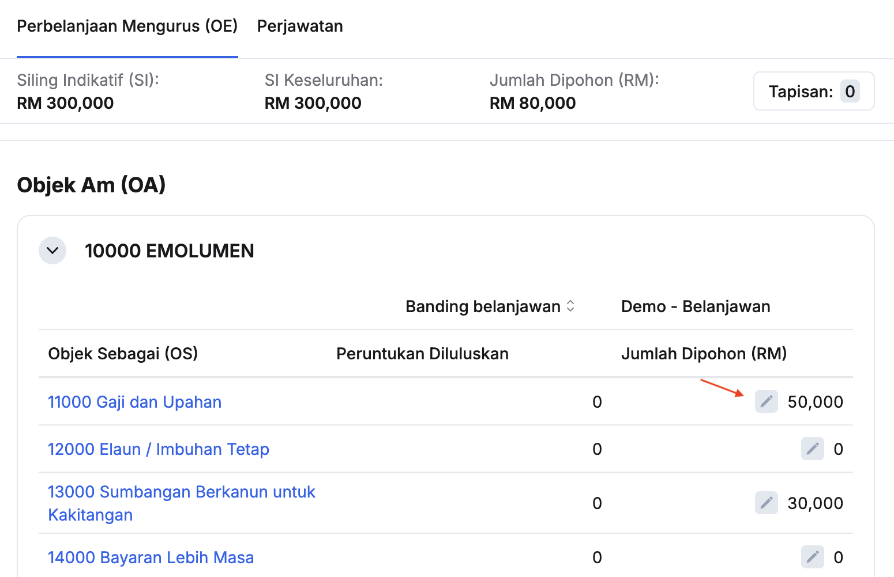
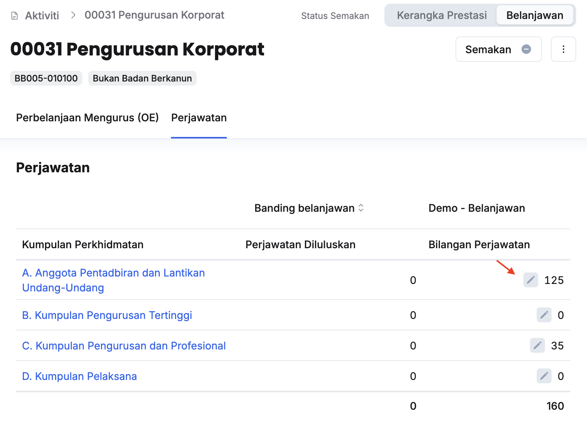

## Penyediaan Jumlah Dipohon Tajuk (PK/DB/OO/KK)
Peranan: Penyedia/Ketua Aktiviti  

Langkah:
1. Klik **Aktiviti** pada *Sidebar*
2. Klik pada tajuk yang berkaitan

3. Pastikan sekurang-kurangnya satu SDG telah dimasukkan untuk butiran tajuk. Kemaskini sekiranya perlu
4. Klik pada tab **Perbelanjaan Mengurus (OE)**

5. Klik butang **Kemaskini** dan kunci masuk **Jumlah Dipohon** pada Objek Sebagai yang berkaitan
6. Pastikan **Jumlah Dipohon** pada rumusan tidak melebihi **Siling Indikatif** yang diagihkan, sekiranya ada

<Callout title="Outcome"> 
Jumlah dipohon pada tajuk aktiviti berjaya dimasukkan
</Callout>

---

## Penyediaan Jumlah Dipohon Aktiviti
Peranan: Penyedia/Ketua Aktiviti  

Langkah:
1. Klik **Aktiviti** pada *Sidebar*
2. Klik pada aktiviti yang berkaitan
3. Klik **Belanjawan** pada sudut kanan atas halaman aktiviti

4. Klik butang **Kemaskini** dan kunci masuk **Jumlah Dipohon** pada Objek Sebagai yang berkaitan

5. Pastikan **Jumlah Dipohon** pada rumusan tidak melebihi **Siling Indikatif** yang diagihkan, sekiranya ada

<Callout title="Outcome"> 
Jumlah dipohon pada aktiviti berjaya dimasukkan
</Callout>

---

## Permohonan Bilangan Perjawatan Aktiviti
Peranan: Penyedia/Ketua Aktiviti  

Langkah:
1. Klik **Aktiviti** pada *Sidebar*
2. Klik pada aktiviti yang berkaitan
3. Klik **Belanjawan** pada sudut kanan atas halaman aktiviti
4. Klik pada tab **Perjawatan**

5. Klik butang **Kemaskini** dan kunci masuk **Bilangan Perjawatan** pada Kumpulan Perkhidmatan yang berkaitan

<Callout title="Outcome"> 
Bilangan perjawatan aktiviti berjaya dimasukkan
</Callout>