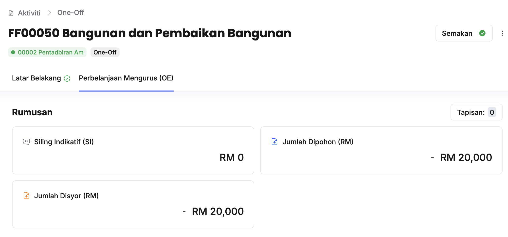
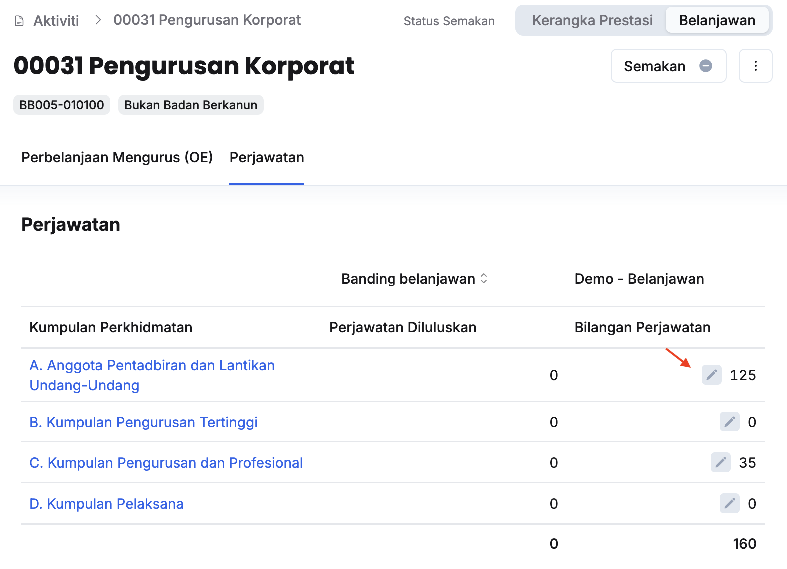

## Penyediaan Jumlah Disyor Tajuk (PK/DB/OO/KK)
Peranan: ABRO/BRO

<Callout title="Pra-syarat" type="warn">
Pegawai Pengawal telah membuat semakan dan memberikan kelulusan
</Callout>

Langkah:
1. Klik **Aktiviti** pada *Sidebar*
2. Klik pada tajuk yang berkaitan

3. Klik pada tab **Perbelanjaan Mengurus (OE)**

4. Klik butang **Kemaskini** dan kunci masuk **Jumlah Disyor** pada Objek Sebagai yang berkaitan

<Callout title="Outcome">
Jumlah disyor pada tajuk aktiviti berjaya dimasukkan
</Callout>

## Penyediaan Jumlah Disyor Aktiviti
Peranan: ABRO/BRO

<Callout title="Pra-syarat" type="warn">
Pegawai Pengawal telah membuat semakan dan memberikan kelulusan
</Callout>

Langkah:
1. Klik **Aktiviti** pada *Sidebar*
2. Klik pada aktiviti yang berkaitan

3. Klik **Belanjawan** pada sudut kanan atas halaman aktiviti

4. Klik butang **Kemaskini** dan kunci masuk **Jumlah Disyor** pada Objek Sebagai yang berkaitan

<Callout title="Outcome">
Jumlah disyor pada aktiviti berjaya dimasukkan
</Callout>

## Pengesyoran Bilangan Perjawatan Aktiviti
Peranan: ABRO/BRO

<Callout title="Pra-syarat" type="warn">
Pegawai Pengawal telah membuat semakan dan memberikan kelulusan
</Callout>

Langkah:
1. Klik **Aktiviti** pada *Sidebar*
2. Klik pada aktiviti yang berkaitan
3. Klik **Belanjawan** pada sudut kanan atas halaman aktiviti

4. Klik pada tab **Perjawatan**
5. Klik butang **Kemaskini** dan kunci masuk **Bilangan Perjawatan** pada Kumpulan Perkhidmatan yang berkaitan

<Callout title="Outcome">
Bilangan perjawatan aktiviti berjaya dikemaskini
</Callout>