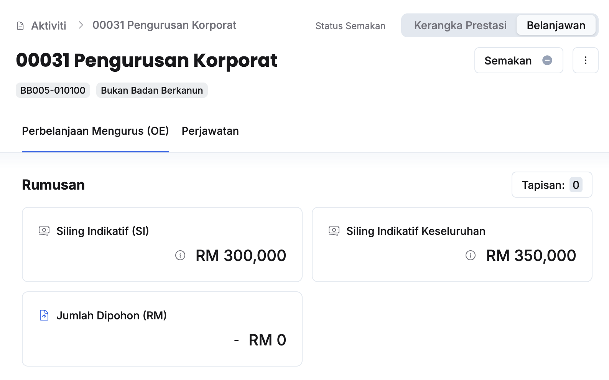

## Permohonan Semakan kepada Ketua Aktiviti
Peranan: Penyedia Aktiviti  

<Callout title="Pra-syarat" type="warn"> 
1. Jumlah dipohon aktiviti telah dimasukkan dan tidak melebihi siling indikatif
2. Bilangan perjawatan telah dimasukkan
</Callout>

Langkah:
1. Klik **Aktiviti** pada *Sidebar*
2. Pilih aktiviti yang berkaitan
3. Klik **Belanjawan** pada sudut kanan atas halaman aktiviti

4. Klik butang **Semakan** 
5. Klik butang **Maklum semak**
6. Pastikan mesej **Berjaya** dipaparkan di bawah halaman

<Callout title="Outcome">
Ketua Aktiviti akan menerima notifikasi dalam sistem untuk membuat semakan
</Callout>

## Semakan Aktiviti
Peranan: Ketua Aktiviti

<Callout title="Pra-syarat" type="warn"> 
1. Jumlah dipohon aktiviti telah dimasukkan dan tidak melebihi siling indikatif
2. Bilangan perjawatan telah dimasukkan
</Callout>

Langkah:
1. Klik **Aktiviti** pada *Sidebar*
2. Pilih aktiviti yang berkaitan
3. Klik **Belanjawan** pada sudut kanan atas halaman aktiviti

4. Klik butang **Semakan** 
5. Kunci masuk **Keterangan** dan klik **Luluskan**
6. Klik butang **Kemaskini**
7. Klik butang **Luluskan** 
8. Pastikan status semakan telah dikemaskini kepada **Luluskan(Hijau)**

<Callout title="Outcome">
Penyedia Aktiviti, Penyedia dan Pengurus Program akan menerima notifikasi selepas kelulusan diberikan
</Callout>

## Mohon Pindaan Ketua Aktiviti
Peranan: Penyedia/Pengurus Program

<Callout title="Pra-syarat" type="warn"> 
Aktiviti yang berkaitan telah diluluskan
</Callout>

Langkah:
1. Klik **Aktiviti** pada *Sidebar*
2. Pilih aktiviti yang berkaitan
3. Klik **Belanjawan** pada sudut kanan atas halaman aktiviti

4. Klik butang **Semakan** 
5. Klik butang **Pembetulan** 
6. Kunci masuk **Keterangan** dan buat pilihan **Mohon Pindaan**
7. Klik butang **Kemaskini**
8. Klik butang **Teruskan** 
9. Pastikan status semakan telah dikemaskini kepada status **Perlu pindaan (Oren)**

<Callout title="Outcome">
Penyedia dan Ketua Aktiviti akan menerima notifikasi untuk melakukan pindaan 
</Callout>