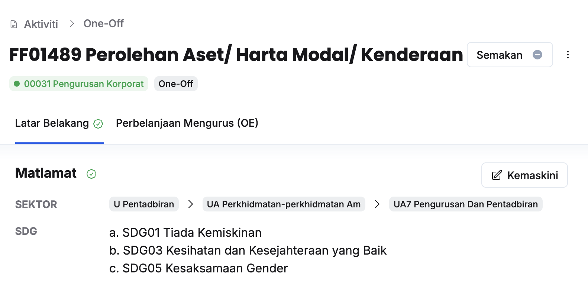

## Maklumkan Ketua Aktiviti untuk Melakukan Semakan kepada Tajuk
Peranan: Penyedia Aktiviti  

<Callout title="Pra-syarat" type="warn">
1. Latar belakang tajuk aktiviti PK/DB/OO/KK telah memenuhi syarat-syarat yang ditetapkan
2. Jumlah dipohon tajuk aktiviti telah dimasukkan dan tidak melebihi siling indikatif
</Callout>

Langkah:
1. Klik **Aktiviti** pada *Sidebar*
2. Pilih tajuk aktiviti yang berkaitan

3. Klik butang **Semakan** 
4. Klik butang **Maklum semak**
5. Pastikan mesej **Berjaya** dipaparkan di bawah halaman

<Callout title="Outcome">
Ketua Aktiviti akan menerima notifikasi dalam sistem untuk membuat semakan
</Callout>

---

## Semakan Tajuk PK/DB/OO/KK
Peranan: Ketua Aktiviti

<Callout title="Pra-syarat" type="warn">
1. Latar belakang tajuk aktiviti PK/DB/OO/KK telah memenuhi syarat-syarat yang ditetapkan
2. Jumlah dipohon tajuk aktiviti telah dimasukkan dan tidak melebihi siling indikatif
</Callout>

Langkah:
1. Klik **Aktiviti** pada *Sidebar*
2. Pilih tajuk aktiviti yang berkaitan

3. Klik butang **Semakan** 
4. Kunci masuk **Keterangan** dan buat pilihan untuk **Luluskan/Mohon Pindaan**
5. Klik butang **Kemaskini**
6. Klik butang **Luluskan** sekiranya **Luluskan** dipilih / butang **Teruskan** sekiranya **Mohon pindaan** dipilih
7. Pastikan status semakan telah dikemaskini kepada **Luluskan(Hijau)/Perlu pindaan(Oren)**

<Callout title="Outcome">
* Penyedia Aktiviti akan menerima notifikasi sekiranya pindaan diperlu
* Penyedia Aktiviti, Penyedia dan Pengurus Program akan menerima notifikasi sekiranya kelulusan diberikan
</Callout>

---

## Mohon Pindaan Ketua Aktiviti pada Tajuk PK/DB/OO/KK
Peranan: Penyedia/Pengurus Program

<Callout title="Pra-syarat" type="warn">
Tajuk aktiviti yang berkaitan telah diluluskan
</Callout>

Langkah:
1. Klik **Aktiviti** pada *Sidebar*
2. Pilih tajuk aktiviti yang berkaitan

3. Klik butang **Semakan** 
4. Klik butang **Pembetulan** 
5. Kunci masuk **Keterangan** dan buat pilihan **Mohon Pindaan**
6. Klik butang **Kemaskini**
7. Klik butang **Teruskan** 
8. Pastikan status semakan telah dikemaskini kepada status **Perlu pindaan (Oren)**

<Callout title="Outcome">
Penyedia dan Ketua Aktiviti akan menerima notifikasi untuk melakukan pindaan
</Callout>