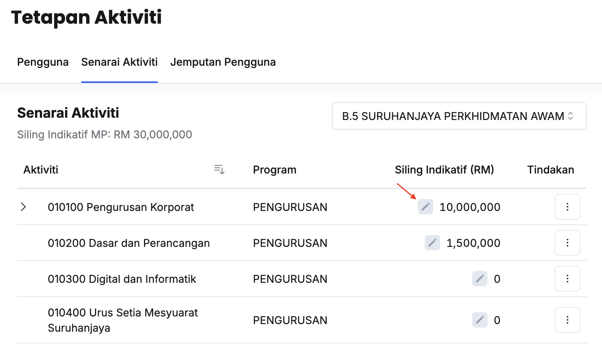

## Peringkat Kementerian
Peranan: Penyedia Syor Dasar

Langkah:
1. Klik **Maksud Perbelanjaan** pada *Sidebar*
2. Klik butang **Tetapan**
3. Klik tab **Senarai Maksud Perbelanjaan**

4. Klik butang **Kemaskini** dan kunci masuk **Siling Indikatif (RM)** pada Maksud Perbelanjaan yang berkaitan

<Callout title="Outcome"> 
Siling indikatif berjaya diagihkan kepada Kementerian masing-masing
</Callout>

---

## Peringkat Aktiviti
Peranan: Penyelaras MP  

<Callout title="Pra-syarat" type="warn">
Penyedia Syor Dasar telah melakukan agihan Siling Indikatif pada Maksud Perbelanjaan yang berkaitan
</Callout>

Langkah:
1. Klik **Maksud Perbelanjaan** pada *Sidebar*
2. Klik butang **Tetapan**
3. Klik tab **Senarai Maksud Perbelanjaan**

4. Klik butang **Kemaskini** dan kunci masuk **Siling Indikatif (RM)** pada Maksud Perbelanjaan yang berkaitan

<Callout title="Outcome"> 
Siling indikatif berjaya diagihkan kepada aktiviti Kementerian masing-masing
</Callout>
