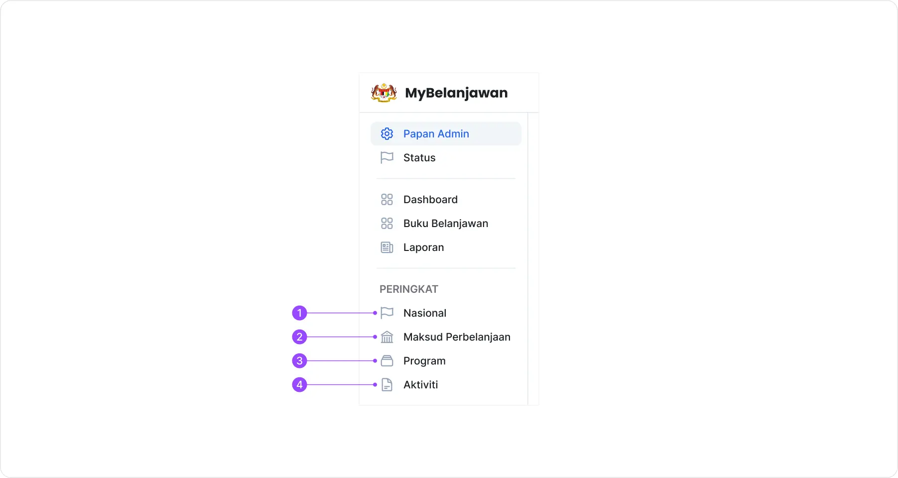
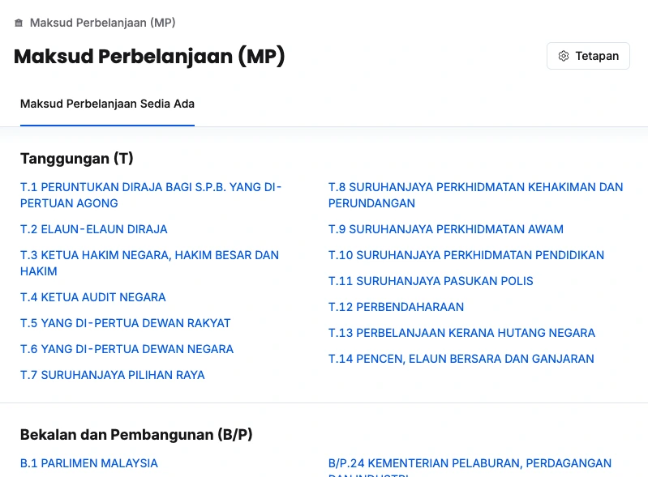
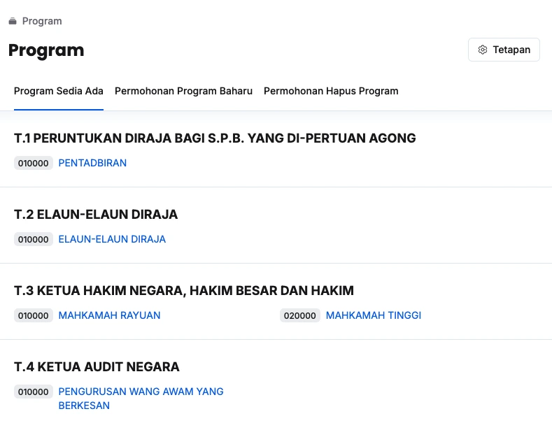
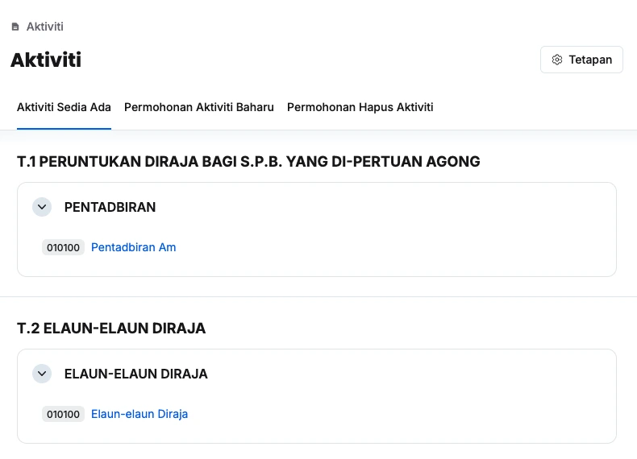
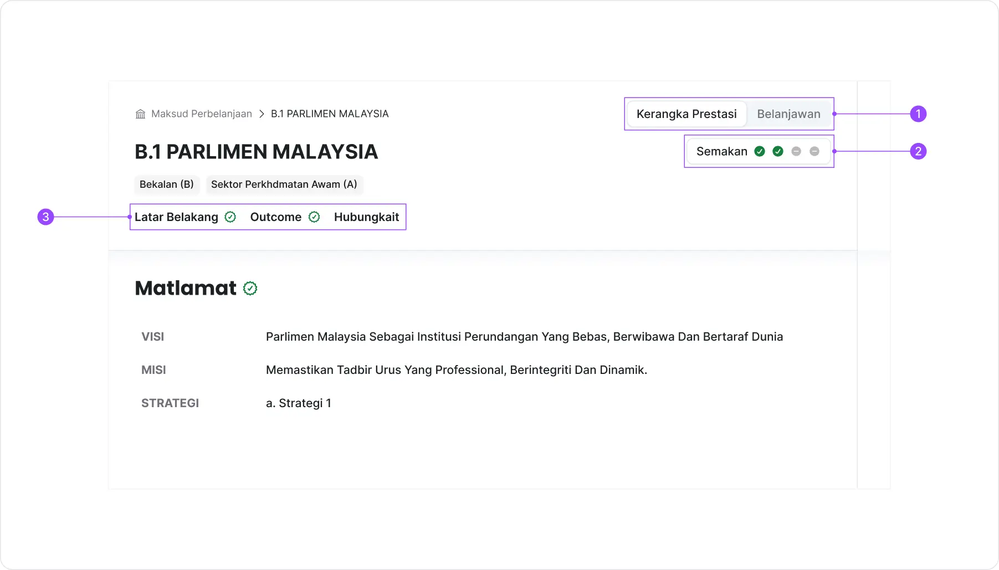
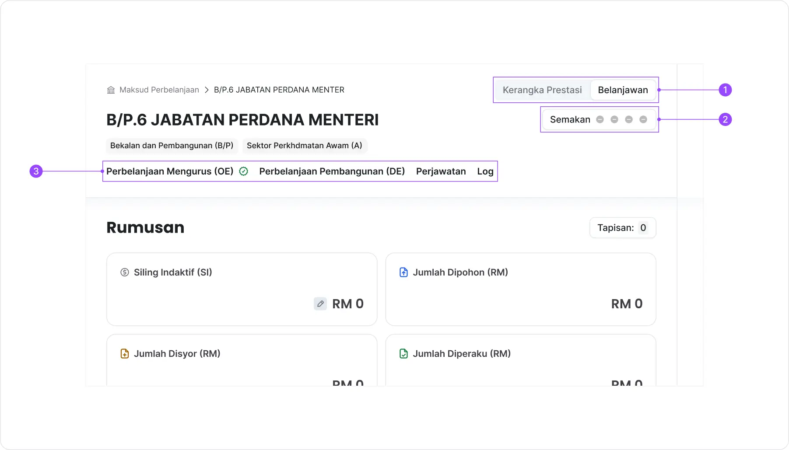
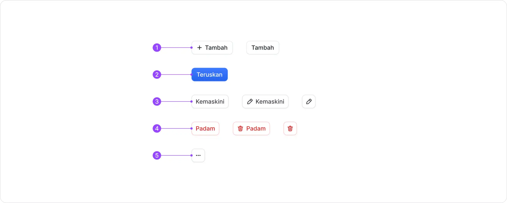

## Menu Samping (*Sidebar*)

Menu samping digunakan untuk akses kepada peringkat yang berkaitan:
1. Peringkat Nasional
2. Peringkat Kementerian
3. Peringkat Program
4. Peringkat Aktiviti

---

## Contoh Halaman Pilihan MP/Program/Aktiviti
### Maksud Perbelanjaan

### Program

### Aktiviti

---

## Contoh Halaman Penyediaan Kerangka Prestasi/Bajet
### Kerangka Prestasi

1. Butang **Togol** untuk tukar halaman antara Belanjawan dan Kerangka Prestas
2. Butang **Semakan**
3. Tab navigasi antara **Latar Belakang** dan **Outcome** 

### Bajet

1. Butang **Togol** untuk tukar halaman antara Belanjawan dan Kerangka Prestas
2. Butang **Semakan**
3. Tab navigasi antara **Perbelanjaan Mengurus (OE)**, **Perbelanjaan Pembangunan(DE)** dan **Perjawatan**

## Butang Umum 

Butang-butang yang biasa digunakan dan akan banyak dirujuk dalam panduan pengguna:
1. Tambah
2. Teruskan
3. Kemaskini
4. Padam
5. *3 dots*

