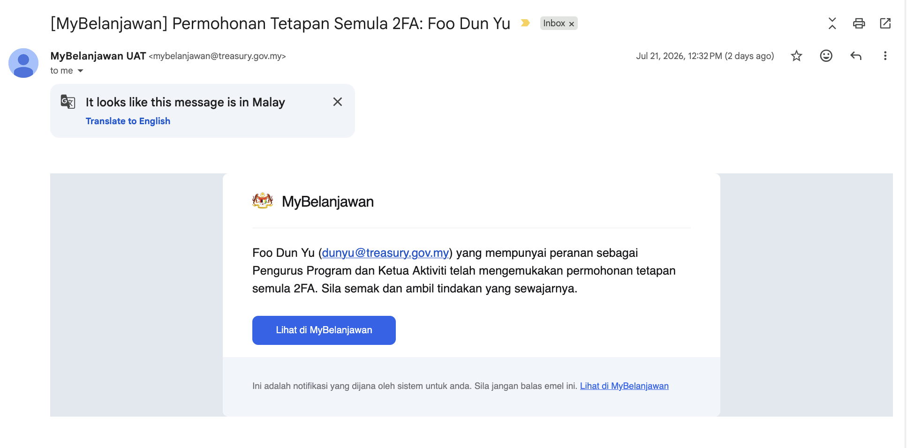
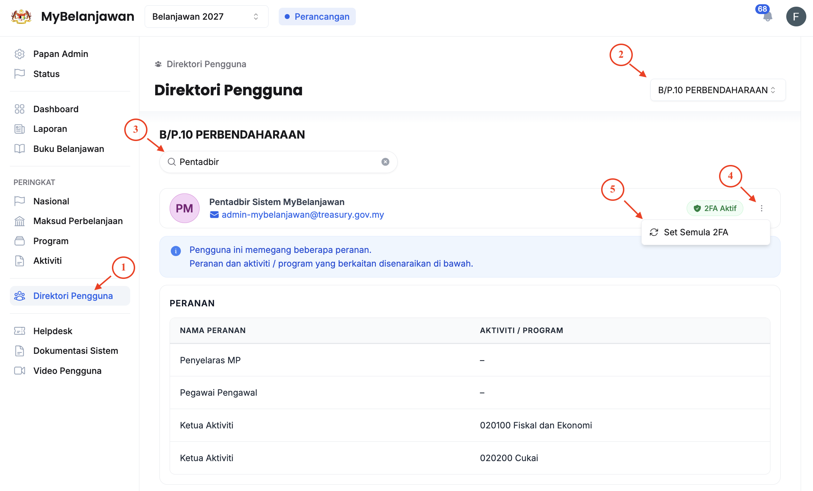

## Kaedah Memberi Kebenaran Tetapan Semula 2FA
Peranan: Penyelaras MP
<Callout title="Notifikasi Permohonan" type="warn">
Sekiranya terdapat permohonan tetapan semula 2FA daripada pengguna, anda akan menerima notifikasi e-mel seperti di bawah:
  Contoh e-mel:

</Callout>
\
Langkah:

1. Klik **Direktori Pengguna** pada *Sidebar*
2. **Pilih Maksud Perbelanjaan** yang berkaitan
3. Taip **Nama / Emel Pengguna** pada ruang carian
4. Klik butang **3 dots** pada sudut kanan pengguna yang berkaitan
5. Klik butang **Set Semula 2FA**
6. Klik butang **Teruskan**

<Callout title = "Outcome">
* Status 2FA pengguna yang berkaitan akan ditukar daripada "Aktif" kepada "Tidak Aktif"
* Pengguna yang berkaitan akan dimaklumkan bahawa tindakan telah diambil dan diminta untuk tetap semula 2FA pada akaun mereka
</Callout>
