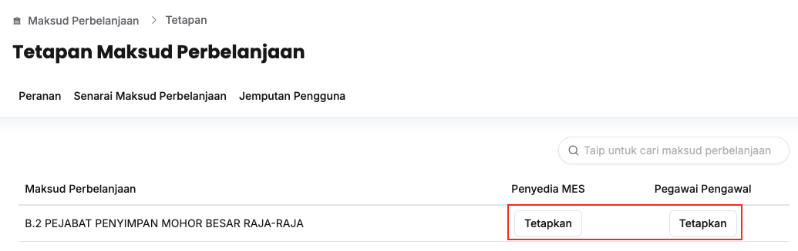
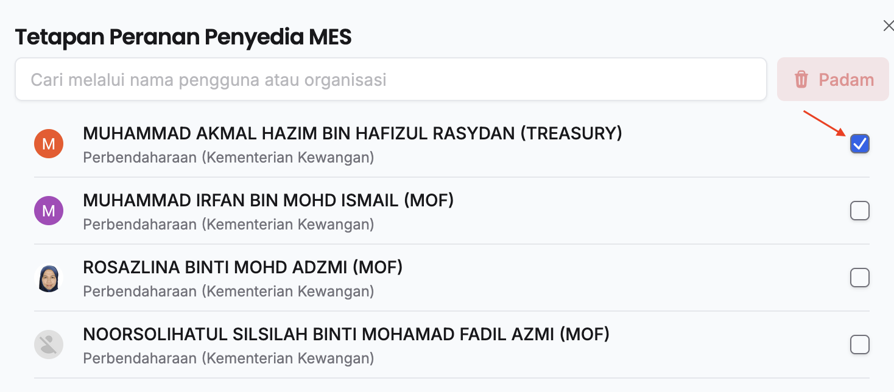
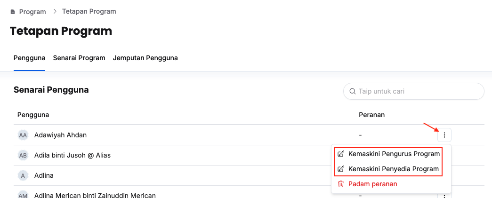
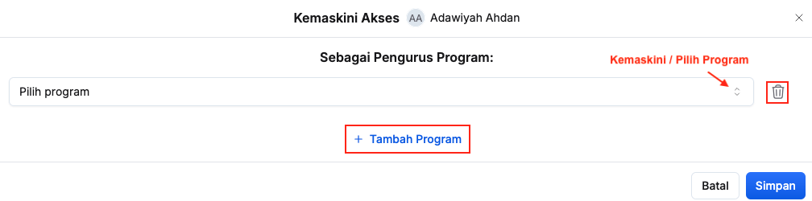
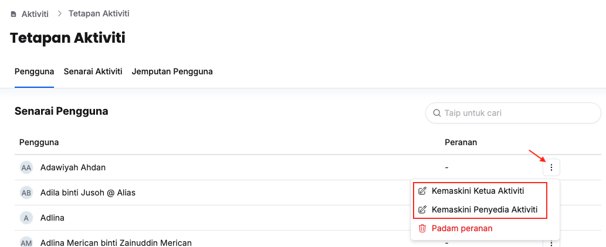
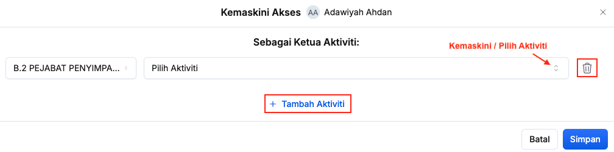

## Tetapan Peranan Peringkat Maksud Perbelanjaan
Peranan: Penyelaras MP

Tetapan untuk peranan yang berikut:
1. Penyedia MES
2. Pegawai Pengawal

Langkah:
1. Klik **Maksud Perbelanjaan** pada *Sidebar*
2. Klik butang **Tetapan**

3. Klik butang **Tetapkan** dibawah peranan yang berkaitan

4. Aktif/nyahaktifkan peranan pengguna yang berkaitan
5. Klik butang **Kemaskini**
6. Pastikan peranan pengguna yang berkaitan telah tersenarai

<Callout title="Outcome">
Peranan pengguna berjaya dikemaskini dan menerima akses pengguna yang berkaitan dalam sistem
</Callout> 

## Tetapan Peranan Peringkat Program
Peranan: Penyelaras MP

Tetapan untuk peranan yang berikut:
1. Penyedia Program
2. Pengurus Program

Langkah:
1. Klik **Program** pada *Sidebar*
2. Klik butang **Tetapan**

3. Klik butang **3 dots** pada sudut kanan pengguna yang berkaitan
4. Klik **Kemaskini Pengurus Program / Kemaskini Penyedia Program**

5. Dari sini, anda boleh melakukan perkara berikut:
    * Klik **+ Tambah** dan buat pilihan untuk peranan baharu
    * Kemaskini peranan (sekiranya ada)
    * Klik butang **Padam** untuk padam peranan yang berkaitan
6. Pastikan peranan pengguna yang berkaitan telah dikemaskini

<Callout title="Outcome">
Peranan pengguna berjaya dikemaskini dan menerima akses pengguna yang berkaitan dalam sistem 
</Callout>

## Tetapan Peranan Peringkat Aktiviti
Peranan: Penyelaras MP

Tetapan untuk peranan yang berikut:
1. Penyedia Aktiviti
2. Ketua Aktiviti

Langkah:
1. Klik **Aktiviti** pada *Sidebar*
2. Klik butang **Tetapan**

3. Klik butang **3 dots** pada sudut kanan pengguna yang berkaitan
4. Klik **Kemaskini Ketua Aktiviti / Kemaskini Penyedia Aktiviti**

5. Dari sini, anda boleh melakukan perkara berikut:
    * Klik **+ Tambah** dan buat pilihan untuk peranan baharu
    * Kemaskini peranan (sekiranya ada)
    * Klik butang **Padam** untuk padam peranan yang berkaitan
6. Pastikan peranan pengguna yang berkaitan telah dikemaskini

<Callout title="Outcome">
Peranan pengguna berjaya dikemaskini dan menerima akses pengguna yang berkaitan dalam sistem
</Callout> 