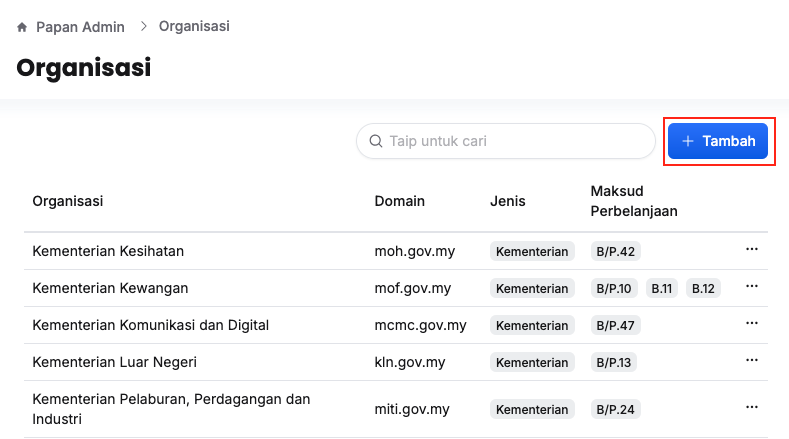
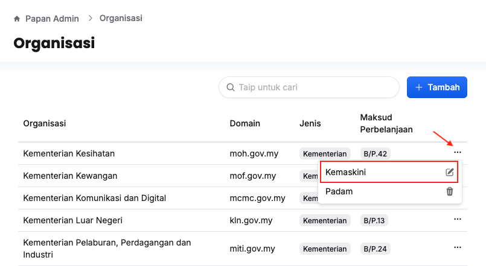
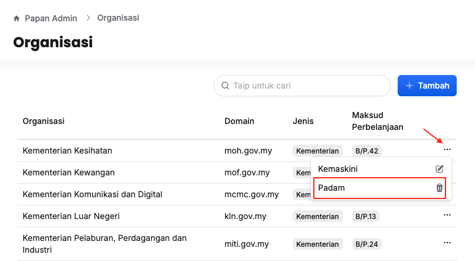

## Organisasi
### Tambah Organisasi Baharu
Peranan: Super Admin

1. Klik **Papan Admin** pada *Sidebar*
2. Klik **Organisasi** di bawah aturan umum

3. Klik butang **+ Tambah** 
4. Isikan maklumat dalam medan:
    * Nama Organisasi
    * Domain
    * Jenis
5. Klik butang **Tambah**

<Callout title = "Outcome">
Organisasi baharu berjaya ditambahkan 
</Callout>

### Kemaskini Maklumat Organisasi
Peranan: Super Admin 

1. Klik **Papan Admin** pada *Sidebar*
2. Klik **Organisasi** di bawah aturan umum

3. Klik butang **3 dots** pada sudut kanan organisasi yang berkaitan
4. Klik butang **Kemaskini**
5. Kemaskini:
    * Nama Organisasi
    * Domain
    * Jenis
6. Klik butang **Kemaskini**

<Callout title = "Outcome">
Maklumat organisasi berjaya dikemaskini
</Callout>

### Padam Organisasi 
Peranan: Super Admin 
1. Klik **Papan Admin** pada *Sidebar*
2. Klik **Organisasi** di bawah aturan umum

3. Klik butang **3 dots** pada sudut kanan organisasi yang berkaitan
4. Klik butang **Padam**
5. Klik butang **Teruskan** pada paparan konfirmasi

<Callout title = "Outcome">
Organisasi yang berkaitan berjaya dipadamkan
</Callout>