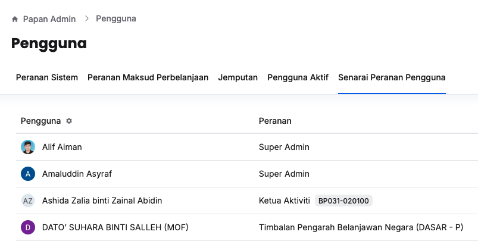
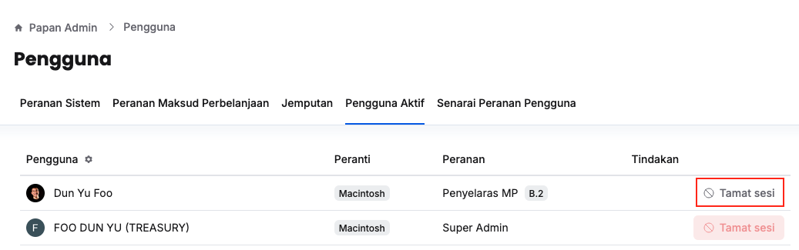

## Senarai Peranan Pengguna
Peranan: Super Admin

1. Klik **Papan Admin** pada *Sidebar*
2. Klik **Peranan & pengguna** di bawah aturan umum
3. Klik tab **Senarai Peranan Pengguna**

4. Pastikan anda dapat melihat peranan yang dipegangi oleh setiap pengguna

<Callout title="Outcome">
Super admin dapat melihat peranan yang dipegangi oleh setiap pengguna 
</Callout>

## Tamat Sesi Pengguna Aktif
Peranan: Super Admin

1. Klik **Papan Admin** pada *Sidebar*
2. Klik **Peranan & pengguna** di bawah aturan umum
3. Klik tab **Pengguna Aktif**

4. Klik butang **Tamat sesi** pada sudut kanan pengguna yang berkaitan
5. Pastikan sesi pengguna yang berkaitan telah ditamatkan

<Callout title="Outcome">
Super admin berjaya menamatkan sesi pengguna yang disyaki menceroboh sistem
</Callout>