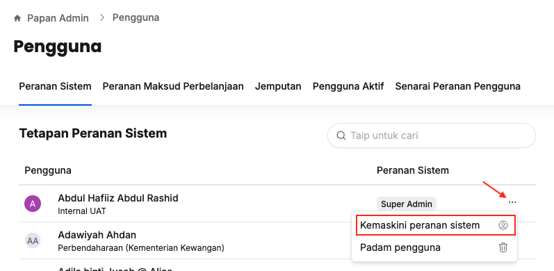
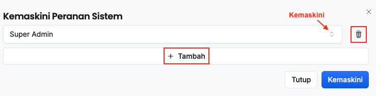
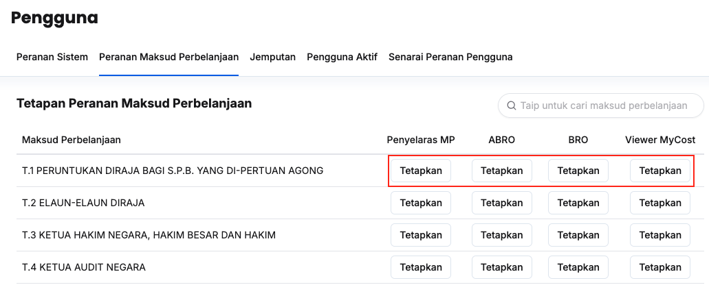
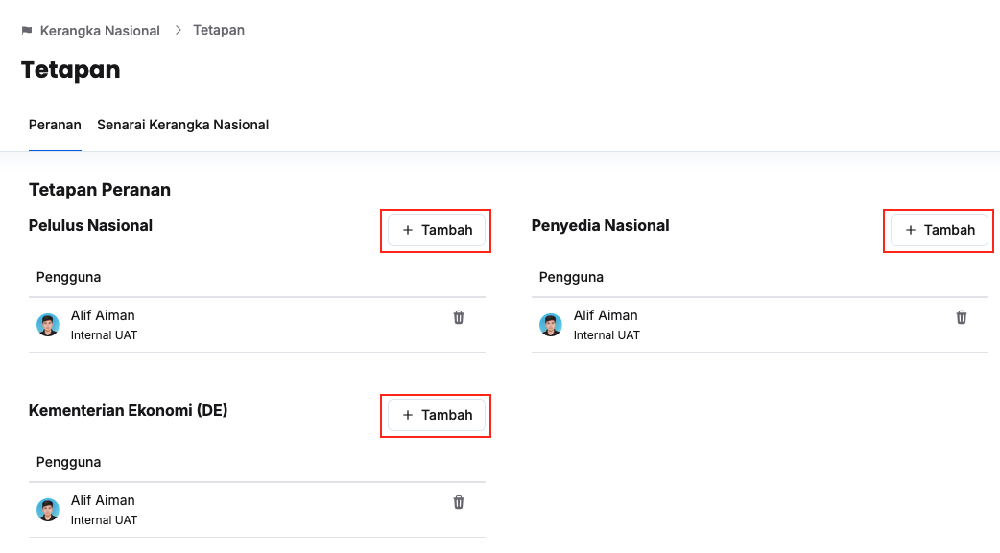
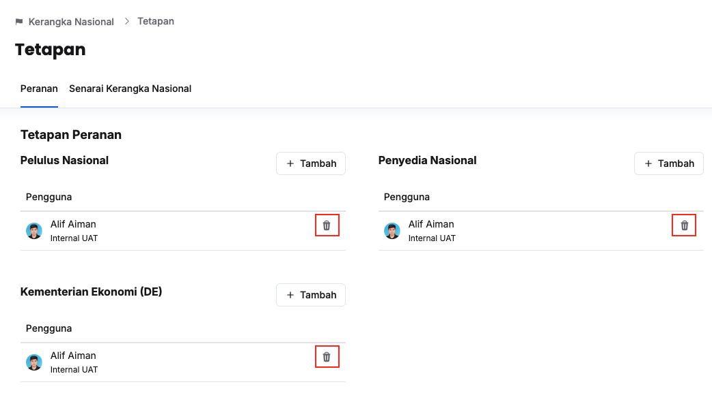

## Tetapan Peranan Sistem
Peranan: Super Admin

Tetapan untuk peranan yang berikut:
1. Super Admin
2. Pengarah Belanjawan Negara
3. Penyedia Buku Perbelanjaan 
4. TPBN Dasar D
5. TPBN Seksyen P
6. Penyedia Syor Dasar
7. TPBN Sektor A,K,E,S
8. Viewer

Langkah:
1. Klik **Papan Admin** pada *Sidebar*
2. Klik **Peranan & pengguna** di bawah aturan umum

3. Klik butang **3 dots** pada sudut kanan pengguna yang berkaitan
4. Klik butang **Kemaskini** peranan sistem

5. Dari sini, anda boleh melakukan perkara berikut:
    * Klik **+ Tambah** dan buat pilihan untuk peranan baharu
    * Kemaskini peranan (sekiranya ada)
    * Klik butang **Padam** untuk padam peranan yang berkaitan
6. Seterusnya, klik butang **Kemaskini**
7. Pastikan peranan sistem pengguna yang berkaitan telah dikemaskini

<Callout title="Outcome">
Peranan pengguna berjaya dikemaskini dan menerima akses pengguna yang berkaitan dalam sistem
</Callout>

## Tetapan Peranan Pegawai Atasan Maksud Perbelanjaan
Peranan: Super Admin

Tetapan untuk peranan yang berikut:
1. Penyelaras MP
2. ABRO
3. BRO
4. Viewer Mycost

Langkah: 
1. Klik **Papan Admin** pada *Sidebar*
2. Klik **Peranan & pengguna** di bawah aturan umum
3. Klik tab **Peranan Maksud Perbelanjaan**

4. Klik butang **Tetapkan** dibawah peranan yang berkaitan
5. Aktif/nyahaktifkan peranan pengguna yang berkaitan
6. Klik butang **Kemaskini**
7. Pastikan peranan pengguna yang berkaitan telah dikemaskini

<Callout title="Outcome"> 
Peranan pengguna berjaya dikemaskini dan menerima akses pengguna yang berkaitan dalam sistem
</Callout>

## Tetapan Peranan Peringkat Nasional dan Kementerian Ekonomi
Peranan: Super Admin

Tetapan untuk peranan yang berikut:
1. Penyedia Nasioanl
2. Pelulus Nasional
3. Kementerian Ekonomi (Penyedia Peruntukan DE)

### Tambah
Langkah:
1. Klik **Nasional** pada *Sidebar*
2. Klik butang **Tetapan**

3. Klik butang **+ Tambah** pada sudut kanan peranan pengguna yang berkaitan
4. Isi nama pengguna yang berkaitan dalam bar carian
5. Aktif/nyahaktifkan butang bulat pada sudut kiri pengguna yang berkaitan
6. Klik butang **Kemaskini**
7. Pastikan peranan pengguna yang berkaitan telah tersenarai

<Callout title="Outcome">
Peranan pengguna berjaya dikemaskini dan menerima akses pengguna yang berkaitan dalam sistem
</Callout>

### Padam 
Langkah:
1. Klik **Nasional** pada *Sidebar*
2. Klik butang **Tetapan**

3. Klik butang Padam pada sudut kanan pengguna yang berkaitan
4. Klik butang Padam pada paparan **Padam Peranan Pengguna**
5. Pastikan peranan pengguna yang berkaitan telah dipadamkan

<Callout title="Outcome">
Peranan pengguna berjaya dipadamkan
</Callout>