## Permohonan Hapus Aktiviti Sedia Ada
Peranan: Penyelaras MP / BRO / Dasar

Langkah:
1. Klik **Aktiviti** pada *Sidebar*
2. Klik tab **Permohonan Hapus Aktiviti**
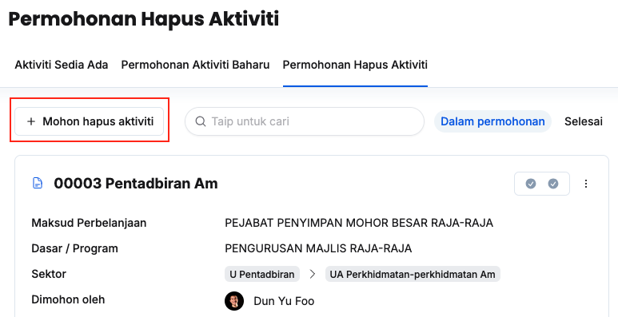
3. Klik butang **+ Mohon hapus Aktiviti**
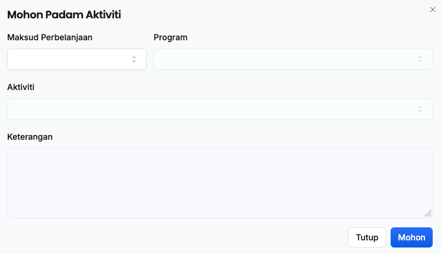
4. Isikan maklumat dalam medan:
    * Maksud Perbelanjaan
    * Program
    * Aktiviti
    * Keterangan
5. Klik butang **Mohon**
6. Pastikan aktiviti yang dipohon tersenarai dibawah tab **Dalam permohonan**

<Callout title="Outcome">
BRO MP yang berkaitan akan menerima notifikasi dalam sistem untuk membuat semakan
</Callout>

### Semakan BRO
Peranan: BRO

Langkah:
1. Klik **Aktiviti** pada *Sidebar*
2. Klik tab **Permohonan Hapus Aktiviti**
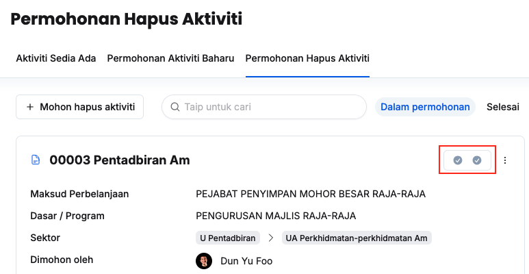
3. Klik butang **Semakan** pada aktiviti yang berkaitan
4. Klik **Semakan Pertama** untuk **Pengesyoran BRO**
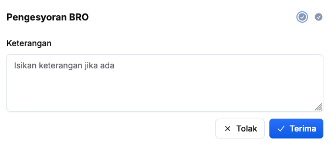
5. Isikan maklumat dalam medan **Keterangan**
6. Klik butang **X Tolak/✓ Terima**
7. Pastikan status semakan telah dikemaskini

<Callout title="Outcome">
* Penyelaras MP akan menerima notifikasi sekiranya permohonan hapus aktiviti ditolak
* Dasar akan menerima notifikasi untuk membuat semakan sekiranya mendapat kelulusan BRO
</Callout>

### Semakan Dasar
Peranan: Dasar

<Callout title="Pra-syarat" type="warn"> 
BRO telah membuat semakan dan memberi kelulusan
</Callout>

Langkah:
1. Klik **Aktiviti** pada *Sidebar*
2. Klik tab **Permohonan Hapus Aktiviti**
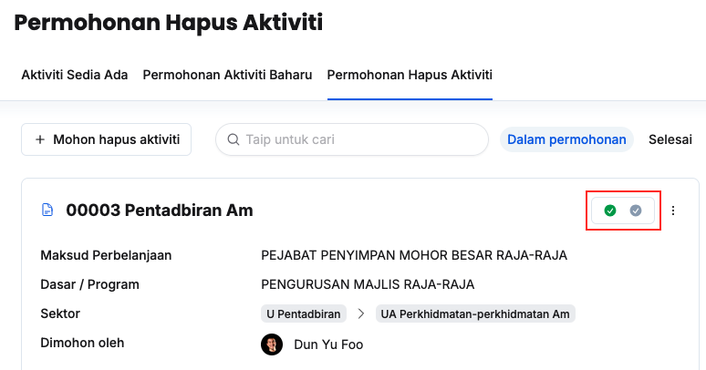
3. Klik butang **Semakan** pada aktiviti yang berkaitan
4. Klik **Semakan Kedua** untuk **Perakuan Dasar**
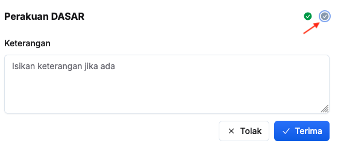
5. Isikan maklumat dalam medan **Keterangan**
6. Klik butang **X Tolak/✓ Terima**
7. Pastikan status semakan telah dikemaskini pada tab selesai

<Callout title="Outcome">
* Penyelaras MP dan BRO akan menerima notifikasi selepas permohonan aktiviti telah ditolak/diterima
* Aktiviti yang berkaitan akan dipadam daripada senarai aktiviti sedia ada sekiranya permohonan diluluskan
</Callout>

### Kemaskini Butiran Aktiviti dalam Permohonan
Peranan: Penyelaras MP / BRO / Dasar

Langkah:
1. Klik **Aktiviti** pada *Sidebar*
2. Klik tab **Permohonan Hapus Aktiviti**
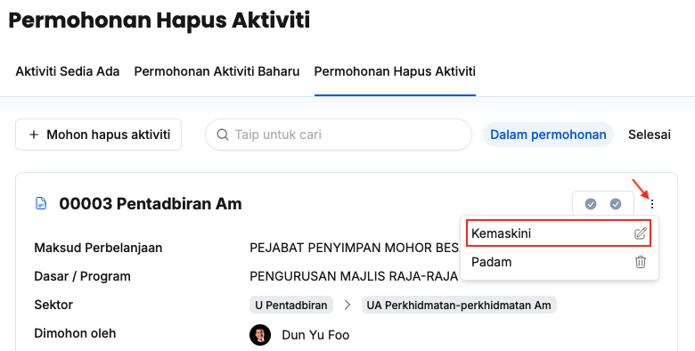
3. Klik butang **3 dots** pada aktiviti yang berkaitan
4. Klik butang **Kemaskini**
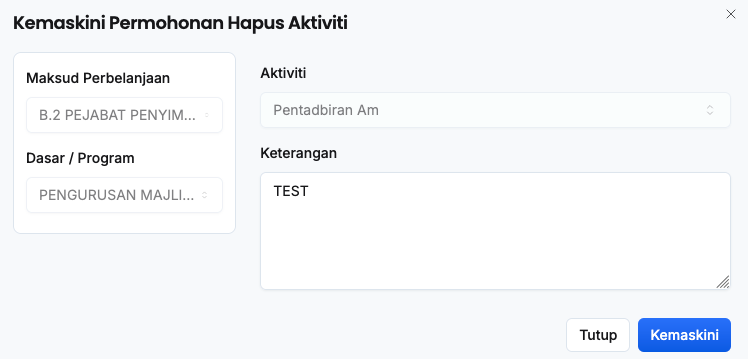
5. Kemaskini **Keterangan**
6. Klik butang **Kemaskini**
7. Pastikan butiran aktiviti telah dikemaskini

<Callout title="Outcome">
Butiran aktiviti dalam permohonan berjaya dikemaskini
</Callout>

### Padam Aktiviti dalam Permohonan
Peranan: Penyelaras MP / BRO / Dasar

Langkah:
1. Klik **Aktiviti** pada *Sidebar*
2. Klik tab **Permohonan Hapus Aktiviti**
3. Klik butang **3 dots** pada aktiviti yang berkaitan
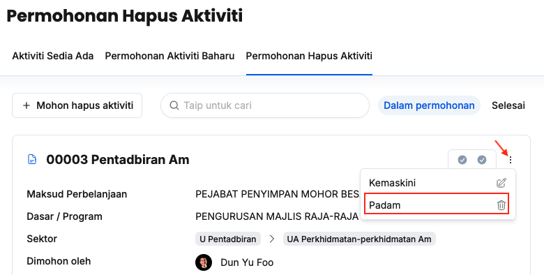
4. Klik butang **Padam**
5. Klik butang **Padam** pada paparan **Padam permohonan Aktiviti**
6. Pastikan permohonan aktiviti yang berkaitan telah dipadamkan

<Callout title="Outcome">
Permohonan hapus aktiviti berjaya dipadamkan dan tidak lagi wujud di bawah senarai **Dalam permohonan**
</Callout>

## Kemaskini Butiran Aktiviti Sedia Ada
Peranan: Penyelaras MP / BRO / Dasar

Langkah:
1. Klik **Aktiviti** pada *Sidebar*
2. Klik butang **Tetapan**
3. Klik tab **Senarai Aktiviti**
4. Pilih maksud perbelanjaan yang berkaitan
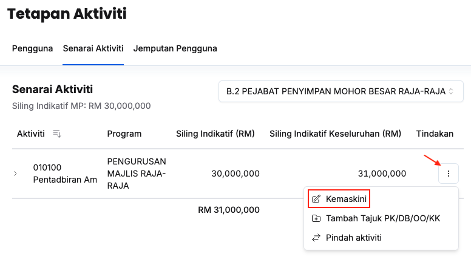
5. Klik butang **3 dots**
6. Klik butang **Kemaskini**
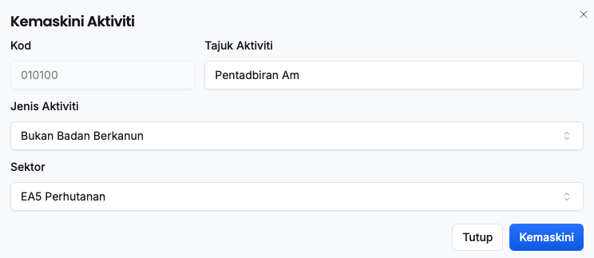
7. Kemaskini:
    * Tajuk
    * Jenis Aktiviti
    * Sektor
8. Klik butang **Kemaskini**
9. Pastikan butiran aktiviti yang berkaitan telah dikemaskini

<Callout title="Outcome">
Butiran aktiviti berjaya dikemaskini
</Callout>

## Pindah Aktiviti Sedia Ada
Peranan: Dasar / BRO

Langkah:
1. Klik **Aktiviti** pada *Sidebar*
2. Klik butang **Tetapan**
3. Klik tab **Senarai Aktiviti**
4. Pilih maksud perbelanjaan yang berkaitan
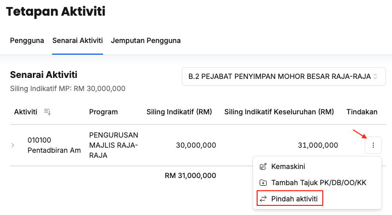
5. Klik butang **3 dots**
6. Klik butang **Pindah aktiviti**
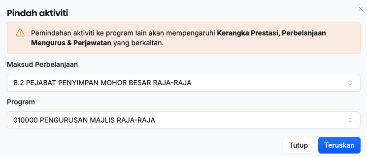
7. Pilih **Maksud Perbelanjaan** dan **Program** yang berkaitan
8. Klik butang **Teruskan**
9. Pastikan aktiviti telah dipindah ke maksud perbelanjaan yang berkaitan

<Callout title="Outcome">
Aktiviti berjaya dipindahkan
</Callout>
