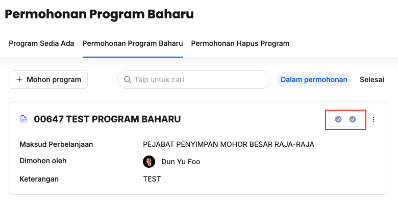

## Permohonan Program Baharu
Peranan: Penyelaras MP / BRO / Dasar

Langkah:
1. Klik **Program** pada *Sidebar*
2. Klik tab **Permohonan Program Baharu**

3. Klik butang **+ Mohon program**

4. Isikan maklumat dalam medan:
    * Maksud Perbelanjaan
    * Tajuk Program
    * Keterangan
5. Klik butang **Mohon**
6. Pastikan program yang dipohon tersenarai dibawah tab **Dalam permohonan**

<Callout title="Outcome">
BRO MP yang berkaitan akan menerima notifikasi dalam sistem untuk membuat semakan
</Callout>

### Semakan BRO
Peranan: BRO

Langkah:
1. Klik **Program** pada *Sidebar*
2. Klik tab **Permohonan Program Baharu**

3. Klik butang **Semakan** pada program yang berkaitan
4. Klik **Semakan Pertama** untuk **Pengesyoran BRO**

5. Isikan maklumat dalam medan **Keterangan**
6. Klik butang **X Tolak/✓ Terima**
7. Pastikan status semakan telah dikemaskini

<Callout title="Outcome">
* Penyelaras MP akan menerima notifikasi sekiranya permohonan program ditolak
* Dasar akan menerima notifikasi untuk membuat semakan sekiranya mendapat kelulusan BRO
</Callout>

### Semakan Dasar
Peranan: Dasar

<Callout title="Pra-syarat" type="warn"> 
BRO telah membuat semakan dan memberi kelulusan
</Callout>

Langkah:
1. Klik **Program** pada *Sidebar*
2. Klik tab **Permohonan Program Baharu**

3. Klik butang **Semakan** pada program yang berkaitan
4. Klik **Semakan Kedua** untuk **Perakuan Dasar**

5. Isikan maklumat dalam medan **Keterangan**
6. Klik butang **X Tolak/✓ Terima**
7. Pastikan status semakan telah dikemaskini pada tab selesai

<Callout title="Outcome">
* Penyelaras MP dan BRO akan menerima notifikasi selepas permohonan program telah ditolak/diterima
* Program baharu akan dimasukkan ke dalam senarai program sedia ada sekiranya permohonan telah diluluskan
</Callout>

### Kemaskini Butiran Program dalam Permohonan
Peranan: Penyelaras MP / BRO / Dasar

Langkah:
1. Klik **Program** pada *Sidebar*
2. Klik tab **Permohonan Program Baharu**

3. Klik butang **3 dots** pada program yang berkaitan
4. Klik butang **Kemaskini**

5. Kemaskini:
    * Tajuk Program
    * Keterangan
6. Pastikan butiran program telah dikemaskini

<Callout title="Outcome">
Butiran program dalam permohonan berjaya dikemaskini
</Callout>

### Padam Program dalam Permohonan
Peranan: Penyelaras MP / BRO / Dasar

Langkah:
1. Klik **Program** pada *Sidebar*
2. Klik tab **Permohonan Program Baharu**

3. Klik butang **3 dots** pada program yang berkaitan
4. Klik butang **Padam**
5. Klik butang **Padam** pada paparan **Padam permohonan program**
6. Pastikan permohonan program yang berkaitan telah dipadamkan

<Callout title="Outcome">
Permohonan program yang berkaitan berjaya dipadamkan dan tidak lagi wujud di bawah senarai **Dalam permohonan**
</Callout>
---

## Permohonan Aktiviti Baharu
Peranan: Penyelaras MP / BRO / Dasar

Langkah:
1. Klik **Aktiviti** pada *Sidebar*
2. Klik tab **Permohonan Aktiviti Baharu**

3. Klik butang **+ Mohon aktiviti**

4. Isikan maklumat dalam medan:
    * Maksud Perbelanjaan
    * Program
    * Tajuk Aktiviti
    * Jenis Aktiviti
    * Sektor
    * SDG
    * Keterangan
5. Klik butang **Mohon**
6. Pastikan aktiviti yang dipohon tersenarai dibawah tab **Dalam permohonan**

<Callout title="Outcome">
BRO MP yang berkaitan akan menerima notifikasi dalam sistem untuk membuat semakan
</Callout>

### Semakan BRO
Peranan: BRO

Langkah:
1. Klik **Aktiviti** pada *Sidebar*
2. Klik tab **Permohonan Aktiviti Baharu**

3. Klik butang **Semakan** pada aktiviti yang berkaitan
4. Klik **Semakan Pertama** untuk **Pengesyoran BRO**

5. Isikan maklumat dalam medan **Keterangan**
6. Klik butang **X Tolak/✓ Terima**
7. Pastikan status semakan telah dikemaskini

<Callout title="Outcome">
* Penyelaras MP akan menerima notifikasi sekiranya permohonan aktiviti ditolak
* Dasar akan menerima notifikasi untuk membuat semakan sekiranya mendapat kelulusan BRO
</Callout>

### Semakan Dasar
Peranan: Dasar

<Callout title="Pra-syarat" type="warn"> 
BRO telah membuat semakan dan memberi kelulusan
</Callout>

Langkah:
1. Klik **Aktiviti** pada *Sidebar*
2. Klik tab **Permohonan Aktiviti Baharu**

3. Klik butang **Semakan** pada aktiviti yang berkaitan
4. Klik **Semakan Kedua** untuk **Perakuan Dasar**

5. Isikan maklumat dalam medan **Keterangan**
6. Klik butang **X Tolak/✓ Terima**
7. Pastikan status semakan telah dikemaskini pada tab selesai

<Callout title="Outcome">
* Penyelaras MP dan BRO akan menerima notifikasi selepas permohonan aktiviti telah ditolak/diterima
* Aktiviti baharu akan dimasukkan ke dalam senarai aktiviti sedia ada sekiranya permohonan telah diluluskan
</Callout>

### Kemaskini Butiran Aktiviti dalam Permohonan
Peranan: Penyelaras MP / BRO / Dasar

Langkah:
1. Klik **Aktiviti** pada *Sidebar*
2. Klik tab **Permohonan Aktiviti Baharu**

3. Klik butang **3 dots** pada aktiviti yang berkaitan
4. Klik butang **Kemaskini**

5. Kemaskini:
    * Maksud Perbelanjaan
    * Program
    * Tajuk Aktiviti
    * Jenis Aktiviti
    * Sektor
    * SDG
    * Keterangan
6. Pastikan butiran aktiviti telah dikemaskini

<Callout title="Outcome">
Butiran aktiviti dalam permohonan berjaya dikemaskini
</Callout>

### Padam Aktiviti dalam Permohonan
Peranan: Penyelaras MP / BRO / Dasar

Langkah:
1. Klik **Aktiviti** pada *Sidebar*
2. Klik tab **Permohonan Aktiviti Baharu**

3. Klik butang **3 dots** pada aktiviti yang berkaitan
4. Klik butang **Padam**
5. Klik butang **Padam** pada paparan **Padam permohonan aktiviti**
6. Pastikan permohonan aktiviti yang berkaitan telah dipadamkan

<Callout title="Outcome">
Permohonan aktiviti yang berkaitan berjaya dipadamkan dan tidak lagi wujud di bawah senarai **Dalam permohonan**
</Callout>