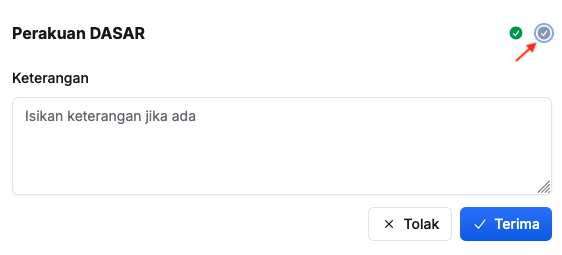

## Permohonan Hapus Program Sedia Ada
Peranan: Penyelaras MP / BRO / Dasar

Langkah:
1. Klik **Program** pada *Sidebar*
2. Klik tab **Permohonan Hapus Program**

3. Klik butang **+ Mohon hapus program**

4. Isikan maklumat dalam medan:
    * Maksud Perbelanjaan
    * Tajuk Program
    * Keterangan
5. Klik butang **Mohon**
6. Pastikan program yang dipohon tersenarai dibawah tab **Dalam permohonan**

<Callout title="Outcome">
BRO MP yang berkaitan akan menerima notifikasi dalam sistem untuk membuat semakan
</Callout>

### Semakan BRO
Peranan: BRO

Langkah:
1. Klik **Program** pada *Sidebar*
2. Klik tab **Permohonan Hapus Program**

3. Klik butang **Semakan** pada program yang berkaitan
4. Klik **Semakan Pertama** untuk **Pengesyoran BRO**

5. Isikan maklumat dalam medan **Keterangan**
6. Klik butang **X Tolak/✓ Terima**
7. Pastikan status semakan telah dikemaskini

<Callout title="Outcome">
* Penyelaras MP akan menerima notifikasi sekiranya permohonan hapus program ditolak
* Dasar akan menerima notifikasi untuk membuat semakan sekiranya mendapat kelulusan BRO
</Callout>

### Semakan Dasar
Peranan: Dasar

<Callout title="Pra-syarat" type="warn"> 
BRO telah membuat semakan dan memberi kelulusan
</Callout>

Langkah:
1. Klik **Program** pada *Sidebar*
2. Klik tab **Permohonan Hapus Program**

3. Klik butang **Semakan** pada program yang berkaitan
4. Klik **Semakan Kedua** untuk **Perakuan Dasar**

5. Isikan maklumat dalam medan **Keterangan**
6. Klik butang **X Tolak/✓ Terima**
7. Pastikan status semakan telah dikemaskini pada tab selesai

<Callout title="Outcome">
* Penyelaras MP dan BRO akan menerima notifikasi selepas permohonan program telah ditolak/diterima
* Program yang berkaitan akan dipadam daripada senarai program sedia ada sekiranya permohonan diluluskan
</Callout>

### Kemaskini Butiran Program dalam Permohonan
Peranan: Penyelaras MP / BRO / Dasar

Langkah:
1. Klik **Program** pada *Sidebar*
2. Klik tab **Permohonan Hapus Program**

3. Klik butang **3 dots** pada program yang berkaitan
4. Klik butang **Kemaskini**

5. Kemaskini **Keterangan**
6. Klik butang **Kemaskini**
7. Pastikan butiran program telah dikemaskini

<Callout title="Outcome">
Butiran program dalam permohonan berjaya dikemaskini
</Callout>

### Padam Program dalam Permohonan
Peranan: Penyelaras MP / BRO / Dasar

Langkah:
1. Klik **Program** pada *Sidebar*
2. Klik tab **Permohonan Hapus Program**

3. Klik butang **3 dots** pada program yang berkaitan
4. Klik butang **Padam**
5. Klik butang **Padam** pada paparan **Padam permohonan program**
6. Pastikan permohonan program yang berkaitan telah dipadamkan

<Callout title="Outcome">
Permohonan hapus program berjaya dipadamkan dan tidak lagi wujud di bawah senarai **Dalam permohonan**
</Callout>

## Kemaskini Tajuk Program Sedia Ada
Peranan: Penyelaras MP / BRO / Dasar

Langkah:
1. Klik **Program** pada *Sidebar*
2. Klik butang **Tetapan**
3. Klik tab **Senarai Program**
4. Pilih maksud perbelanjaan yang berkaitan

5. Klik butang **3 dots**
6. Klik butang **Kemaskini**

7. Kemaskini **Tajuk Program**
8. Klik butang **Kemaskini**
9. Pastikan butiran program yang berkaitan telah dikemaskini

<Callout title="Outcome">
Tajuk program berjaya dikemaskini
</Callout>

## Pindah Program Sedia Ada
Peranan: Dasar

Langkah:
1. Klik **Program** pada *Sidebar*
2. Klik butang **Tetapan**
3. Klik tab **Senarai Program**

4. Klik butang **3 dots**
5. Klik butang **Pindah program**

6. Pilih **Maksud Perbelanjaan** yang berkaitan
7. Klik butang **Teruskan**
8. Pastikan program telah dipindah ke maksud perbelanjaan yang berkaitan

<Callout title="Outcome">
Program berjaya dipindah kepada maksud perbelanjaan yang lain
</Callout>