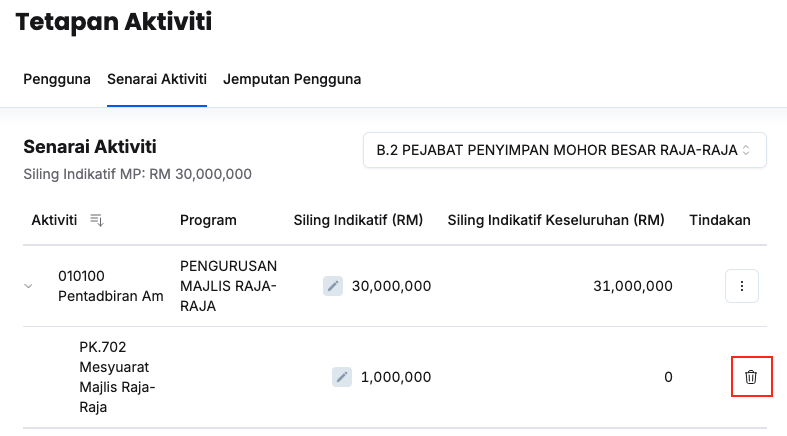

## Tambah Tajuk PK/DB/OO/KK kepada Aktiviti
Peranan: Penyelaras MP

Langkah:
1. Klik **Aktiviti** pada *Sidebar*
2. Klik butang **Tetapan**
3. Klik tab **Senarai Aktiviti**
4. Pilih maksud perbelanjaan yang berkaitan

5. Klik butang **3 dots** pada sudut kanan aktiviti yang berkaitan
6. Klik butang **Tambah Tajuk PK/DB/OO/KK**

7. Isikan maklumat dalam medan:
    * Dasar
    * Tajuk
    * SDG
    * Sektor
8. Klik butang **Tambah**
9. Pastikan tajuk PK/DB/OO/KK yang berkaitan telah tersenarai

<Callout title="Outcome">
Tajuk aktiviti berjaya ditambahkan dan sedia untuk dilibatkan dalam perancangan bajet
</Callout>

## Padam Tajuk PK/DB/OO/KK
Peranan: Penyelaras MP

Langkah:
1. Klik **Aktiviti** pada *Sidebar*
2. Klik butang **Tetapan**
3. Klik tab **Senarai Aktiviti**
4. Pilih maksud perbelanjaan yang berkaitan

5. Klik butang **Padam** pada sudut kanan tajuk aktiviti yang berkaitan
6. Klik butang **Padam** pada paparan **Padam tajuk**
7. Pastikan tajuk aktiviti yang berkaitan telah dipadamkan

<Callout title="Outcome">
Tajuk aktiviti yang berkaitan berjaya dipadamkan
</Callout>