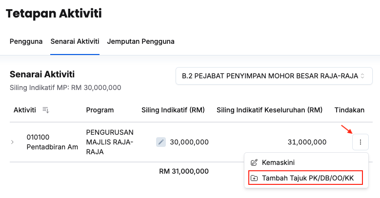

## Penyelaras MP
### Tambah Tajuk PK/DB/OO/KK kepada Aktiviti
Peranan: Penyelaras MP

Langkah:
1. Klik **Aktiviti** pada *Sidebar*
2. Klik butang **Tetapan**
3. Klik tab **Senarai Aktiviti**
4. Pilih maksud perbelanjaan yang berkaitan

5. Klik butang **3 dots** pada sudut kanan aktiviti yang berkaitan
6. Klik butang **Tambah Tajuk PK/DB/OO/KK**

7. Isikan maklumat dalam medan:
    * Dasar
    * Tajuk
    * SDG
    * Sektor
8. Klik butang **Tambah**
9. Pastikan tajuk PK/DB/OO/KK yang berkaitan telah tersenarai

<Callout title="Outcome">
Tajuk aktiviti berjaya ditambahkan dan sedia untuk dilibatkan dalam perancangan bajet
</Callout>

### Padam Tajuk PK/DB/OO/KK
Peranan: Penyelaras MP

Langkah:
1. Klik **Aktiviti** pada *Sidebar*
2. Klik butang **Tetapan**
3. Klik tab **Senarai Aktiviti**
4. Pilih maksud perbelanjaan yang berkaitan

5. Klik butang **Padam** pada sudut kanan tajuk aktiviti yang berkaitan
6. Klik butang **Padam** pada paparan **Padam tajuk**
7. Pastikan tajuk aktiviti yang berkaitan telah dipadamkan

<Callout title="Outcome">
Tajuk aktiviti yang berkaitan berjaya dipadamkan
</Callout>

## Dasar, ABRO/BRO, Ketua/Penyedia Aktiviti
### Tambah Tajuk PK/DB/OO/KK kepada Aktiviti
Peranan: Dasar, ABRO/BRO, Ketua/Penyedia Aktiviti

Langkah:
1. Klik **Aktiviti** pada *Sidebar*
2. Pilih aktiviti yang berkaitan

3. Klik butang **3 dots**
4. Klik **Tambah Tajuk PK/DB/OO/KK**

5. Isikan maklumat dalam medan:
    * Dasar
    * Tajuk
    * SDG
    * Sektor
6. Klik butang **Tambah**
7. Pastikan tajuk PK/DB/OO/KK yang berkaitan telah tersenarai

<Callout title="Outcome">
Tajuk aktiviti berjaya ditambahkan dan sedia untuk dilibatkan dalam perancangan bajet
</Callout>

### Padam Tajuk PK/DB/OO/KK
Peranan: Dasar, ABRO/BRO, Ketua/Penyedia Aktiviti

Langkah:
1. Klik **Aktiviti** pada *Sidebar*
2. Pilih PK/DB/OO/KK yang berkaitan

3. Klik butang **3 dots**
4. Klik butang **Padam**
5. Klik butang **Padam** pada paparan **Padam tajuk**
6. Pastikan tajuk aktiviti yang berkaitan telah dipadamkan

<Callout title="Outcome">
Tajuk aktiviti yang berkaitan berjaya dipadamkan
</Callout>