## Tajuk PK/DB/OO/KK
### Tambah Tajuk Aktiviti Baharu
Peranan: Super Admin

Langkah:
1. Klik **Papan Admin** pada *Sidebar*
2. Klik **Tajuk PK/DB/OO/KK** di bawah aturan umum
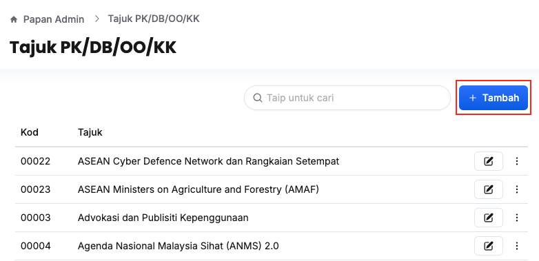
3. Klik butang **+ Tambah**
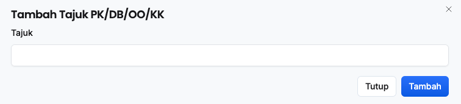
4. Isikan maklumat dalam medan **Tajuk**
5. Tekan butang **Tambah**
6. Pastikan tajuk aktiviti baharu telah tersenarai

<Callout title="Outcome">
Tajuk aktiviti baharu berjaya ditambahkan dan sedia untuk dimasukkan kepada aktiviti yang berkaitan dalam proses perancangan bajet
</Callout>

### Kemaskini Tajuk Aktiviti
Peranan: Super Admin

Langkah:
1. Klik **Papan Admin** pada *Sidebar*
2. Klik **Tajuk PK/DB/OO/KK** di bawah aturan umum
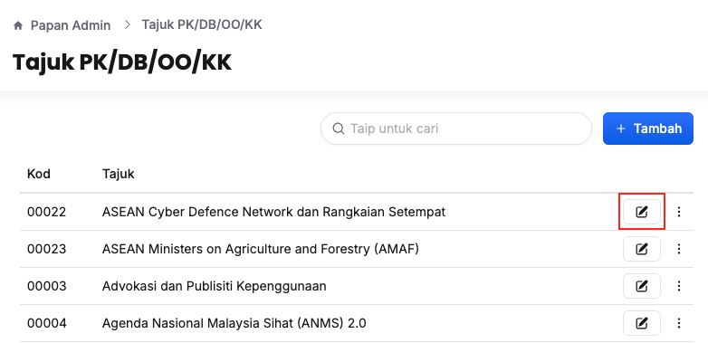
3. Klik butang **Kemaskini** pada sudut kanan tajuk aktiviti yang berkaitan
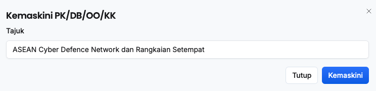
4. Kemaskini **Tajuk** 
5. Klik butang **Kemaskini**
6. Pastikan tajuk aktiviti yang berkaitan telah dikemaskini

<Callout title="Outcome">
Tajuk aktiviti berjaya dikemaskini
</Callout>

### Padam Tajuk Aktiviti
Peranan: Super Admin

Langkah:
1. Klik **Papan Admin** pada *Sidebar*
2. Klik **Tajuk PK/DB/OO/KK** di bawah aturan umum
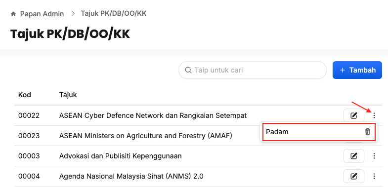
3. Klik butang **3 dots** pada sudut kanan tajuk aktiviti yang berkaitan
4. Klik butang **Padam**
5. Klik butang **Teruskan**
6. Pastikan tajuk aktiviti yang berkaitan telah dipadamkan

<Callout title="Outcome">
Tajuk aktiviti berjaya dipadamkan
</Callout>

## Tetapan Objek Am & Objek Sebagai
Peranan: Super Admin

Langkah:
1. Klik **Papan Admin** pada *Sidebar*
2. Klik **Objek Am & Objek Sebagai** di bawah aturan umum
3. Klik tab **Tetapan**
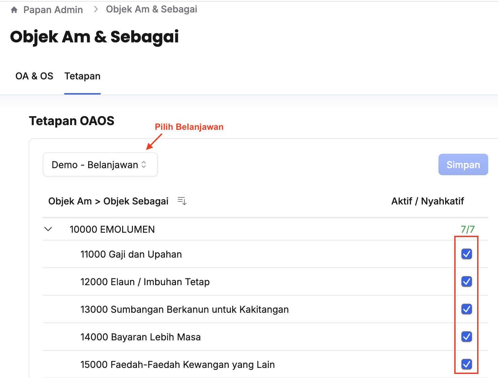
4. Pilih **Belanjawan** yang berkaitan
5. Aktif dan nyahaktifkan objek sebagai yang berkaitan
6. Klik butang **Simpan**

### Tambah Objek Am & Sebagai Baharu
Peranan: Super Admin

Langkah:
1. Klik **Papan Admin** pada *Sidebar*
2. Klik **Objek Am & Objek Sebagai** di bawah aturan umum
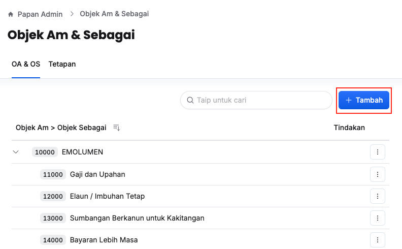
3. Klik butang **+ Tambah**
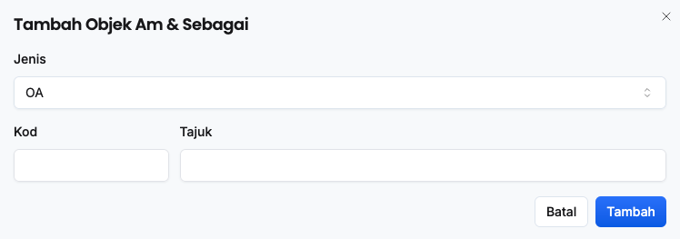
4. Isikan maklumat dalam medan:
    * Jenis
    * Objek Am (Sekiranya pilih OS pada medan **Jenis**)
    * Kod 
    * Tajuk
5. Tekan butang **Tambah**
6. Pastikan objek am / objek sebagai baharu telah tersenarai

<Callout title="Outcome">
Objek am / objek sebagai yang baharu berjaya ditambahkan dan boleh diaktifkan untuk perancangan bajet
</Callout>

### Kemaskini Butiran Objek Am & Sebagai
Peranan: Super Admin

Langkah:
1. Klik **Papan Admin** pada *Sidebar*
2. Klik **Objek Am & Objek Sebagai** di bawah aturan umum
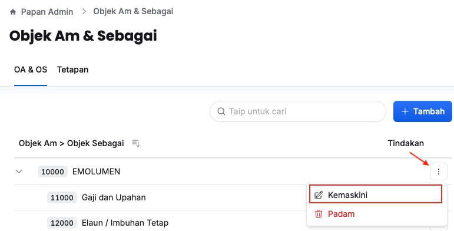
3. Klik butang **3 dots** pada sudut kanan objek am / objek sebagai yang berkaitan
4. Klik butang **Kemaskini**
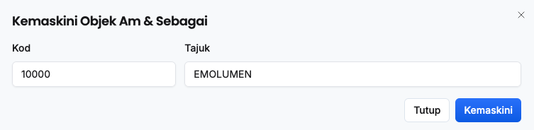
5. Kemaskini:
    * Kod
    * Tajuk
6. Klik butang **Kemaskini**
7. Pastikan butiran objek am / objek sebagai yang berkaitan telah dikemaskini

<Callout title="Outcome">
Objek am / objek sebagai yang berkaitan berjaya dikemaskini
</Callout>

### Padam Objek Am & Sebagai
1. Klik **Papan Admin** pada *Sidebar*
2. Klik **Objek Am & Objek Sebagai** di bawah aturan umum
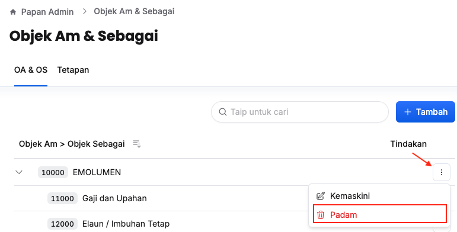
3. Klik butang **3 dots** pada sudut kanan objek am / objek sebagai yang berkaitan
4. Klik butang **Padam**
5. Klik butang **Teruskan** pada paparan **Padam Objek**
6. Pastikan objek am / objek sebagai yang berkaitan telah dipadamkan

<Callout title="Outcome">
Objek am / objek sebagai yang berkaitan berjaya dipadamkan
</Callout>

## Kumpulan Perjawatan
### Tambah Kumpulan Perjawatan Baharu
Peranan: Super Admin

Langkah:
1. Klik **Papan Admin** pada *Sidebar*
2. Klik **Kumpulan Perjawatan** di bawah aturan umum
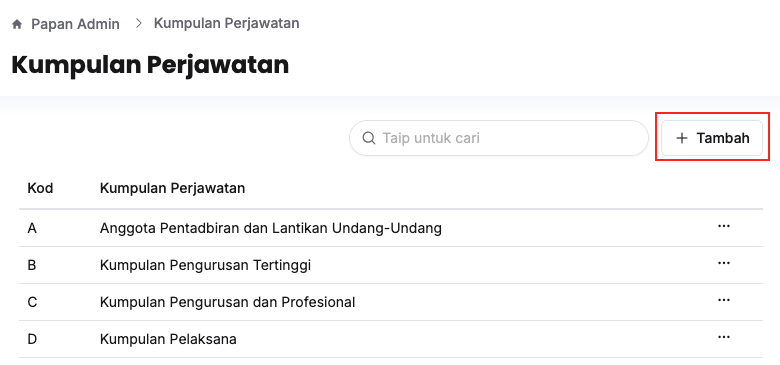
3. Klik butang **+ Tambah**
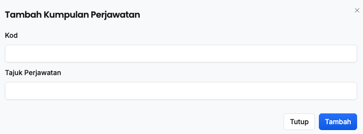
4. Isikan maklumat dalam medan:
    * Kod
    * Tajuk Perjawatan
5. Klik butang **Tambah**
6. Pastikan kumpulan perjawatan yang baharu telah tersenarai

<Callout title="Outcome">
Kumpulan perjawatan berjaya ditambahkan dan boleh dilibatkan dalam permohonanan bilangan perjawatan
</Callout>

### Kemaskini Maklumat Kumpulan Perjawatan
Peranan: Super Admin

Langkah:
1. Klik **Papan Admin** pada *Sidebar*
2. Klik **Kumpulan Perjawatan** di bawah aturan umum
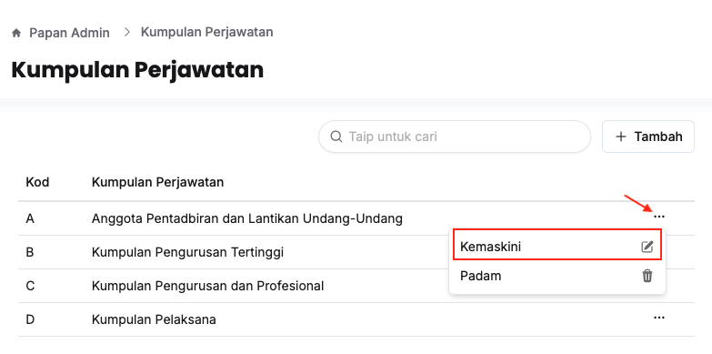
3. Klik butang **3 dots** pada sudut kanan kumpulan perjawatan yang berkaitan
4. Klik butang **Kemaskini**
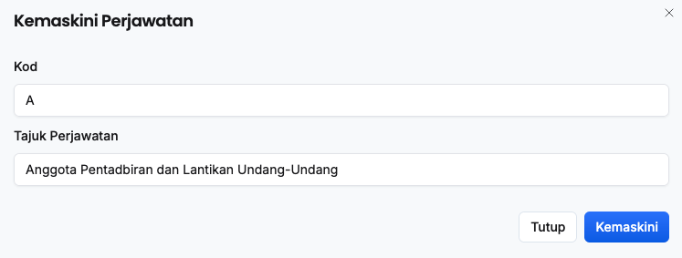
5. Kemaskini:
    * Kod
    * Tajuk Perjawatan
6. Pastikan kumpulan perjawatan yang berkaitan telah dikemaskini

<Callout title="Outcome">
Maklumat kumpulan perjawatan yang berkaitan berjaya dikemaskini
</Callout>

### Padam Kumpulan Perjawatan 
Peranan: Super Admin

Langkah:
1. Klik **Papan Admin** pada *Sidebar*
2. Klik **Kumpulan Perjawatan** di bawah aturan umum
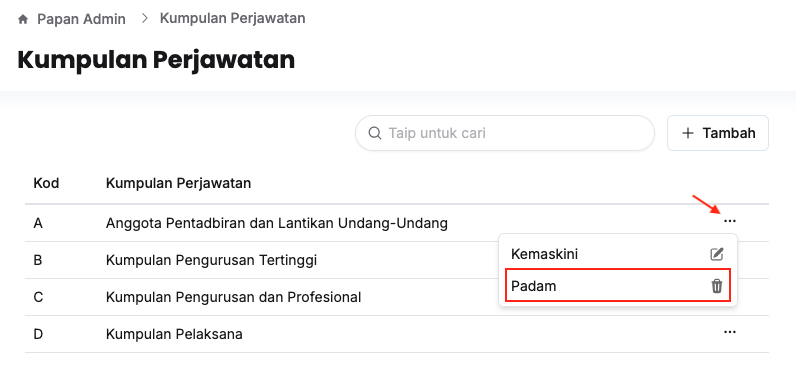
3. Klik butang **3 dots** pada sudut kanan kumpulan perjawatan yang berkaitan
4. Klik butang **Padam**
5. Klik butang **Teruskan** pada paparan **Padam Kumpulan Pelaksana**
6. Pastikan kumpulan perjawatan yang berkaitan telah dipadamkan

<Callout title="Outcome">
Kumpulan perjawatan yang berkaitan berjaya dipadamkan
</Callout>