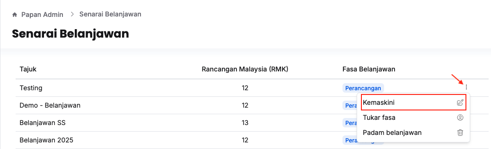
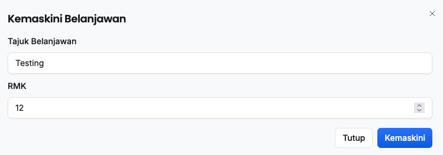
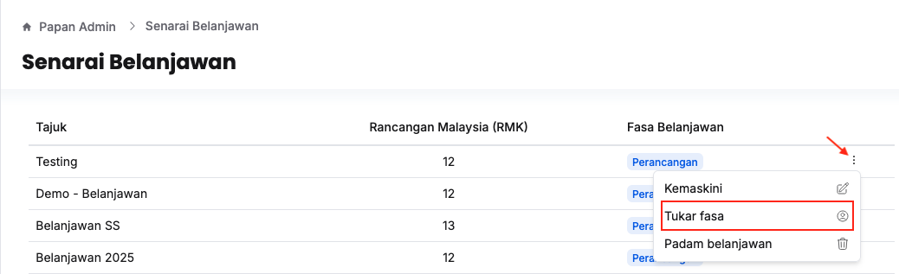
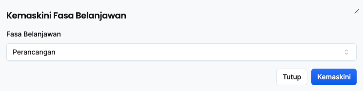
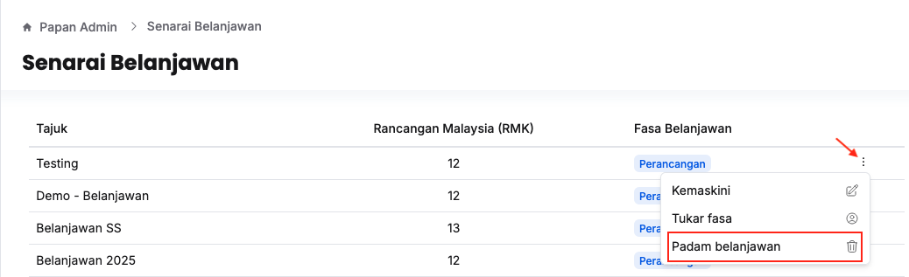

## Kemaskini Belanjawan
Peranan: Super Admin

1. Klik **Papan Admin** pada *Sidebar*
2. Klik **Senarai Belanjawan** di bawah aturan umum

3. Klik butang **3 dots** pada sudut kanan belanjawan yang berkaitan
4. Klik butang **Kemaskini**

5. Kemaskini:
    * Tajuk Belanjawan
    * RMK
6. Klik butang **Kemaskini**

<Callout title="Outcome"> 
Maklumat belanjawan berjaya dikemaskini
</Callout>

## Tukar Fasa Belanjawan
1. Klik **Papan Admin** pada *Sidebar*
2. Klik **Senarai belanjawan** di bawah aturan umum

3. Klik butang **3 dots** pada sudut kanan belanjawan yang berkaitan

4. Klik butang **Tukar fasa**
5. Kemaskini **Fasa Belanjawan**
6. Klik butang **Kemaskini**

<Callout title="Outcome">
* Fasa belanjawan berjaya dikemaskini 
* Akses pengguna kepada belanjawan berkaitan akan dikemaskini mengikut fasa belanjawan
</Callout>

## Padam Belanjawan
Peranan: Super Admin

1. Klik **Papan Admin** pada *Sidebar*
2. Klik **Senarai belanjawan** di bawah aturan umum
3. Pastikan tidak berada pada belanjawan yang ingin dipadamkan. *Tindakan padam belanjawan tidak dapat dilakukan kepada pilihan semasa*

4. Klik butang **3 dots** pada sudut kanan belanjawan yang berkaitan
5. Klik butang **Padam belanjawan**
6. Klik butang **Teruskan**

<Callout title="Outcome">
Belanjawan berjaya dipadamkan dan tidak lagi wujud pada senarai dan bar navigasi belanjawan
</Callout>