## Pelanggan & Stakeholder
### Tambah Pelanggan & Stakeholder Baharu
Peranan: Super Admin

Langkah: 
1. Klik **Papan Admin** pada *Sidebar*
2. Klik **Pelanggan & Stakeholder** di bawah aturan umum
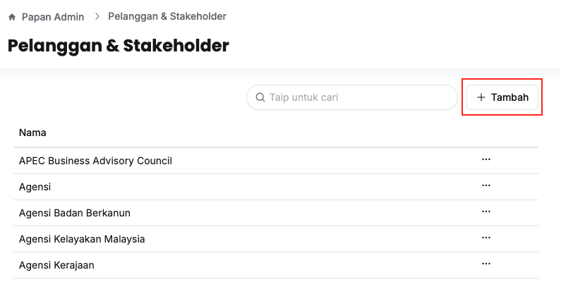
3. Klik butang **+ Tambah**
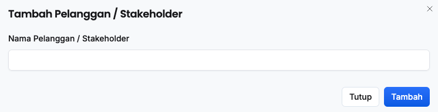
4. Isikan maklumat dalam medan **Nama Pelanggan / Stakeholder**
5. Klik butang **Tambah**
6. Pastikan pelanggan/stakeholder baharu telah tersenarai

<Callout title="Outcome">
Pelanggan/stakeholder baharu berjaya ditambahkan dan sedia digunakan untuk penyediaan kerangka prestasi
</Callout>

### Kemaskini Maklumat Pelanggan & Stakeholder
Peranan: Super Admin

Langkah: 
1. Klik **Papan Admin** pada *Sidebar*
2. Klik **Pelanggan & Stakeholder** di bawah aturan umum
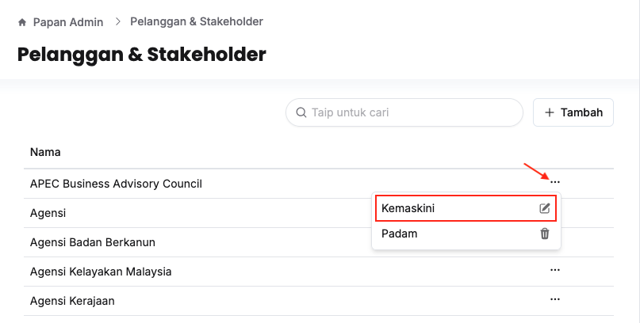
3. Klik butang **3 dots** pada sudut kanan pelanggan/stakeholder yang berkaitan
4. Klik butang **Kemaskini**
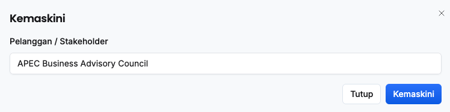
5. Kemaskini **Pelanggan / Stakeholder**
6. Klik butang **Kemaskini**
7. Pastikan maklumat pelanggan/stakeholder yang berkaitan telah dikemaskini

<Callout title="Outcome"> 
Maklumat pelanggan/stakeholder yang berkaitan berjaya dikemaskini
</Callout>

### Padam Pelanggan & Stakeholder
Peranan: Super Admin

Langkah: 
1. Klik **Papan Admin** pada *Sidebar*
2. Klik **Pelanggan & Stakeholder** di bawah aturan umum
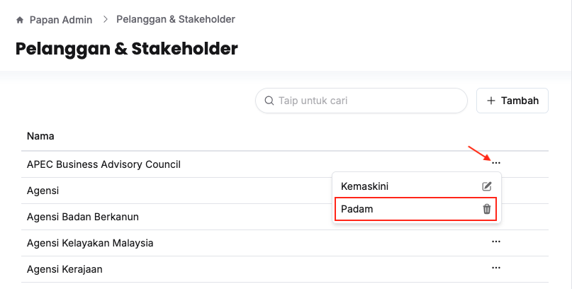
3. Klik butang **3 dots** pada sudut kanan pelanggan/stakeholder yang berkaitan
4. Klik butang **Padam**
5. Klik butang **Teruskan**
6. Pastikan pelanggan/stakeholder yang berkaitan telah dipadamkan

<Callout title="Outcome"> 
Pelanggan/stakeholder yang berkaitan berjaya dipadamkan
</Callout>

## Bidang & Punca Kuasa
### Tambah Bidang & Punca Kuasa Baharu
Peranan: Super Admin

1. Klik **Papan Admin** pada *Sidebar*
2. Klik **Bidang & Punca Kuasa** di bawah aturan umum
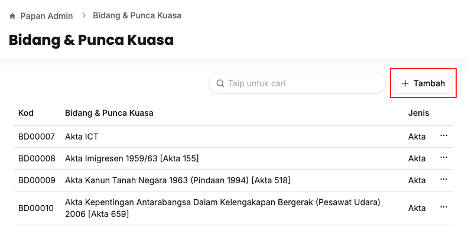
3. Klik butang **+ Tambah**
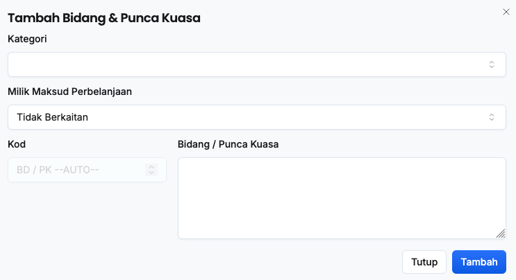
4. Isikan maklumat dalam medan:
    * Kategori
    * Milik Maksud Perbelanjaan
    * Bidang / Punca Kuasa
5. Klik butang **Tambah**
6. Pastikan bidang/punca kuasa baharu telah tersenarai

<Callout title="Outcome">
Bidang/punca kuasa baharu berjaya ditambahkan dan sedia digunakan untuk penyediaan kerangka prestasi
</Callout>

### Kemaskini Maklumat Bidang & Punca Kuasa
Peranan: Super Admin

Langkah: 
1. Klik **Papan Admin** pada *Sidebar*
2. Klik **Bidang & Punca Kuasa** di bawah aturan umum
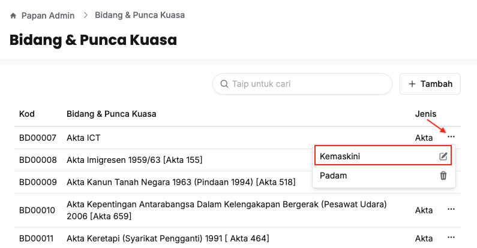
3. Klik butang **3 dots** pada sudut kanan bidang/punca kuasa yang berkaitan
4. Klik butang **Kemaskini**
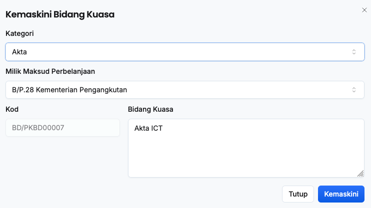
5. Kemaskini:
    * Kategori
    * Milik Maksud Perbelanjaan
    * Bidang Kuasa / Punca Kuasa
6. Klik butang **Kemaskini**
7. Pastikan maklumat bidang/punca kuasa yang berkaitan telah dikemaskini

<Callout title="Outcome"> 
Maklumat bidang/punca kuasa yang berkaitan berjaya dikemaskini
</Callout>

### Padam Bidang & Punca Kuasa
Peranan: Super Admin

Langkah: 
1. Klik **Papan Admin** pada *Sidebar*
2. Klik **Bidang & Punca Kuasa** di bawah aturan umum
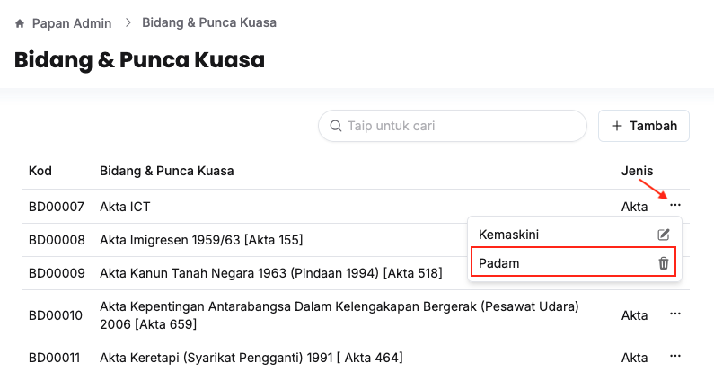
3. Klik butang **3 dots** pada sudut kanan bidang/punca kuasa yang berkaitan
4. Klik butang **Padam**
5. Klik butang **Teruskan**
6. Pastikan bidang/punca kuasa yang berkaitan telah dipadamkan

<Callout title="Outcome"> 
Bidang/punca kuasa yang berkaitan berjaya dipadamkan
</Callout>

## SDG
### Tambah SDG Baharu
Peranan: Super Admin

1. Klik **Papan Admin** pada *Sidebar*
2. Klik **SDG** di bawah aturan umum
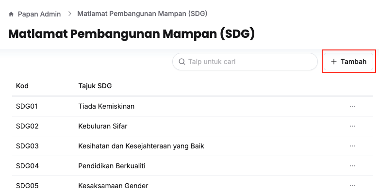
3. Klik butang **+ Tambah**
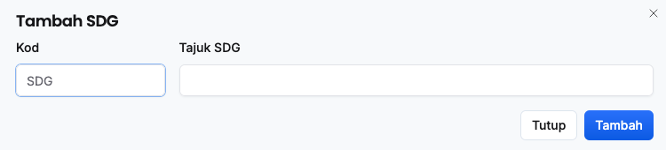
4. Isikan maklumat dalam medan:
    * Kod
    * Tajuk SDG
5. Klik butang **Tambah**
6. Pastikan SDG baharu telah tersenarai

<Callout title="Outcome">
SDG baharu berjaya ditambahkan dan sedia digunakan untuk perancangan bajet 
</Callout>

### Kemaskini Maklumat SDG
Peranan: Super Admin

Langkah: 
1. Klik **Papan Admin** pada *Sidebar*
2. Klik **SDG** di bawah aturan umum
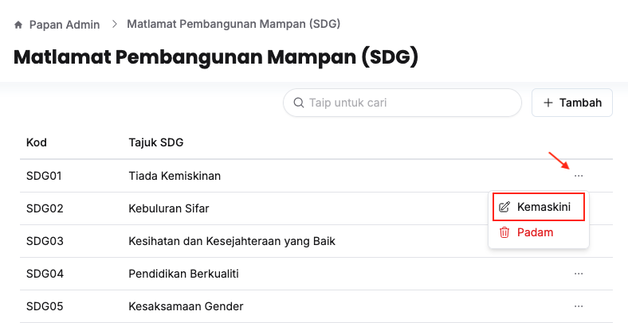
3. Klik butang **3 dots** pada sudut kanan SDG yang berkaitan
4. Klik butang **Kemaskini**
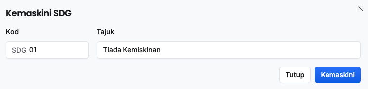
5. Kemaskini:
    * Kod
    * Tajuk
6. Klik butang **Kemaskini**
7. Pastikan maklumat SDG yang berkaitan telah dikemaskini

<Callout title="Outcome"> 
Maklumat SDG yang berkaitan berjaya dikemaskini
</Callout>

### Padam SDG
Peranan: Super Admin

Langkah: 
1. Klik **Papan Admin** pada *Sidebar*
2. Klik **SDG** di bawah aturan umum
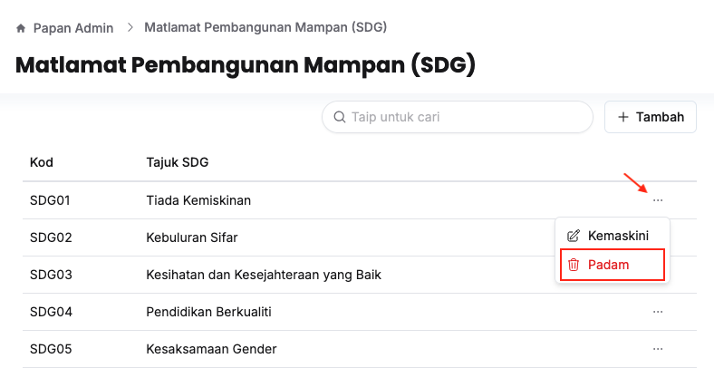
3. Klik butang **3 dots** pada sudut kanan SDG yang berkaitan
4. Klik butang **Padam**
5. Klik butang **Teruskan**
6. Pastikan SDG yang berkaitan telah dipadamkan

<Callout title="Outcome"> 
SDG yang berkaitan berjaya dipadamkan
</Callout>

## Sektor
### Tambah Sektor Utama/Sektor/Sub-Sektor Baharu
Peranan: Super Admin

Langkah:
1. Klik **Papan Admin** pada *Sidebar*
2. Klik **Sektor** di bawah aturan umum
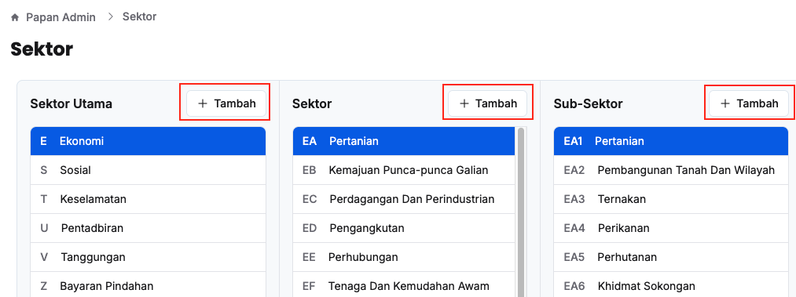
3. Klik butang **+ Tambah**
    * *Nota: Pilih **Sektor Utama/Sektor** terlebih dahulu untuk **Sektor/Sub-Sektor***
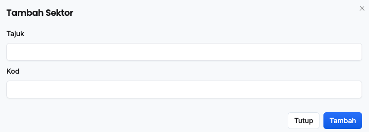
4. Isikan maklumat dalam medan:
    * Kod
    * Tajuk
5. Klik butang *Tambah*
6. Pastikan sektor utama/sektor/sub-sektor yang baharu telah tersenarai

<Callout title="Outcome">
Sektor utama/sektor/sub-sektor yang baharu berjaya ditambahkan dan sedia untuk digunakan untuk perancangan bajet
</Callout>

### Kemaskini Maklumat Sektor Utama/Sektor/Sub-Sektor
Peranan: Super Admin

Langkah: 
1. Klik **Papan Admin** pada *Sidebar*
2. Klik **Sektor** di bawah aturan umum
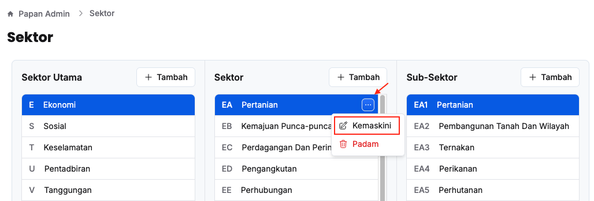
3. Klik butang **3 dots** pada sudut kanan sektor utama/sektor/sub-sektor yang berkaitan
4. Klik butang **Kemaskini**
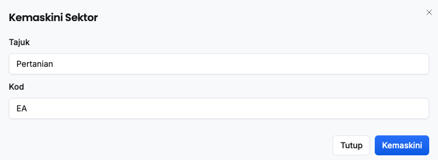
5. Kemaskini:
    * Tajuk
    * Kod
6. Klik butang **Kemaskini**
7. Pastikan maklumat sektor utama/sektor/sub-sektor yang berkaitan telah dikemaskini

<Callout title="Outcome"> 
Maklumat sektor utama/sektor/sub-sektor yang berkaitan berjaya dikemaskini
</Callout>

### Padam Sektor Utama/Sektor/Sub-Sektor
Peranan: Super Admin

Langkah: 
1. Klik **Papan Admin** pada *Sidebar*
2. Klik **Sektor** di bawah aturan umum
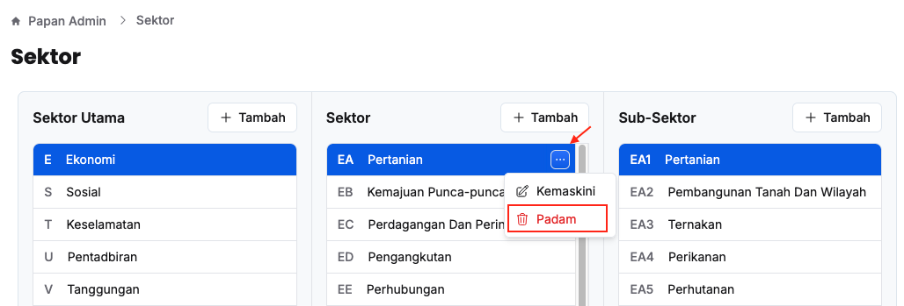
3. Klik butang **3 dots** pada sudut kanan sektor utama/sektor/sub-sektor yang berkaitan
4. Klik butang **Padam**
5. Klik butang **Teruskan**
6. Pastikan sektor utama/sektor/sub-sektor yang berkaitan telah dipadamkan

<Callout title="Outcome"> 
Sektor utama/sektor/sub-sektor yang berkaitan berjaya dipadamkan
</Callout>