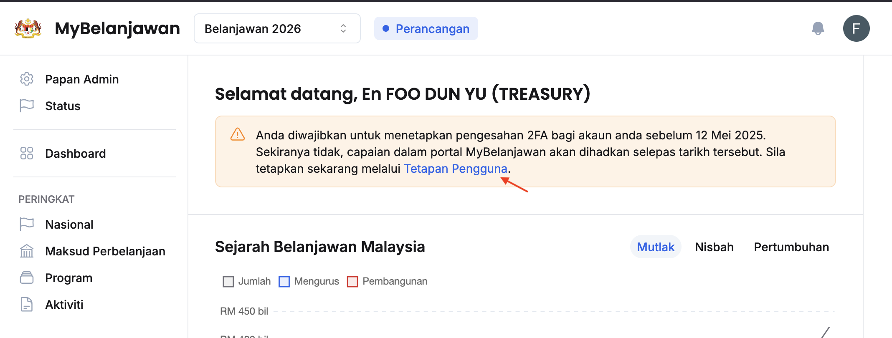
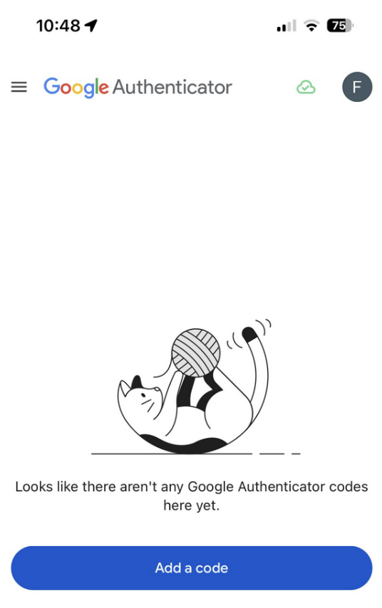

## Panduan Bertulis
<Callout title="Pra-Syarat" type="warn">
Sila muat turun aplikasi _Google Authenticator_ pada _Google Play Store_ ataupun _Apple App Store_ pada telefon bimbit anda
* https://play.google.com/store/apps/details?id=com.google.android.apps.authenticator2&hl=en
* https://apps.apple.com/us/app/google-authenticator/id388497605
</Callout>

Langkah:
1. Klik **Tetapan Pengguna**

2. Klik butang **Aturkan** pada sudut kanan **Pengesahan Dua Langkah (2FA)**

3. Buka aplikasi _**Google Authenticator**_ pada telefon
4. Klik butang _**Add a code**_ dan klik _**Scan a QR code**_

5. Imbas kod QR  

6. Masukkan kod 6-digit dalam ruang yang disediakan
7. Klik butang **Sahkan**

<Callout title="Outcome">
Anda telah berjaya menetapkan 2FA pada akaun anda 
</Callout>

## Panduan Video
<iframe
  src="https://drive.google.com/file/d/1e95kl1f_gb7bPEQqxEedeCFnD_fS2qMT/preview"
  width="640"
  height="360"
  allow="autoplay"
  frameBorder="0"
  allowFullScreen
></iframe>
