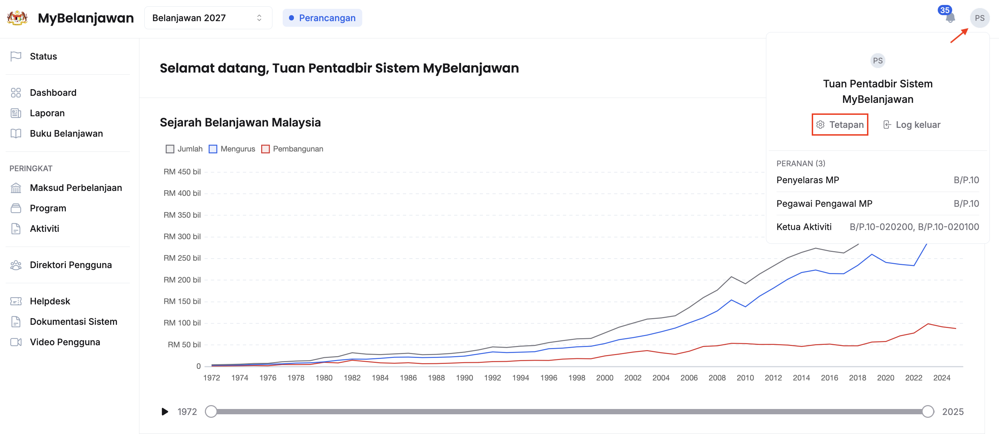
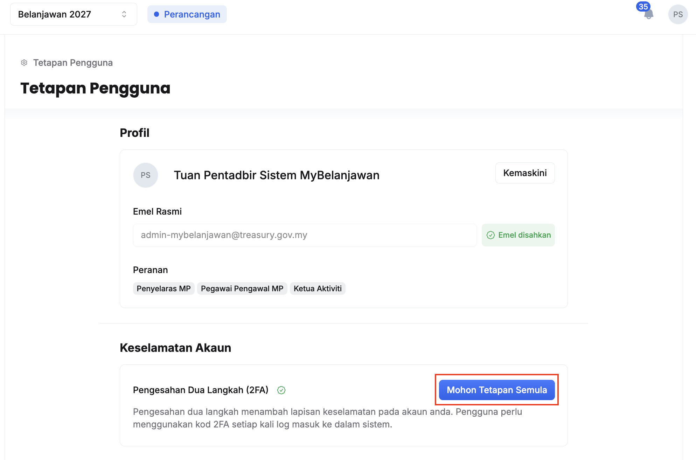
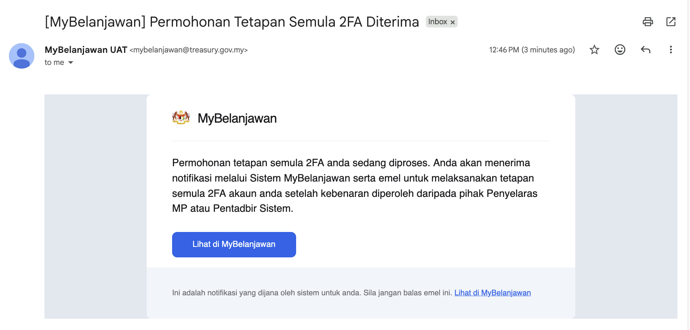
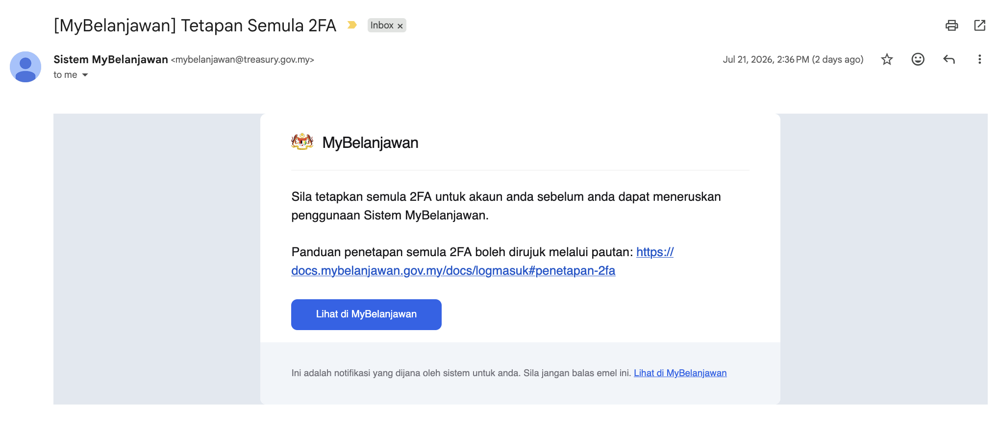

## Panduan Bertulis
Langkah:

1. Klik Butang **Profil Pengguna**
2. Klik **Tetapan Pengguna**
3. Klik butang **Mohon Tetapan Semula** pada sudut kanan **Pengesahan Dua Langkah (2FA)**

4. Klik butang **Teruskan**
5. Permohonan tetapan semula 2FA telah selesai. Anda akan menerima e-mel pengesahan bahawa permohonan tetapan semula 2FA anda sedang diproses.

 
<Callout title="Outcome">
Penyelaras MP atau Super Admin telah dimaklumkan untuk menyemak dan mengambil tindakan terhadap permohonan anda
* Sekiranya tindakan telah diambil, anda akan menerima notifikasi emel untuk menetap semula 2FA pada akaun anda

* Sekiranya permohonan anda masih belum diambil tindakan selepas 24 jam, anda boleh mengulangi langkah-langkah ini untuk menghantar peringatan kepada Penyelaras MP atau Super Admin
</Callout>

## Panduan Video
<iframe
  src="https://drive.google.com/file/d/10ucONXEmUqeYwz7a-Gv7XyjpnzhIgT9x/preview"
  width="640"
  height="360"
  allow="autoplay"
  frameBorder="0"
  allowFullScreen
></iframe>
